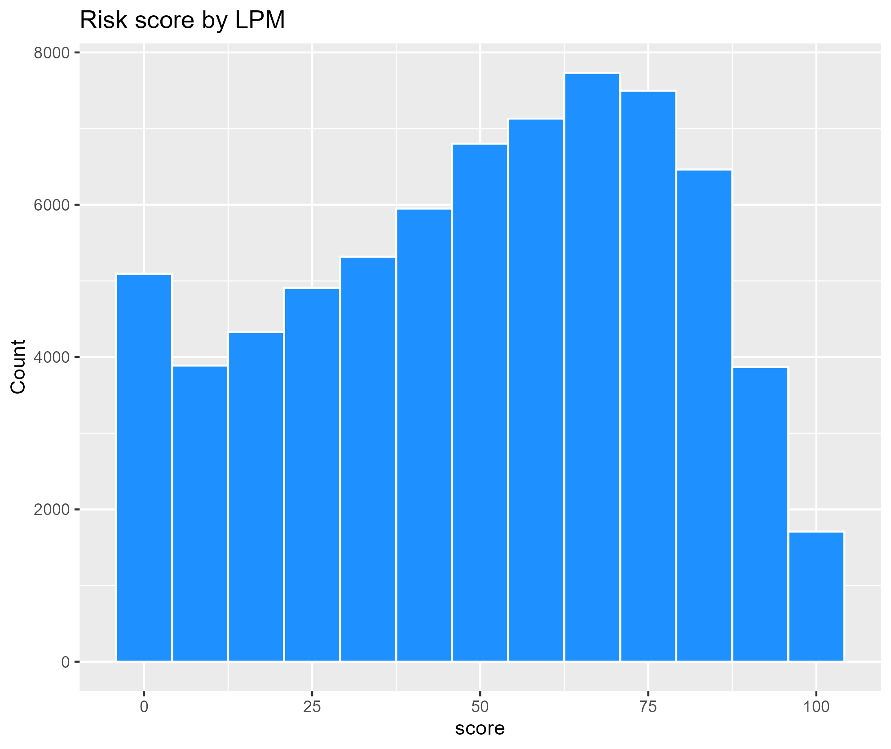
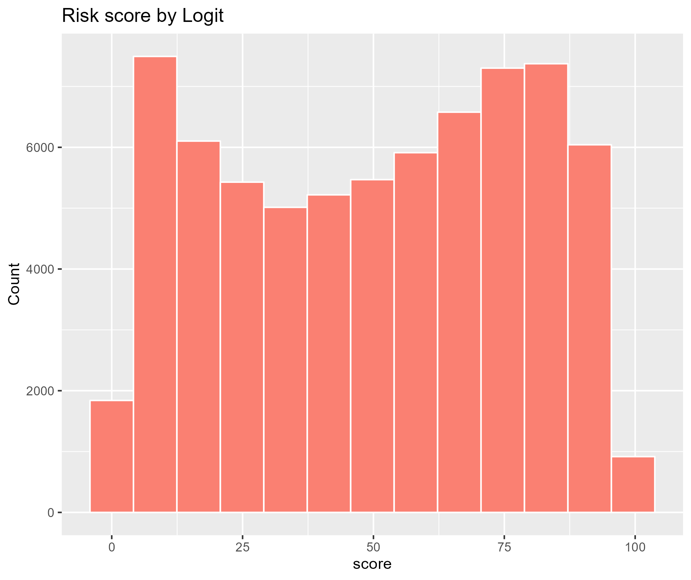
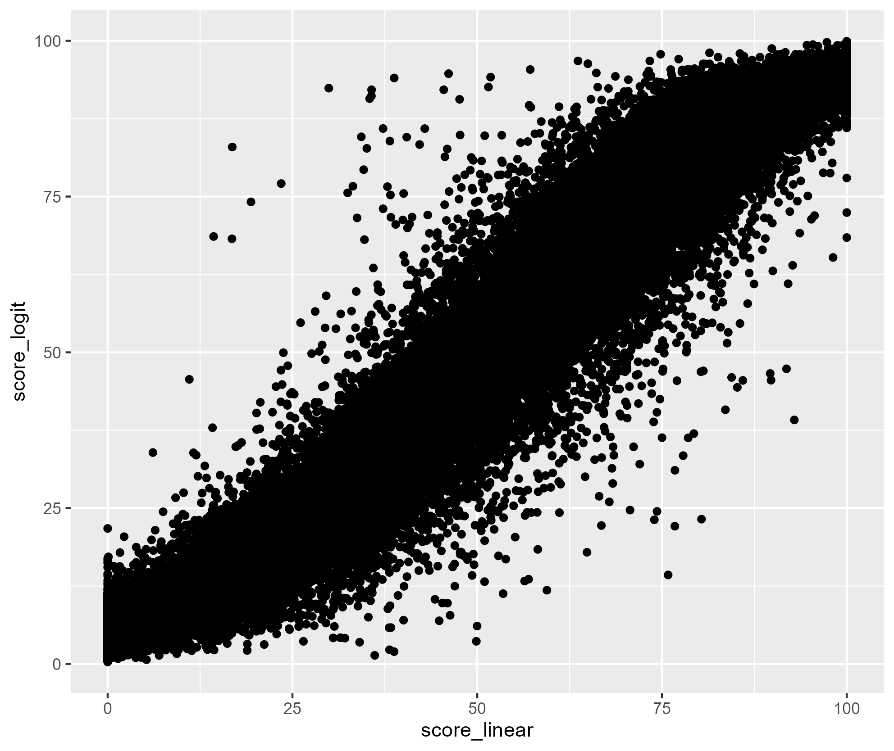
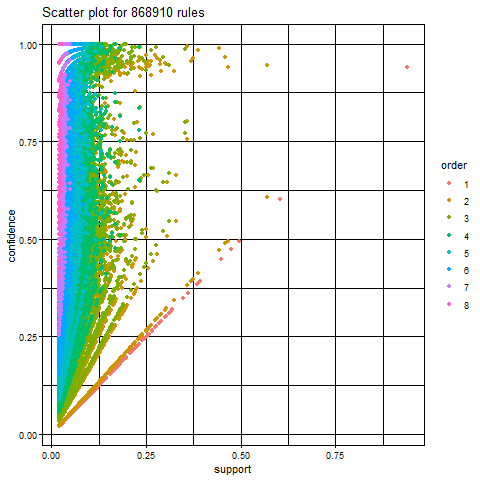
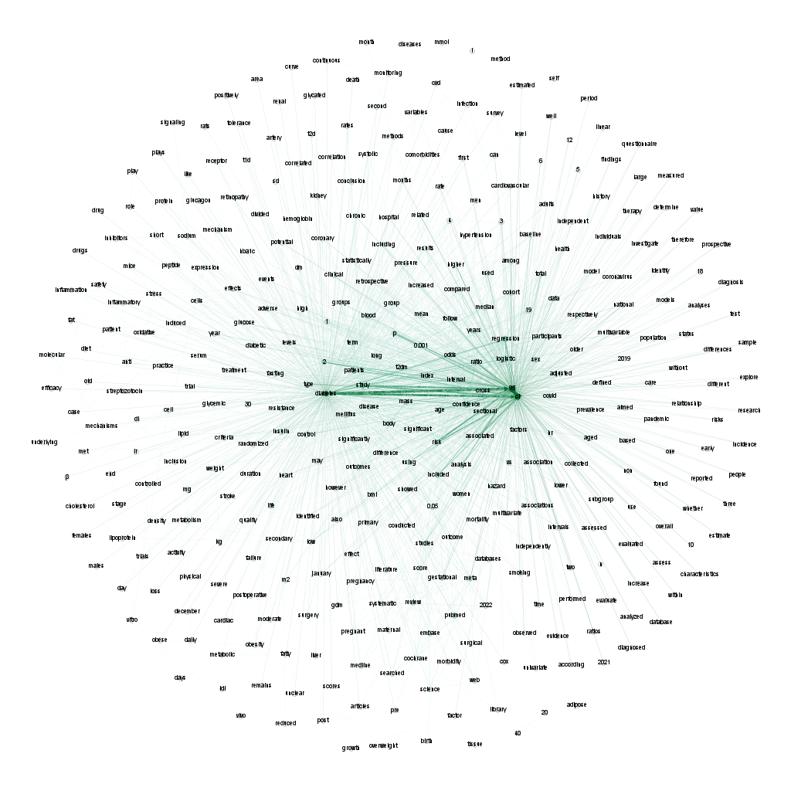
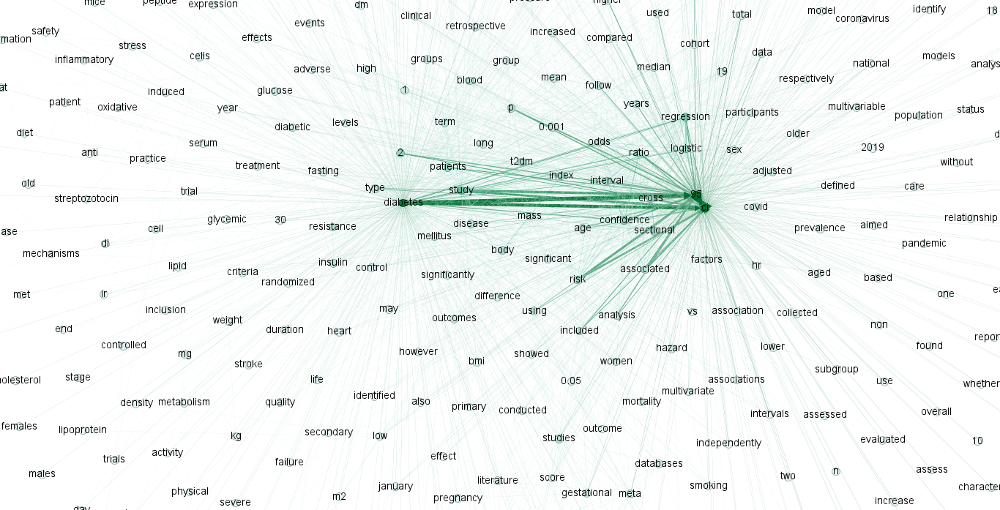

```{r, include=FALSE,eval=FALSE}
options(tinytex.verbose = TRUE)
options(dplyr.summarise.inform = FALSE)
```

```{r setup, include=FALSE,eval=FALSE}
library(magrittr)
library(dplyr)
library(tidyverse) 
library(sjmisc)
library(ggplot2)
library(reshape2)
library(gapminder)
library(mosaic)
library(extraDistr)
library(caret)
library(modelr)
library(parallel)
library(foreach)
library(rsample)
library(lubridate)
library(olsrr)
library(rpart)
library(rpart.plot)
library(randomForest)
library(gbm)
library(gamlr)
library(arules)
library(knitr)
library(tokenizers)
library(stopwords)
library(arulesViz)
load("./data/diabetes.RData")
```

# 1. Introduction

## 1-1. Background

Diabetes is a prevalent chronic disease in the US, affecting millions of people and placing a significant financial burden on the economy. It is characterized by the inability to regulate glucose levels in the blood due to insufficient insulin production or ineffective use of insulin. High blood sugar levels can lead to complications such as heart disease, vision loss, lower-limb amputation, and kidney disease. While there is no cure for diabetes, lifestyle changes and medical treatments can help mitigate its harms. Early diagnosis is important, and predictive models for diabetes risk can aid public health officials. Type II diabetes is the most common form, and its prevalence varies by social determinants of health such as age, education, income, race, and location. Diabetes also has a disproportionate impact on those of lower socioeconomic status. The economic burden of diabetes is significant, with costs exceeding $400 billion annually.

Here are some statistics on diabetes in the USA:<br>
* As of 2021, approximately 34.2 million Americans, or 10.5% of the population, have diabetes.<br>
* About 90-95% of cases are type II diabetes.<br>
* Another 88 million American adults, or 34.5% of the population, have prediabetes.
* 1 in 5 people with diabetes, and 8 in 10 people with prediabetes, are unaware of their condition.<br>
* Diabetes is also more common among people with lower income and education levels.
* Diabetes is the seventh leading cause of death in the United States.<br>
* In 2017, the total cost of diagnosed diabetes in the United States was estimated to be $327 billion.<br>

So given this statistics, we know that it is important to identify the key factors that lead to diabetes. Also if we can develop a predictive model that gives an idea how we can predict the chance of developing diabetes, we can take necessary actions to prevent diabetes as this disease is not curable. 

## 1-2. Our Objectives and findings

Our questions that we would like to answer and main findings in this paper are as follow:

**[Objectives]**

* Can we develop a predictive model of diabetes?<br>
* Can we assign a risk score for an individual given we know his/her individual  biological & behavioral characteristics? <br>
* What risk factors are most predictive of diabetes risk?<br>

**[Findings]**

* Patients: Diabetes models can help patients understand their risk of developing the disease, make informed lifestyle choices, and take steps to prevent or manage the disease.<br>
* Healthcare providers: Predictive models can help healthcare providers identify patients who are at high risk of developing diabetes, allowing for earlier interventions and better disease management.<br>
* Public health officials: Modeling diabetes can help public health officials understand the patterns and trends of the disease, identify populations at high risk, and develop targeted prevention and treatment strategies.<br>
* Researchers: By analyzing data from diabetes models, researchers can gain insights into the underlying causes of the disease, identify new risk factors, and develop more effective treatments.<br>

To achieve the objective of our project, we are expecting to do the following:<br>
**1. Visualize data:** By using visualization techniques such as scatter plot, hit maps, clusters etc we can identify the relationship between different biological, behavioral & demographic and diabetes. <br>
**2. Predictive model:** Using different predictive models such as linear regression, KNN regression, random forest, logistic regression, decision tree models, we shall come up with predicting diabetes.<br>
 **3. Identifying importance of different factors:** We can use PCA, partial dependence plot etc to identify the marginal effects of different variables on diabetes.<br>
**4. Develop a risk score:** based on the individual characteristics we will develop a risk score & based on the risk score we can give early signal whether an individual is within the risk zone of developing diabetes.<br>
**5. Need more data to estimate our model preciously:** Our data are always limited, and so we cannot build a perfect predictive model. Then, we use the "Natural Language Processing" and "Association rules" to identify factors that are much related to "diabetes" because if we can get additionally data of them, we can estimate our model more preciously.<br>


# 2. Data and Model

## 2-1. Data

**Nature of Data:** Dataset includes 70,692 observations of US individuals 50% of whom are diabetic patients (others are not).  These data were collected by BEHAVIORAL RISK FACTOR SURVEILLANCE SYSTEM in assistance with Chronic Disease Center. There are total 21 variables. The variables are defined as follows:
Diabetes_binary: A binary variable indicating presence of diabetes by 1 & absence by 0.

*HighBP,HighChol*,Smoker (Have you smoked at least 100 cigarettes in your entire life? 0 = no 1 = yes), Stroke, HeartDisease PhysActiv, Fruits, Veggies, HvyAlcoholConsump, AnyHealthcare, NoDocbcCost, DiffWalk (Any difficulty on walking, 1 indicate presence of difficulty) - all are binary variables where 1 indicate presence of the factor and 0 indicates absence. Cholcheck is also a binary variable where 0 = no cholesterol check in 5 years 1 = yes cholesterol check in 5 years

*BMI :* Body Mass index is a measure of body fat based on height and weight that applies to adult men and women. Here, BMI had minimum value of 12 & maximum value of 98. BMI more than 25 is considered obese. 
General Health: A measure of general health situation, 1=Excellent, 2=Very Good, 3=Good, 4=Fair, 5=Poor.  

*Mental Health:* During the past 30 days, for about how many days did poor physical or mental health keep an individual from doing your usual activities, such as self-care, work, or recreation? A value from 0 to 30 where 0 indicates bests mental health & 30 indicates worst. 

*Physical Health:* for how many days during the past 30 days was the individual’s physical health not good? A value from 0 to 30 where higher the value worse the physical health.

**Demographic Variables:**

*Sex:* patient's gender (1: male; 0: female). 

*Age:* 13-level age category ,where 1 = 18-24 9 = 60-64 13 = 80 or older etc. 

*Education:* A value that ranges from 1 to 6. Higher the value higher the level of education. 1= Never attended school or only kindergarten, 2 = Grades 1 through 8 (Elementary) 3 =Grades 9 through 11 (Some high school), 4= Grade 12 or GED (High school graduate), 5= College 1 year to 3 years (Some college or technical school), 6= College 4 years or more (College graduate)

*Income:* Indicates level of annual income for the households where 1= income less than \$10000, 2= \$10,000 to less than \$15,000, 3= \$15,000 to less than \$20,000, 4= \$20,000 to less than \$25,000, 5= \$25,000 to less than \$35,000, 6= \$35,000 to less than \$50,000, 7= \$50,000 to less than \$75,000, 8= 75,000 or more

In the following, we shows histograms conunting of some characteristics by diabees status from the raw data.

```{r, echo=FALSE, message=FALSE, warning=FALSE, results='hide',eval=FALSE}
diabetes <- read.csv("./data/diabetes.csv")
#ge_labels <- c("18-24", "25-29", "30-34", "35-39", "40-44", "45-49", "50-54", "55-59", "60-64", "65-69", "70-74", "75-79", "80+")

ggplot(diabetes, aes(x = Age)) +
  geom_histogram(bins = 13, color = "white", fill = "salmon") +
  facet_wrap(~ Diabetes_binary, labeller = labeller(Diabetes_binary = c("0" = "Non Diabetes", "1" = "Diabetes"))) +
  labs(title = "Histogram of Age by Diabetes Status", y = "Count")
ggsave("./fig/hist_age.png")

ggplot(diabetes, aes(x = Education)) +
  geom_histogram(bins = 13, color = "white", fill = "dodgerblue") +
  facet_wrap(~ Diabetes_binary, labeller = labeller(Diabetes_binary = c("0" = "Non Diabetes", "1" = "Diabetes"))) +
  labs(title = "Histogram of Education by Diabetes Status", y = "Count")
ggsave("./fig/hist_education.png")

ggplot(diabetes, aes(x = Income)) +
  geom_histogram(bins = 13, color = "white", fill = "aquamarine2") +
  facet_wrap(~ Diabetes_binary, labeller = labeller(Diabetes_binary = c("0" = "Non Diabetes", "1" = "Diabetes"))) +
  labs(title = "Histogram of Income by Diabetes Status", y = "Count")
ggsave("./fig/hist_income.png")

ggplot(diabetes, aes(x = BMI)) +
  geom_histogram(bins = 13, color = "white", fill = "gold") +
  facet_wrap(~ Diabetes_binary, labeller = labeller(Diabetes_binary = c("0" = "Non Diabetes", "1" = "Diabetes"))) +
  labs(title = "Histogram of BMI by Diabetes Status", y = "Count")
ggsave("./fig/hist_bmi.png")
```

```{r, echo=FALSE,out.width ="50%", out.height = "70%",fig.align='center'}
knitr::include_graphics("./fig/hist_age.png")
knitr::include_graphics("./fig/hist_education.png")
knitr::include_graphics("./fig/hist_income.png")
knitr::include_graphics("./fig/hist_bmi.png")
```

## 2-2. Model

### 2-2-1. Best Predictive Model

### 2-2-2. Factors related to "diabetes"

In this paper, we use the Natural Language Processing to identify factors that are much related to "diabetes" because if we can get additionally data of them, we can estimate our model more preciously.

To do that, at first, we collected data of the abstract of the recent academic paper with keyword "diabetes" from the [Pubmed](https://pubmed.ncbi.nlm.nih.gov/). Specifically, we used the application of [Publish or Perish 8](https://harzing.com/resources/publish-or-perish/), put "diabetes" into the "Keywords" and get information of the 1000 medical papers with "diabetes" keyword from 2022 to 2023.

Next, we excluded blank data and stopwords of "stopwords" library, and tokenized their abstracts using "tokenizers" library. So there were 950 papers' data.

After that, we apply apriori function for data that we got with support =.02, confidence=.001, and extract some data from them with lift>4. Then we showed the node graph that told us words that related to "diabetes" word with [Gephi](https://gephi.org/).

Finally, from the node graph, we got factors that related to "diabetes", and identified factors that we should collect additionally while comparing to our current factors of data.

Note: the reason we did not use "Google scholar" to collect in Publish or Perish is it did not give us all abstract data of each papers.<br> Also, Publish or Perish can only get up to 1000 data.


# 3. Result

## 3-1. Best Diabetes Prediction


### 3-1-2. Linear model regression

First, to find the best combination of variables for the model, we used stepwise selection. And we got the best model from the point of AIC view, which is so complex, and so we shows it in the [Appendix](## 6-1. Stewise selection model).

```{r , eval=FALSE,echo=FALSE,fig.width =5.5, fig.height = 2,fig.align='center'}
## Linear regression and Knn regression
# standarized
data <- diabetes[,2:22]
scale_train = apply(data, 2, sd) # calculate std dev for each column
data_tilde = scale(data , scale = scale_train) %>% as.data.frame
data_cv <- as.data.frame(c(diabetes[1],data_tilde))

# Split
diabetes_split = initial_split(data_cv, prop = 0.8)
diabetes_train = training(diabetes_split)
diabetes_test = testing(diabetes_split)

## Varialbe Selection
#Find some good model through stepwise(which variable should be included?)
#It took about 2hours to execute this code!
lm_medium = lm(Diabetes_binary ~ ., data=diabetes_train)
lm_step = step(lm_medium, scope=~(.)^2, data=diabetes_test)

# From this result, I got the following model is the best
# Step:  AIC=-100451.2
# Diabetes_binary ~ HighBP + HighChol + CholCheck + BMI + Smoker + 
#     Stroke + HeartDiseaseorAttack + PhysActivity + Fruits + Veggies + 
#     HvyAlcoholConsump + AnyHealthcare + NoDocbcCost + GenHlth + 
#     MentHlth + PhysHlth + DiffWalk + Sex + Age + Education + 
#     Income + GenHlth:DiffWalk + BMI:Age + Sex:Age + HighChol:Age + 
#     GenHlth:Income + BMI:DiffWalk + HighBP:HeartDiseaseorAttack + 
#     DiffWalk:Age + GenHlth:PhysHlth + HvyAlcoholConsump:Age + 
#     CholCheck:GenHlth + GenHlth:Sex + HighChol:HeartDiseaseorAttack + 
#     HighChol:GenHlth + HeartDiseaseorAttack:Age + Smoker:GenHlth + 
#     HeartDiseaseorAttack:GenHlth + Fruits:Education + HeartDiseaseorAttack:DiffWalk + 
#     HighBP:HvyAlcoholConsump + HighChol:Stroke + AnyHealthcare:Education + 
#     HighBP:CholCheck + Smoker:Education + BMI:HeartDiseaseorAttack + 
#     BMI:Smoker + MentHlth:DiffWalk + CholCheck:BMI + HighChol:BMI + 
#     HighBP:HighChol + Fruits:Age + PhysActivity:Fruits + Stroke:GenHlth + 
#     HighBP:Sex + Stroke:Age + HeartDiseaseorAttack:NoDocbcCost + 
#     CholCheck:Age + CholCheck:HeartDiseaseorAttack + Fruits:Sex + 
#     HvyAlcoholConsump:GenHlth + HighChol:MentHlth + HighBP:AnyHealthcare + 
#     HighBP:Education + Smoker:Stroke + PhysActivity:Age + PhysActivity:Education + 
#     CholCheck:AnyHealthcare + Veggies:NoDocbcCost + BMI:Sex + 
#     MentHlth:Income + PhysHlth:Income + NoDocbcCost:DiffWalk + 
#     BMI:MentHlth + HighChol:Sex + Sex:Education + Smoker:Sex + 
#     PhysHlth:Age + MentHlth:Age + HeartDiseaseorAttack:PhysHlth + 
#     PhysActivity:PhysHlth + Stroke:MentHlth + BMI:NoDocbcCost + 
#     AnyHealthcare:Age + BMI:PhysActivity + Smoker:DiffWalk + 
#     Smoker:Age + Smoker:HvyAlcoholConsump + AnyHealthcare:DiffWalk + 
#     AnyHealthcare:PhysHlth + Stroke:HeartDiseaseorAttack + PhysActivity:Income
```

Also, we compared three model with the cross-Validation, the linear model of this stepwised model and the basic model (which simply includes all variables), and Knn regression model. These rmse of three model is as follow:

```{r , eval=FALSE,echo=FALSE,fig.width =5.5, fig.height = 2,fig.align='center'}
## Linear regression and K-CV for the best selected model
# K-CV
K_folds = 5
diabetes_folds = crossv_kfold(data_cv, k=K_folds)

# Linear regression of some model found by step wise
model_step_cv = map(diabetes_folds$train, ~ lm(Diabetes_binary ~ HighBP + HighChol + CholCheck + BMI + Smoker + 
    Stroke + HeartDiseaseorAttack + PhysActivity + Fruits + Veggies + 
    HvyAlcoholConsump + AnyHealthcare + NoDocbcCost + GenHlth + 
    MentHlth + PhysHlth + DiffWalk + Sex + Age + Education + 
    Income + GenHlth:DiffWalk + BMI:Age + Sex:Age + HighChol:Age + 
    GenHlth:Income + BMI:DiffWalk + HighBP:HeartDiseaseorAttack + 
    DiffWalk:Age + GenHlth:PhysHlth + HvyAlcoholConsump:Age + 
    CholCheck:GenHlth + GenHlth:Sex + HighChol:HeartDiseaseorAttack + 
    HighChol:GenHlth + HeartDiseaseorAttack:Age + Smoker:GenHlth + 
    HeartDiseaseorAttack:GenHlth + Fruits:Education + HeartDiseaseorAttack:DiffWalk +
    HighBP:HvyAlcoholConsump + HighChol:Stroke + AnyHealthcare:Education + 
    HighBP:CholCheck + Smoker:Education + BMI:HeartDiseaseorAttack + 
    BMI:Smoker + MentHlth:DiffWalk + CholCheck:BMI + HighChol:BMI + 
    HighBP:HighChol + Fruits:Age + PhysActivity:Fruits + Stroke:GenHlth + 
    HighBP:Sex + Stroke:Age + HeartDiseaseorAttack:NoDocbcCost + 
    CholCheck:Age + CholCheck:HeartDiseaseorAttack + Fruits:Sex + 
    HvyAlcoholConsump:GenHlth + HighChol:MentHlth + HighBP:AnyHealthcare + 
    HighBP:Education + Smoker:Stroke + PhysActivity:Age + PhysActivity:Education + 
    CholCheck:AnyHealthcare + Veggies:NoDocbcCost + BMI:Sex + 
    MentHlth:Income + PhysHlth:Income + NoDocbcCost:DiffWalk + 
    BMI:MentHlth + HighChol:Sex + Sex:Education + Smoker:Sex + 
    PhysHlth:Age + MentHlth:Age + HeartDiseaseorAttack:PhysHlth + 
    PhysActivity:PhysHlth + Stroke:MentHlth + BMI:NoDocbcCost + 
    AnyHealthcare:Age + BMI:PhysActivity + Smoker:DiffWalk + 
    Smoker:Age + Smoker:HvyAlcoholConsump + AnyHealthcare:DiffWalk + 
    AnyHealthcare:PhysHlth + Stroke:HeartDiseaseorAttack + PhysActivity:Income,data=.))

rmse_step_cv = mean(map2_dbl(model_step_cv, diabetes_folds$test, modelr::rmse))

# Linear regression of some model found by step wise
model_lm1_cv = map(diabetes_folds$train, ~ lm(Diabetes_binary ~ .,data=.))
rmse_lm1_cv = mean(map2_dbl(model_lm1_cv , diabetes_folds$test, modelr::rmse))


# Knn regression of some model found by step wise
model_knncv = foreach(k = 1:2, .combine='rbind') %do% {
  model_cv = map(diabetes_folds$train, ~ knnreg(Diabetes_binary ~  HighBP + HighChol + CholCheck + BMI + Smoker + 
    Stroke + HeartDiseaseorAttack + PhysActivity + Fruits + Veggies + 
    HvyAlcoholConsump + AnyHealthcare + NoDocbcCost + GenHlth + 
    MentHlth + PhysHlth + DiffWalk + Sex + Age + Education + 
    Income + GenHlth:DiffWalk + BMI:Age + Sex:Age + HighChol:Age + 
    GenHlth:Income + BMI:DiffWalk + HighBP:HeartDiseaseorAttack + 
    DiffWalk:Age + GenHlth:PhysHlth + HvyAlcoholConsump:Age + 
    CholCheck:GenHlth + GenHlth:Sex + HighChol:HeartDiseaseorAttack + 
    HighChol:GenHlth + HeartDiseaseorAttack:Age + Smoker:GenHlth + 
    HeartDiseaseorAttack:GenHlth + Fruits:Education + HeartDiseaseorAttack:DiffWalk +
    HighBP:HvyAlcoholConsump + HighChol:Stroke + AnyHealthcare:Education + 
    HighBP:CholCheck + Smoker:Education + BMI:HeartDiseaseorAttack + 
    BMI:Smoker + MentHlth:DiffWalk + CholCheck:BMI + HighChol:BMI + 
    HighBP:HighChol + Fruits:Age + PhysActivity:Fruits + Stroke:GenHlth + 
    HighBP:Sex + Stroke:Age + HeartDiseaseorAttack:NoDocbcCost + 
    CholCheck:Age + CholCheck:HeartDiseaseorAttack + Fruits:Sex + 
    HvyAlcoholConsump:GenHlth + HighChol:MentHlth + HighBP:AnyHealthcare + 
    HighBP:Education + Smoker:Stroke + PhysActivity:Age + PhysActivity:Education + 
    CholCheck:AnyHealthcare + Veggies:NoDocbcCost + BMI:Sex + 
    MentHlth:Income + PhysHlth:Income + NoDocbcCost:DiffWalk + 
    BMI:MentHlth + HighChol:Sex + Sex:Education + Smoker:Sex + 
    PhysHlth:Age + MentHlth:Age + HeartDiseaseorAttack:PhysHlth + 
    PhysActivity:PhysHlth + Stroke:MentHlth + BMI:NoDocbcCost + 
    AnyHealthcare:Age + BMI:PhysActivity + Smoker:DiffWalk + 
    Smoker:Age + Smoker:HvyAlcoholConsump + AnyHealthcare:DiffWalk + 
    AnyHealthcare:PhysHlth + Stroke:HeartDiseaseorAttack + PhysActivity:Income, k=k, data = ., use.all=FALSE))
  errs_cv = map2_dbl(model_cv, diabetes_folds$test, modelr::rmse)
  c(k=k, err = mean(errs_cv), std_err = sd(errs_cv)/sqrt(K_folds))
} %>% as.data.frame

# Comparison of RMSE
knn_min_rmse=model_knncv[model_knncv$err==min(model_knncv$err),]
result_cv =c(rmse_lm1_cv,knn_min_rmse[2])
```

```{r, echo=FALSE,out.width ="50%", out.height = "70%",fig.align='center'}
knitr::kable(cbind( RMSE_stndard=0.415,RMSE_step=0.411, RMSE_KNN=0.500))
```

where the optimal k is $2$. From the above the result, it is safe to say the stepwise model is the best predictive model so far.

### 3-1-2. Logit model comparison

Next to find better predictive model, 

```{r ,  eval=FALSE,include=FALSE}

## Linear Probability Model
lm_db <- lm(Diabetes_binary~ HighBP + HighChol + CholCheck + BMI + Smoker + 
    Stroke + HeartDiseaseorAttack + PhysActivity + Fruits + Veggies + 
    HvyAlcoholConsump + AnyHealthcare + NoDocbcCost + GenHlth + 
    MentHlth + PhysHlth + DiffWalk + Sex + Age + Education + 
    Income + GenHlth:DiffWalk + BMI:Age + Sex:Age + HighChol:Age + 
    GenHlth:Income + BMI:DiffWalk + HighBP:HeartDiseaseorAttack + 
    DiffWalk:Age + GenHlth:PhysHlth + HvyAlcoholConsump:Age + 
    CholCheck:GenHlth + GenHlth:Sex + HighChol:HeartDiseaseorAttack + 
    HighChol:GenHlth + HeartDiseaseorAttack:Age + Smoker:GenHlth + 
    HeartDiseaseorAttack:GenHlth + Fruits:Education + HeartDiseaseorAttack:DiffWalk +
    HighBP:HvyAlcoholConsump + HighChol:Stroke + AnyHealthcare:Education + 
    HighBP:CholCheck + Smoker:Education + BMI:HeartDiseaseorAttack + 
    BMI:Smoker + MentHlth:DiffWalk + CholCheck:BMI + HighChol:BMI + 
    HighBP:HighChol + Fruits:Age + PhysActivity:Fruits + Stroke:GenHlth + 
    HighBP:Sex + Stroke:Age + HeartDiseaseorAttack:NoDocbcCost + 
    CholCheck:Age + CholCheck:HeartDiseaseorAttack + Fruits:Sex + 
    HvyAlcoholConsump:GenHlth + HighChol:MentHlth + HighBP:AnyHealthcare + 
    HighBP:Education + Smoker:Stroke + PhysActivity:Age + PhysActivity:Education + 
    CholCheck:AnyHealthcare + Veggies:NoDocbcCost + BMI:Sex + 
    MentHlth:Income + PhysHlth:Income + NoDocbcCost:DiffWalk + 
    BMI:MentHlth + HighChol:Sex + Sex:Education + Smoker:Sex + 
    PhysHlth:Age + MentHlth:Age + HeartDiseaseorAttack:PhysHlth + 
    PhysActivity:PhysHlth + Stroke:MentHlth + BMI:NoDocbcCost + 
    AnyHealthcare:Age + BMI:PhysActivity + Smoker:DiffWalk + 
    Smoker:Age + Smoker:HvyAlcoholConsump + AnyHealthcare:DiffWalk + 
    AnyHealthcare:PhysHlth + Stroke:HeartDiseaseorAttack + PhysActivity:Income, data = data_cv)
phat_test_lm = predict(lm_db, data_cv, type='response')
yhat_test_lm = ifelse(phat_test_lm > 0.5, 1, 0)
confusion_out_lm = table(y = data_cv$Diabetes_binary ,yhat = yhat_test_lm )

## Other linear model -> accuracy rate does not change
# lm_db2 <- lm(Diabetes_binary~ ., data = data_cv)
# phat_test_lm2 = predict(lm_db2, data_cv, type='response')
# yhat_test_lm2 = ifelse(phat_test_lm2 > 0.5, 1, 0)
# confusion_out_lm2 = table(y = data_cv$Diabetes_binary ,yhat = yhat_test_lm )
#accuracy_lm2 = 1- (confusion_out_lm2[2,1]+confusion_out_lm2[1,2])/sum(confusion_out_lm2)

## Logit Model
logit_db <- glm(Diabetes_binary~ ., data = data_cv, family=binomial)
phat_test_logit = predict(logit_db, data_cv, type='response')
yhat_test_logit = ifelse(phat_test_logit> 0.5, 1, 0)
confusion_out_logit = table(y = data_cv$Diabetes_binary, yhat = yhat_test_logit)

## Accuracy
accuracy_lm = 1- (confusion_out_lm[2,1]+confusion_out_lm[1,2])/sum(confusion_out_lm)
accuracy_logit = 1- (confusion_out_logit[2,1]+confusion_out_logit[1,2])/sum(confusion_out_logit)

## TPR
TPR_lm = (confusion_out_lm[2,2])/(confusion_out_lm[2,1]+confusion_out_lm[2,2])
TPR_logit =  (confusion_out_logit[2,2])/(confusion_out_logit[2,1]+confusion_out_logit[2,2])

## FPR
FPR_lm = (confusion_out_lm[1,2])/(confusion_out_lm[1,1]+confusion_out_lm[1,2])
FPR_logit = (confusion_out_logit[1,2])/(confusion_out_logit[1,1]+confusion_out_logit[1,2])

## FDR
FDR_lm =  (confusion_out_lm[1,2])/(confusion_out_lm[1,2]+confusion_out_lm[2,2])
FDR_logit =  (confusion_out_logit[1,2])/(confusion_out_logit[1,2]+confusion_out_logit[2,2])
```

```{r, echo=FALSE,out.width ="50%", out.height = "70%",fig.align='center'}
table <- matrix(c(0.753, 0.748, 0.790, 0.768,0.282,0.272,0.263,0.253), nrow = 4, ncol = 2, byrow = TRUE)
rownames(table) <- c("accuracy", "TPR","FPR","FDR")
colnames(table) <- c("Linear", "Logit")
knitr::kable(table,caption = "the output of LPM and Logit")
```

From these tables, the accuracy rate of the linear model is 0.753(=75.3%) and that of the logit model is 0.748(=74.8%). Also, each true positive rate (TPR) is 0.79 and 0.768, each false positive rate (FPR) is 0.282 (=Specificity: 70.8%) and 0.272 (=Specificity: 72.8%), and each false discovery rate (FDR) is 0.263 (=Precision: 73.7%) and 0.253 (=Precision: 74.7%).

Therefore, from the result, the linear model can be better than the logit model because the linear model has the lowest rmse and the ability of the prediction for diabetes. However, we need to careful about what sometimes the logit model will be better. (if you have an interest ROC curve, see [Appendix](## 6-2. ROC curve linear vs logit))

### 3-1-3. Scoring

```{r, echo=FALSE, message=FALSE, warning=FALSE, results='hide',eval=FALSE}
linear_score = data.frame(phat_test_lm*100)
colnames(linear_score) <- c("score")
linear_score = linear_score %>% mutate(score=ifelse(score<0, 0, score))
linear_score = linear_score %>% mutate(score=ifelse(score>100, 100, score))

logit_score = data.frame(phat_test_logit*100)
colnames(logit_score) <- c("score")
logit_score = logit_score %>% mutate(score=ifelse(score<0, 0, score))

ggplot(linear_score, aes(x=score)) + geom_histogram(bins = 13,color = "white", fill = "dodgerblue")+
  labs(title = "Risk score by LPM", y = "Count")
ggsave("./fig/lpm_score.png")

ggplot(logit_score, aes(x=score)) + geom_histogram(bins = 13,color = "white", fill = "salmon")+
  labs(title = "Risk score by Logit", y = "Count")
ggsave("./fig/logit_score.png")


data_score = data.frame(c(linear_score,logit_score))
colnames(data_score) <- c("score_linear","score_logit")
ggplot(data_score) + geom_point(aes(x=score_linear,y=score_logit))+
  labs(title = "Relationship of each risk scores by linear and logit")
ggsave("./fig/relation_score.png")
cor(data_score$score_linear,data_score$score_logit)
```

From the linear probability model and the logit model, the individual risk score in the data is as follow: 

```{r, echo=FALSE,out.width ="50%", out.height = "50%",fig.align='center'}



knitr::kable(c(correlation=0.975))
```

where in linear model the below 0 score is changed into 0 and the above 100 score is changed into 100.

From the above graphs, the linear model is like the normal distribution that the top was biased to slightly the right. Also, the logit model is a distribution with a dent in the middle. The bottom of the graph shows the relationship between two ways to score, and these correlation is 0.975. 

From these result, whichever ways to score we select, almost scores are the same as another way. So, we can focus on the shape of the distribution for scores. In general, a scoring distribution will be normal hopefully because we have already had some uncertain conditions for this prediction, such as unknown factors or something like this. Also, the result of the logit model can distinguish diabetes or not as possibly, and many people gives scores of below 50 points compared to linear model. In practice, the scoring has a function of warning and so, we think many low score should not be given.

Accordingly, we would select the way of linear scoring model for getting score of diabetes.


## 3-3. What kind of data is more helpful?

```{r, echo=FALSE, message=FALSE, warning=FALSE, results='hide',eval=FALSE}
pubmed = read.csv("./data/PoPCites_Pubmed.csv", header=T)

# Drop blank row 1000rows -> 950 rows
data_pubmed = data.frame(pubmed$Abstract[!pubmed$Abstract==""])

token = list()
for (i in 1:nrow(data_pubmed)){
  token[i]= tokenize_words(data_pubmed[i,1], stopwords = stopwords::stopwords("en"))
}
## Remove duplicates ("de-dupe")
token_d = lapply(token, unique)
  
## Cast this variable as a special arules "transactions" class.
token_trans = as(token_d, "transactions")

## Cast this variable as a special arules "transactions" class.
token_rules = apriori(token_trans, 
	parameter=list(support=.02, confidence=.001))

png("./fig/plot_token.png")
plot(token_rules, method='two-key plot',jitter = 0)
dev.off()

token_graph = associations2igraph(subset(token_rules, lift>4), associationsAsNodes = FALSE)
igraph::write_graph(token_graph, file='./fig/token_graph.graphml', format = "graphml")
```

From the result, at first the support-confidence plot is as follow: 

```{r, echo=FALSE,out.width ="40%", out.height = "40%",fig.align='center'}

```

This looks many data is tend to the side of the confidence. Note that although we tried to do low confidence level, its result does not change mostly.

Next, the node graph is as follow, the former one is the overall graph and the latter one is enlarged it:
```{r, echo=FALSE,out.width ="80%", out.height = "80%",fig.align='center'}


```

From this graph, we can get some factors which are not included in our data are related to diabetes like these:

- fasting <br>
- metabolic<br>
- blood glucose level<br>
- cholesterol level<br>
- stress<br>
- inflammatory<br>
- pregnancy<br>

Therefore, if we want to refine our model much more, it is better to get data included these factors additionally.

# 4. Conclusion

# 5. Reference

# 6. Appendix

## 6-1. Stewise selection model

The model that we got from the stepwise selection in 3-1 is as follow:

$$
\begin{aligned}
 Diabetes_binary &= \beta_0 + \beta [ HighBP + HighChol + CholCheck +\\BMI + Smoker + 
     &Stroke + HeartDiseaseorAttack + PhysActivity + Fruits + Veggies \\+ 
     &HvyAlcoholConsump + AnyHealthcare + NoDocbcCost + GenHlth + \\
     &MentHlth + PhysHlth + DiffWalk + Sex + Age + Education + \\
     &Income + GenHlth\cdot DiffWalk \\& + BMI\cdot Age + Sex\cdot Age + HighChol\cdot Age +\\ 
   &GenHlth\cdot Income + BMI\cdot DiffWalk \\& + HighBP\cdot HeartDiseaseorAttack + \\
     &DiffWalk\cdot Age + GenHlth\cdot PhysHlth \\& + HvyAlcoholConsump\cdot Age + \\
     &CholCheck\cdot GenHlth + GenHlth\cdot Sex \\& + HighChol\cdot HeartDiseaseorAttack +\\ 
     &HighChol\cdot GenHlth + HeartDiseaseorAttack\cdot Age + Smoker\cdot GenHlth + \\
     &HeartDiseaseorAttack\cdot GenHlth \\& + Fruits\cdot Education + HeartDiseaseorAttack\cdot DiffWalk +\\&HighBP\cdot HvyAlcoholConsump \\& + HighChol\cdot Stroke + AnyHealthcare\cdot Education +\\ 
    & HighBP\cdot CholCheck + Smoker\cdot Education + BMI\cdot HeartDiseaseorAttack + \\
     &BMI\cdot Smoker + MentHlth\cdot DiffWalk \\& + CholCheck\cdot BMI + HighChol\cdot BMI + \\
     &HighBP\cdot HighChol + Fruits\cdot Age \\& + PhysActivity\cdot Fruits + Stroke\cdot GenHlth + \\ 
     &HighBP\cdot Sex + Stroke\cdot Age \\& + HeartDiseaseorAttack\cdot NoDocbcCost + \\
     &CholCheck\cdot Age + CholCheck\cdot HeartDiseaseorAttack \\& + Fruits\cdot Sex + \\
     &HvyAlcoholConsump\cdot GenHlth \\& + HighChol\cdot MentHlth \\& + HighBP\cdot AnyHealthcare + \\ 
     &HighBP\cdot Education + Smoker\cdot Stroke \\& + PhysActivity\cdot Age + PhysActivity\cdot Education + \\
     &CholCheck\cdot AnyHealthcare + Veggies\cdot NoDocbcCost + BMI\cdot Sex + \\
     &MentHlth\cdot Income + PhysHlth\cdot Income + NoDocbcCost\cdot DiffWalk + \\
     &BMI\cdot MentHlth + HighChol\cdot Sex \\& + Sex\cdot Education + Smoker\cdot Sex + \\
     &PhysHlth\cdot Age + MentHlth\cdot Age \\& + HeartDiseaseorAttack\cdot PhysHlth + \\ 
     &PhysActivity\cdot PhysHlth + Stroke\cdot MentHlth + BMI\cdot NoDocbcCost + \\
     &AnyHealthcare\cdot Age + BMI\cdot PhysActivity + Smoker\cdot DiffWalk + \\
     &Smoker\cdot Age + Smoker\cdot HvyAlcoholConsump \\& + AnyHealthcare\cdot DiffWalk +\\ 
     &AnyHealthcare\cdot PhysHlth + Stroke\cdot HeartDiseaseorAttack + \\ &PhysActivity\cdot Income]+\varepsilon \\
\end{aligned}
$$


The summary of the regression of the linear probability model is as follow:
```
Residuals:
     Min       1Q   Median       3Q      Max 
-1.75341 -0.32024  0.05317  0.31446  1.22353 

Coefficients:
                                   Estimate Std. Error t value
(Intercept)                       5.402e-01  2.273e-03 237.646
HighBP                            7.140e-02  1.829e-03  39.041
HighChol                          5.283e-02  1.699e-03  31.086
CholCheck                         3.460e-02  2.164e-03  15.985
BMI                               8.713e-02  1.832e-03  47.567
Smoker                           -3.219e-03  1.623e-03  -1.984
Stroke                            1.686e-02  2.414e-03   6.982
HeartDiseaseorAttack              3.811e-02  2.482e-03  15.355
PhysActivity                     -3.456e-03  1.738e-03  -1.989
Fruits                           -2.308e-03  1.629e-03  -1.416
Veggies                          -4.145e-03  1.628e-03  -2.547
HvyAlcoholConsump                -2.905e-02  1.815e-03 -16.003
AnyHealthcare                    -3.624e-05  2.062e-03  -0.018
NoDocbcCost                      -8.194e-04  1.749e-03  -0.468
GenHlth                           1.136e-01  2.154e-03  52.744
MentHlth                         -6.827e-03  2.014e-03  -3.391
PhysHlth                         -1.306e-03  2.596e-03  -0.503
DiffWalk                          2.769e-02  2.429e-03  11.397
Sex                               2.143e-02  1.629e-03  13.156
Age                               6.115e-02  1.945e-03  31.438
Education                        -7.619e-03  1.811e-03  -4.207
Income                           -2.517e-02  1.967e-03 -12.795
GenHlth:DiffWalk                 -1.717e-02  2.252e-03  -7.627
BMI:Age                           2.976e-02  1.820e-03  16.352
Sex:Age                           2.024e-02  1.742e-03  11.617
HighChol:Age                     -1.461e-02  1.866e-03  -7.827
GenHlth:Income                    1.418e-02  2.036e-03   6.962
BMI:DiffWalk                     -1.514e-02  1.693e-03  -8.945
HighBP:HeartDiseaseorAttack      -1.169e-02  2.039e-03  -5.731
DiffWalk:Age                     -1.457e-02  2.384e-03  -6.111
GenHlth:PhysHlth                 -1.577e-02  2.124e-03  -7.423
HvyAlcoholConsump:Age            -8.422e-03  1.623e-03  -5.190
CholCheck:GenHlth                 7.512e-03  1.812e-03   4.147
GenHlth:Sex                      -5.582e-03  1.798e-03  -3.104
HighChol:HeartDiseaseorAttack    -1.061e-02  1.903e-03  -5.574
HighChol:GenHlth                  1.247e-02  1.879e-03   6.636
HeartDiseaseorAttack:Age         -1.416e-02  2.325e-03  -6.092
Smoker:GenHlth                   -3.720e-03  1.905e-03  -1.953
HeartDiseaseorAttack:GenHlth     -1.167e-02  2.184e-03  -5.342
Fruits:Education                 -4.449e-03  1.607e-03  -2.769
HeartDiseaseorAttack:DiffWalk     7.955e-03  1.703e-03   4.670
HighBP:HvyAlcoholConsump         -6.729e-03  1.724e-03  -3.903
HighChol:Stroke                  -6.477e-03  1.790e-03  -3.618
AnyHealthcare:Education          -4.973e-03  1.462e-03  -3.401
HighBP:CholCheck                  5.259e-03  2.006e-03   2.621
Smoker:Education                  5.783e-03  1.668e-03   3.468
BMI:HeartDiseaseorAttack         -6.988e-03  1.754e-03  -3.984
BMI:Smoker                        7.850e-03  1.689e-03   4.648
MentHlth:DiffWalk                 2.875e-03  1.658e-03   1.734
CholCheck:BMI                     6.305e-03  1.749e-03   3.605
HighChol:BMI                     -7.411e-03  1.741e-03  -4.256
HighBP:HighChol                   8.004e-03  1.804e-03   4.437
Fruits:Age                       -4.880e-03  1.614e-03  -3.024
PhysActivity:Fruits              -4.090e-03  1.581e-03  -2.587
Stroke:GenHlth                   -6.692e-03  1.835e-03  -3.647
HighBP:Sex                       -4.463e-03  1.802e-03  -2.477
Stroke:Age                       -7.106e-03  2.181e-03  -3.258
HeartDiseaseorAttack:NoDocbcCost -3.667e-03  1.537e-03  -2.385
CholCheck:Age                     5.785e-03  1.632e-03   3.545
CholCheck:HeartDiseaseorAttack   -8.301e-03  2.649e-03  -3.134
Fruits:Sex                       -4.255e-03  1.579e-03  -2.695
HvyAlcoholConsump:GenHlth        -5.618e-03  1.746e-03  -3.218
HighChol:MentHlth                 3.464e-03  1.779e-03   1.947
HighBP:AnyHealthcare             -3.148e-03  1.725e-03  -1.825
HighBP:Education                  3.159e-03  1.642e-03   1.923
Smoker:Stroke                    -4.196e-03  1.632e-03  -2.571
PhysActivity:Age                 -2.567e-03  1.750e-03  -1.467
PhysActivity:Education           -2.380e-03  1.731e-03  -1.375
CholCheck:AnyHealthcare           1.499e-03  8.802e-04   1.703
Veggies:NoDocbcCost              -2.043e-03  1.464e-03  -1.396
BMI:Sex                          -1.502e-03  1.739e-03  -0.864
MentHlth:Income                   3.452e-03  1.677e-03   2.058
PhysHlth:Income                  -6.629e-03  1.924e-03  -3.445
NoDocbcCost:DiffWalk             -4.846e-03  1.549e-03  -3.128
BMI:MentHlth                      4.668e-03  1.538e-03   3.035
HighChol:Sex                     -4.347e-03  1.690e-03  -2.572
Sex:Education                     4.255e-03  1.675e-03   2.540
Smoker:Sex                        2.595e-03  1.618e-03   1.603
PhysHlth:Age                     -4.363e-03  2.194e-03  -1.988
MentHlth:Age                      4.634e-03  1.890e-03   2.451
HeartDiseaseorAttack:PhysHlth     2.283e-03  1.747e-03   1.307
PhysActivity:PhysHlth            -3.579e-03  1.548e-03  -2.312
Stroke:MentHlth                  -7.576e-04  1.366e-03  -0.555
BMI:NoDocbcCost                   2.574e-03  1.476e-03   1.743
AnyHealthcare:Age                -3.109e-03  1.799e-03  -1.728
BMI:PhysActivity                  2.868e-03  1.594e-03   1.799
Smoker:DiffWalk                  -3.612e-03  1.852e-03  -1.951
Smoker:Age                        2.841e-03  1.688e-03   1.683
Smoker:HvyAlcoholConsump          2.194e-03  1.680e-03   1.306
AnyHealthcare:DiffWalk            2.890e-03  1.903e-03   1.518
AnyHealthcare:PhysHlth           -2.912e-03  1.795e-03  -1.622
Stroke:HeartDiseaseorAttack       2.490e-03  1.210e-03   2.057
PhysActivity:Income              -2.207e-03  1.802e-03  -1.225
                                 Pr(>|t|)    
(Intercept)                       < 2e-16 ***
HighBP                            < 2e-16 ***
HighChol                          < 2e-16 ***
CholCheck                         < 2e-16 ***
BMI                               < 2e-16 ***
Smoker                           0.047313 *  
Stroke                           2.93e-12 ***
HeartDiseaseorAttack              < 2e-16 ***
PhysActivity                     0.046719 *  
Fruits                           0.156666    
Veggies                          0.010868 *  
HvyAlcoholConsump                 < 2e-16 ***
AnyHealthcare                    0.985981    
NoDocbcCost                      0.639457    
GenHlth                           < 2e-16 ***
MentHlth                         0.000698 ***
PhysHlth                         0.614918    
DiffWalk                          < 2e-16 ***
Sex                               < 2e-16 ***
Age                               < 2e-16 ***
Education                        2.59e-05 ***
Income                            < 2e-16 ***
GenHlth:DiffWalk                 2.44e-14 ***
BMI:Age                           < 2e-16 ***
Sex:Age                           < 2e-16 ***
HighChol:Age                     5.07e-15 ***
GenHlth:Income                   3.38e-12 ***
BMI:DiffWalk                      < 2e-16 ***
HighBP:HeartDiseaseorAttack      1.00e-08 ***
DiffWalk:Age                     9.93e-10 ***
GenHlth:PhysHlth                 1.16e-13 ***
HvyAlcoholConsump:Age            2.11e-07 ***
CholCheck:GenHlth                3.37e-05 ***
GenHlth:Sex                      0.001912 ** 
HighChol:HeartDiseaseorAttack    2.50e-08 ***
HighChol:GenHlth                 3.25e-11 ***
HeartDiseaseorAttack:Age         1.12e-09 ***
Smoker:GenHlth                   0.050827 .  
HeartDiseaseorAttack:GenHlth     9.23e-08 ***
Fruits:Education                 0.005620 ** 
HeartDiseaseorAttack:DiffWalk    3.01e-06 ***
HighBP:HvyAlcoholConsump         9.50e-05 ***
HighChol:Stroke                  0.000297 ***
AnyHealthcare:Education          0.000673 ***
HighBP:CholCheck                 0.008768 ** 
Smoker:Education                 0.000524 ***
BMI:HeartDiseaseorAttack         6.79e-05 ***
BMI:Smoker                       3.35e-06 ***
MentHlth:DiffWalk                0.082975 .  
CholCheck:BMI                    0.000313 ***
HighChol:BMI                     2.09e-05 ***
HighBP:HighChol                  9.15e-06 ***
Fruits:Age                       0.002496 ** 
PhysActivity:Fruits              0.009676 ** 
Stroke:GenHlth                   0.000266 ***
HighBP:Sex                       0.013244 *  
Stroke:Age                       0.001124 ** 
HeartDiseaseorAttack:NoDocbcCost 0.017067 *  
CholCheck:Age                    0.000393 ***
CholCheck:HeartDiseaseorAttack   0.001726 ** 
Fruits:Sex                       0.007050 ** 
HvyAlcoholConsump:GenHlth        0.001290 ** 
HighChol:MentHlth                0.051543 .  
HighBP:AnyHealthcare             0.067959 .  
HighBP:Education                 0.054425 .  
Smoker:Stroke                    0.010131 *  
PhysActivity:Age                 0.142433    
PhysActivity:Education           0.169065    
CholCheck:AnyHealthcare          0.088663 .  
Veggies:NoDocbcCost              0.162770    
BMI:Sex                          0.387737    
MentHlth:Income                  0.039598 *  
PhysHlth:Income                  0.000571 ***
NoDocbcCost:DiffWalk             0.001761 ** 
BMI:MentHlth                     0.002409 ** 
HighChol:Sex                     0.010100 *  
Sex:Education                    0.011081 *  
Smoker:Sex                       0.108878    
PhysHlth:Age                     0.046767 *  
MentHlth:Age                     0.014241 *  
HeartDiseaseorAttack:PhysHlth    0.191326    
PhysActivity:PhysHlth            0.020757 *  
Stroke:MentHlth                  0.579203    
BMI:NoDocbcCost                  0.081257 .  
AnyHealthcare:Age                0.083994 .  
BMI:PhysActivity                 0.072039 .  
Smoker:DiffWalk                  0.051119 .  
Smoker:Age                       0.092318 .  
Smoker:HvyAlcoholConsump         0.191540    
AnyHealthcare:DiffWalk           0.128947    
AnyHealthcare:PhysHlth           0.104798    
Stroke:HeartDiseaseorAttack      0.039692 *  
PhysActivity:Income              0.220572    
---
Signif. codes:  0 ‘***’ 0.001 ‘**’ 0.01 ‘*’ 0.05 ‘.’ 0.1 ‘ ’ 1

Residual standard error: 0.4109 on 70599 degrees of freedom
Multiple R-squared:  0.3256,	Adjusted R-squared:  0.3247 
F-statistic: 370.4 on 92 and 70599 DF,  p-value: < 2.2e-16
```

Also, the summary of the logit model is as follow:
```
glm(formula = Diabetes_binary ~ ., family = binomial, data = data_cv)

Deviance Residuals: 
    Min       1Q   Median       3Q      Max  
-3.5606  -0.8050  -0.0186   0.8388   2.9678  

Coefficients:
                      Estimate Std. Error z value Pr(>|z|)    
(Intercept)          -0.039644   0.009300  -4.263 2.02e-05 ***
HighBP                0.364689   0.009789  37.255  < 2e-16 ***
HighChol              0.293265   0.009418  31.139  < 2e-16 ***
CholCheck             0.211387   0.012632  16.735  < 2e-16 ***
BMI                   0.537938   0.011194  48.057  < 2e-16 ***
Smoker               -0.000839   0.009426  -0.089 0.929075    
Stroke                0.039125   0.009880   3.960 7.50e-05 ***
HeartDiseaseorAttack  0.089678   0.010092   8.886  < 2e-16 ***
PhysActivity         -0.015138   0.009730  -1.556 0.119726    
Fruits               -0.016817   0.009548  -1.761 0.078185 .  
Veggies              -0.024920   0.009524  -2.616 0.008884 ** 
HvyAlcoholConsump    -0.151613   0.009861 -15.375  < 2e-16 ***
AnyHealthcare         0.012612   0.009782   1.289 0.197264    
NoDocbcCost           0.005539   0.009942   0.557 0.577452    
GenHlth               0.651008   0.012747  51.071  < 2e-16 ***
MentHlth             -0.035561   0.010477  -3.394 0.000688 ***
PhysHlth             -0.083731   0.011995  -6.981 2.94e-12 ***
DiffWalk              0.049951   0.011239   4.445 8.81e-06 ***
Sex                   0.133136   0.009540  13.956  < 2e-16 ***
Age                   0.434217   0.011148  38.950  < 2e-16 ***
Education            -0.037886   0.010518  -3.602 0.000316 ***
Income               -0.127918   0.011295 -11.325  < 2e-16 ***
---
Signif. codes:  0 ‘***’ 0.001 ‘**’ 0.01 ‘*’ 0.05 ‘.’ 0.1 ‘ ’ 1

(Dispersion parameter for binomial family taken to be 1)

    Null deviance: 98000  on 70691  degrees of freedom
Residual deviance: 72388  on 70670  degrees of freedom
AIC: 72432

Number of Fisher Scoring iterations: 5
```


## 6-2. ROC curve linear vs logit

```{r ,  eval=FALSE,include=FALSE}

roc = data.frame()

for (i in seq(0, 1, by = 0.01)){
  ## Linear Probability Model
  lm_db <- lm(Diabetes_binary~ HighBP + HighChol + CholCheck + BMI + Smoker + 
      Stroke + HeartDiseaseorAttack + PhysActivity + Fruits + Veggies + 
      HvyAlcoholConsump + AnyHealthcare + NoDocbcCost + GenHlth + 
      MentHlth + PhysHlth + DiffWalk + Sex + Age + Education + 
      Income + GenHlth:DiffWalk + BMI:Age + Sex:Age + HighChol:Age + 
      GenHlth:Income + BMI:DiffWalk + HighBP:HeartDiseaseorAttack + 
      DiffWalk:Age + GenHlth:PhysHlth + HvyAlcoholConsump:Age + 
      CholCheck:GenHlth + GenHlth:Sex + HighChol:HeartDiseaseorAttack + 
      HighChol:GenHlth + HeartDiseaseorAttack:Age + Smoker:GenHlth + 
      HeartDiseaseorAttack:GenHlth + Fruits:Education + HeartDiseaseorAttack:DiffWalk +
      HighBP:HvyAlcoholConsump + HighChol:Stroke + AnyHealthcare:Education + 
      HighBP:CholCheck + Smoker:Education + BMI:HeartDiseaseorAttack + 
      BMI:Smoker + MentHlth:DiffWalk + CholCheck:BMI + HighChol:BMI + 
      HighBP:HighChol + Fruits:Age + PhysActivity:Fruits + Stroke:GenHlth + 
      HighBP:Sex + Stroke:Age + HeartDiseaseorAttack:NoDocbcCost + 
      CholCheck:Age + CholCheck:HeartDiseaseorAttack + Fruits:Sex + 
      HvyAlcoholConsump:GenHlth + HighChol:MentHlth + HighBP:AnyHealthcare + 
      HighBP:Education + Smoker:Stroke + PhysActivity:Age + PhysActivity:Education + 
      CholCheck:AnyHealthcare + Veggies:NoDocbcCost + BMI:Sex + 
      MentHlth:Income + PhysHlth:Income + NoDocbcCost:DiffWalk + 
      BMI:MentHlth + HighChol:Sex + Sex:Education + Smoker:Sex + 
      PhysHlth:Age + MentHlth:Age + HeartDiseaseorAttack:PhysHlth + 
      PhysActivity:PhysHlth + Stroke:MentHlth + BMI:NoDocbcCost + 
      AnyHealthcare:Age + BMI:PhysActivity + Smoker:DiffWalk + 
      Smoker:Age + Smoker:HvyAlcoholConsump + AnyHealthcare:DiffWalk + 
      AnyHealthcare:PhysHlth + Stroke:HeartDiseaseorAttack + PhysActivity:Income, data = data_cv)
  phat_test_lm = predict(lm_db, data_cv, type='response')
  yhat_test_lm = ifelse(phat_test_lm > i, 1, 0)
  confusion_out_lm = table(y = data_cv$Diabetes_binary ,yhat = yhat_test_lm )
  
  ## Logit Model
  logit_db <- glm(Diabetes_binary~ ., data = data_cv, family=binomial)
  phat_test_logit = predict(logit_db, data_cv, type='response')
  yhat_test_logit = ifelse(phat_test_logit> i, 1, 0)
  confusion_out_logit = table(y = data_cv$Diabetes_binary, yhat = yhat_test_logit)
  
  ## TPR
  TPR_lm = tryCatch({
    (confusion_out_lm[2,2])/(confusion_out_lm[2,1]+confusion_out_lm[2,2])},error=function(e) {"."})
  TPR_logit = tryCatch({ (confusion_out_logit[2,2])/(confusion_out_logit[2,1]+confusion_out_logit[2,2])}, error=function(e) {"."})
  
  ## FPR
  FPR_lm = tryCatch({(confusion_out_lm[1,2])/(confusion_out_lm[1,1]+confusion_out_lm[1,2])}, error=function(e) {"."})
  FPR_logit = tryCatch({(confusion_out_logit[1,2])/(confusion_out_logit[1,1]+confusion_out_logit[1,2])},error=function(e) {"."})
  roc = rbind(rbind(c(i,TPR_lm,TPR_logit,FPR_lm,FPR_logit)),roc)
}
colnames(roc) <- c("TPR_lm","TPR_logit","FPR_lm","FPR_logit")
roc2 =data.frame(cbind(TPR_lm=as.numeric(roc[2:100,]$TPR_lm),FPR_lm=as.numeric(roc[2:100,]$FPR_lm), TPR_logit=as.numeric(roc[2:100,]$TPR_logit), FPR_logit=as.numeric(roc[2:100,]$FPR_logit)))

ggplot(roc2)+geom_line(aes(x=FPR_lm,y=TPR_lm),colour="red")+geom_line(aes(x=FPR_logit,y=TPR_logit),color="blue")+
  ggtitle("ROC curve:linear vs logit")
ggsave("./fig/roc.png")
```

```{r, echo=FALSE,out.width ="70%", out.height = "70%",fig.align='center'}
knitr::include_graphics("./fig/roc.png")
```
The red line of this graph represents the best linear model and the blue line represents the logit model. These gaps are so little but the linear model is slightly better than that the logit model.

