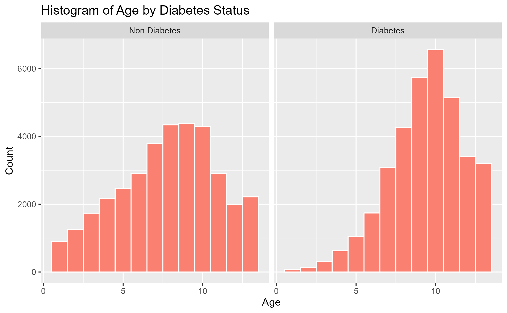

```{r, include=FALSE,eval=FALSE}
options(tinytex.verbose = TRUE)
options(dplyr.summarise.inform = FALSE)
```

```{r setup, include=FALSE,eval=FALSE}
library(magrittr)
library(dplyr)
library(tidyverse) 
library(sjmisc)
library(ggplot2)
library(reshape2)
library(gapminder)
library(mosaic)
library(extraDistr)
library(caret)
library(modelr)
library(parallel)
library(foreach)
library(rsample)
library(lubridate)
library(olsrr)
library(rpart)
library(rpart.plot)
library(randomForest)
library(gbm)
library(gamlr)
library(arules)
library(knitr)
```

# 1. Introduction

## 1-1. Background

Diabetes is a prevalent chronic disease in the US, affecting millions of people and placing a significant financial burden on the economy. It is characterized by the inability to regulate glucose levels in the blood due to insufficient insulin production or ineffective use of insulin. High blood sugar levels can lead to complications such as heart disease, vision loss, lower-limb amputation, and kidney disease. While there is no cure for diabetes, lifestyle changes and medical treatments can help mitigate its harms. Early diagnosis is important, and predictive models for diabetes risk can aid public health officials. Type II diabetes is the most common form, and its prevalence varies by social determinants of health such as age, education, income, race, and location. Diabetes also has a disproportionate impact on those of lower socioeconomic status. The economic burden of diabetes is significant, with costs exceeding $400 billion annually.

Here are some statistics on diabetes in the USA:<br>
* As of 2021, approximately 34.2 million Americans, or 10.5% of the population, have diabetes.<br>
* About 90-95% of cases are type II diabetes.<br>
* Another 88 million American adults, or 34.5% of the population, have prediabetes.
* 1 in 5 people with diabetes, and 8 in 10 people with prediabetes, are unaware of their condition.<br>
* Diabetes is also more common among people with lower income and education levels.
* Diabetes is the seventh leading cause of death in the United States.<br>
* In 2017, the total cost of diagnosed diabetes in the United States was estimated to be $327 billion.<br>

So given this statistics, we know that it is important to identify the key factors that lead to diabetes. Also if we can develop a predictive model that gives an idea how we can predict the chance of developing diabetes, we can take necessary actions to prevent diabetes as this disease is not curable. 

## 1-2. Our Objectives and findings

Our questions that we would like to answer and main findings in this paper are as follow:

**[Objectives]**

* Can we develop a predictive model of diabetes?<br>
* Can we assign a risk score for an individual given we know his/her individual  biological & behavioral characteristics? <br>
* What risk factors are most predictive of diabetes risk?<br>

**[Findings]**

* Patients: Diabetes models can help patients understand their risk of developing the disease, make informed lifestyle choices, and take steps to prevent or manage the disease.<br>
* Healthcare providers: Predictive models can help healthcare providers identify patients who are at high risk of developing diabetes, allowing for earlier interventions and better disease management.<br>
* Public health officials: Modeling diabetes can help public health officials understand the patterns and trends of the disease, identify populations at high risk, and develop targeted prevention and treatment strategies.<br>
* Researchers: By analyzing data from diabetes models, researchers can gain insights into the underlying causes of the disease, identify new risk factors, and develop more effective treatments.<br>

To achieve the objective of our project, we are expecting to do the following:<br>
**1. Visualize data:** By using visualization techniques such as scatter plot, hit maps, clusters etc we can identify the relationship between different biological, behavioral & demographic and diabetes. <br>
**2. Predictive model:** Using different predictive models such as linear regression, KNN regression, random forest, logistic regression, decision tree models, we shall come up with predicting diabetes.<br>
 **3. Identifying importance of different factors:** We can use PCA, partial dependence plot etc to identify the marginal effects of different variables on diabetes.<br>
**4. Develop a risk score:** based on the individual characteristics we will develop a risk score & based on the risk score we can give early signal whether an individual is within the risk zone of developing diabetes.<br>


# 2. Data and Model

## 2-1. Data

**Nature of Data:** Dataset includes 70,692 observations of US individuals 50% of whom are diabetic patients (others are not).  These data were collected by BEHAVIORAL RISK FACTOR SURVEILLANCE SYSTEM in assistance with Chronic Disease Center. There are total 21 variables. The variables are defined as follows:
Diabetes_binary: A binary variable indicating presence of diabetes by 1 & absence by 0.

*HighBP,HighChol*,Smoker (Have you smoked at least 100 cigarettes in your entire life? 0 = no 1 = yes), Stroke, HeartDisease PhysActiv, Fruits, Veggies, HvyAlcoholConsump, AnyHealthcare, NoDocbcCost, DiffWalk (Any difficulty on walking, 1 indicate presence of difficulty) - all are binary variables where 1 indicate presence of the factor and 0 indicates absence. Cholcheck is also a binary variable where 0 = no cholesterol check in 5 years 1 = yes cholesterol check in 5 years

*BMI :* Body Mass index is a measure of body fat based on height and weight that applies to adult men and women. Here, BMI had minimum value of 12 & maximum value of 98. BMI more than 25 is considered obese. 
General Health: A measure of general health situation, 1=Excellent, 2=Very Good, 3=Good, 4=Fair, 5=Poor.  

*Mental Health:* During the past 30 days, for about how many days did poor physical or mental health keep an individual from doing your usual activities, such as self-care, work, or recreation? A value from 0 to 30 where 0 indicates bests mental health & 30 indicates worst. 

*Physical Health:* for how many days during the past 30 days was the individual’s physical health not good? A value from 0 to 30 where higher the value worse the physical health.

**Demographic Variables:**

*Sex:* patient's gender (1: male; 0: female). 

*Age:* 13-level age category ,where 1 = 18-24 9 = 60-64 13 = 80 or older etc. 

*Education:* A value that ranges from 1 to 6. Higher the value higher the level of education. 1= Never attended school or only kindergarten, 2 = Grades 1 through 8 (Elementary) 3 =Grades 9 through 11 (Some high school), 4= Grade 12 or GED (High school graduate), 5= College 1 year to 3 years (Some college or technical school), 6= College 4 years or more (College graduate)

*Income:* Indicates level of annual income for the households where 1= income less than \$10000, 2= \$10,000 to less than \$15,000, 3= \$15,000 to less than \$20,000, 4= \$20,000 to less than \$25,000, 5= \$25,000 to less than \$35,000, 6= \$35,000 to less than \$50,000, 7= \$50,000 to less than \$75,000, 8= 75,000 or more

In the following, we shows histograms conunting of some characteristics by diabees status from the raw data.

```{r, echo=FALSE, message=FALSE, warning=FALSE, results='hide',eval=FALSE}
diabetes <- read.csv("./data/diabetes.csv")
#ge_labels <- c("18-24", "25-29", "30-34", "35-39", "40-44", "45-49", "50-54", "55-59", "60-64", "65-69", "70-74", "75-79", "80+")

ggplot(diabetes, aes(x = Age)) +
  geom_histogram(bins = 13, color = "white", fill = "salmon") +
  facet_wrap(~ Diabetes_binary, labeller = labeller(Diabetes_binary = c("0" = "Non Diabetes", "1" = "Diabetes"))) +
  labs(title = "Histogram of Age by Diabetes Status", y = "Count")
ggsave("./fig/hist_age.png")

ggplot(diabetes, aes(x = Education)) +
  geom_histogram(bins = 13, color = "white", fill = "dodgerblue") +
  facet_wrap(~ Diabetes_binary, labeller = labeller(Diabetes_binary = c("0" = "Non Diabetes", "1" = "Diabetes"))) +
  labs(title = "Histogram of Education by Diabetes Status", y = "Count")
ggsave("./fig/hist_education.png")

ggplot(diabetes, aes(x = Income)) +
  geom_histogram(bins = 13, color = "white", fill = "aquamarine2") +
  facet_wrap(~ Diabetes_binary, labeller = labeller(Diabetes_binary = c("0" = "Non Diabetes", "1" = "Diabetes"))) +
  labs(title = "Histogram of Income by Diabetes Status", y = "Count")
ggsave("./fig/hist_income.png")

ggplot(diabetes, aes(x = BMI)) +
  geom_histogram(bins = 13, color = "white", fill = "gold") +
  facet_wrap(~ Diabetes_binary, labeller = labeller(Diabetes_binary = c("0" = "Non Diabetes", "1" = "Diabetes"))) +
  labs(title = "Histogram of BMI by Diabetes Status", y = "Count")
ggsave("./fig/hist_bmi.png")
```

```{r, echo=FALSE,out.width ="50%", out.height = "70%",fig.align='center'}

knitr::include_graphics("./fig/hist_education.png")
knitr::include_graphics("./fig/hist_income.png")
knitr::include_graphics("./fig/hist_bmi.png")
```

## 2-2. Model

# 3. Result

## 3-1. Best Diabete Prediction


### 3-1-2. Linear model regression

First, to find the best combination of variables for the model, we used stepwise selection. And we got the best model from the point of AIC view, which is so complex, and so we shows it in the [Appendix](## 6-1. Stewise selection model).

```{r , eval=FALSE,echo=FALSE,fig.width =5.5, fig.height = 2,fig.align='center'}
## Linear regression and Knn regression
# standarized
data <- diabetes[,2:22]
scale_train = apply(data, 2, sd) # calculate std dev for each column
data_tilde = scale(data , scale = scale_train) %>% as.data.frame
data_cv <- as.data.frame(c(diabetes[1],data_tilde))

# Split
diabetes_split = initial_split(data_cv, prop = 0.8)
diabetes_train = training(diabetes_split)
diabetes_test = testing(diabetes_split)

## Varialbe Selection
#Find some good model through stepwise(which variable should be included?)
#It took about 2hours to execute this code!
lm_medium = lm(Diabetes_binary ~ ., data=diabetes_train)
lm_step = step(lm_medium, scope=~(.)^2, data=diabetes_test)

# From this result, I got the following model is the best
# Step:  AIC=-100451.2
# Diabetes_binary ~ HighBP + HighChol + CholCheck + BMI + Smoker + 
#     Stroke + HeartDiseaseorAttack + PhysActivity + Fruits + Veggies + 
#     HvyAlcoholConsump + AnyHealthcare + NoDocbcCost + GenHlth + 
#     MentHlth + PhysHlth + DiffWalk + Sex + Age + Education + 
#     Income + GenHlth:DiffWalk + BMI:Age + Sex:Age + HighChol:Age + 
#     GenHlth:Income + BMI:DiffWalk + HighBP:HeartDiseaseorAttack + 
#     DiffWalk:Age + GenHlth:PhysHlth + HvyAlcoholConsump:Age + 
#     CholCheck:GenHlth + GenHlth:Sex + HighChol:HeartDiseaseorAttack + 
#     HighChol:GenHlth + HeartDiseaseorAttack:Age + Smoker:GenHlth + 
#     HeartDiseaseorAttack:GenHlth + Fruits:Education + HeartDiseaseorAttack:DiffWalk + 
#     HighBP:HvyAlcoholConsump + HighChol:Stroke + AnyHealthcare:Education + 
#     HighBP:CholCheck + Smoker:Education + BMI:HeartDiseaseorAttack + 
#     BMI:Smoker + MentHlth:DiffWalk + CholCheck:BMI + HighChol:BMI + 
#     HighBP:HighChol + Fruits:Age + PhysActivity:Fruits + Stroke:GenHlth + 
#     HighBP:Sex + Stroke:Age + HeartDiseaseorAttack:NoDocbcCost + 
#     CholCheck:Age + CholCheck:HeartDiseaseorAttack + Fruits:Sex + 
#     HvyAlcoholConsump:GenHlth + HighChol:MentHlth + HighBP:AnyHealthcare + 
#     HighBP:Education + Smoker:Stroke + PhysActivity:Age + PhysActivity:Education + 
#     CholCheck:AnyHealthcare + Veggies:NoDocbcCost + BMI:Sex + 
#     MentHlth:Income + PhysHlth:Income + NoDocbcCost:DiffWalk + 
#     BMI:MentHlth + HighChol:Sex + Sex:Education + Smoker:Sex + 
#     PhysHlth:Age + MentHlth:Age + HeartDiseaseorAttack:PhysHlth + 
#     PhysActivity:PhysHlth + Stroke:MentHlth + BMI:NoDocbcCost + 
#     AnyHealthcare:Age + BMI:PhysActivity + Smoker:DiffWalk + 
#     Smoker:Age + Smoker:HvyAlcoholConsump + AnyHealthcare:DiffWalk + 
#     AnyHealthcare:PhysHlth + Stroke:HeartDiseaseorAttack + PhysActivity:Income
```

Also, we compared three model with the cross-Validation, the linear model of this stepwised model and the basic model (which simply includes all variables), and Knn regression model. These rmse of three model is as follow:

```{r , eval=FALSE,echo=FALSE,fig.width =5.5, fig.height = 2,fig.align='center'}
## Linear regression and K-CV for the best selected model
# K-CV
K_folds = 5
diabetes_folds = crossv_kfold(data_cv, k=K_folds)

# Linear regression of some model found by step wise
model_step_cv = map(diabetes_folds$train, ~ lm(Diabetes_binary ~ HighBP + HighChol + CholCheck + BMI + Smoker + 
    Stroke + HeartDiseaseorAttack + PhysActivity + Fruits + Veggies + 
    HvyAlcoholConsump + AnyHealthcare + NoDocbcCost + GenHlth + 
    MentHlth + PhysHlth + DiffWalk + Sex + Age + Education + 
    Income + GenHlth:DiffWalk + BMI:Age + Sex:Age + HighChol:Age + 
    GenHlth:Income + BMI:DiffWalk + HighBP:HeartDiseaseorAttack + 
    DiffWalk:Age + GenHlth:PhysHlth + HvyAlcoholConsump:Age + 
    CholCheck:GenHlth + GenHlth:Sex + HighChol:HeartDiseaseorAttack + 
    HighChol:GenHlth + HeartDiseaseorAttack:Age + Smoker:GenHlth + 
    HeartDiseaseorAttack:GenHlth + Fruits:Education + HeartDiseaseorAttack:DiffWalk +
    HighBP:HvyAlcoholConsump + HighChol:Stroke + AnyHealthcare:Education + 
    HighBP:CholCheck + Smoker:Education + BMI:HeartDiseaseorAttack + 
    BMI:Smoker + MentHlth:DiffWalk + CholCheck:BMI + HighChol:BMI + 
    HighBP:HighChol + Fruits:Age + PhysActivity:Fruits + Stroke:GenHlth + 
    HighBP:Sex + Stroke:Age + HeartDiseaseorAttack:NoDocbcCost + 
    CholCheck:Age + CholCheck:HeartDiseaseorAttack + Fruits:Sex + 
    HvyAlcoholConsump:GenHlth + HighChol:MentHlth + HighBP:AnyHealthcare + 
    HighBP:Education + Smoker:Stroke + PhysActivity:Age + PhysActivity:Education + 
    CholCheck:AnyHealthcare + Veggies:NoDocbcCost + BMI:Sex + 
    MentHlth:Income + PhysHlth:Income + NoDocbcCost:DiffWalk + 
    BMI:MentHlth + HighChol:Sex + Sex:Education + Smoker:Sex + 
    PhysHlth:Age + MentHlth:Age + HeartDiseaseorAttack:PhysHlth + 
    PhysActivity:PhysHlth + Stroke:MentHlth + BMI:NoDocbcCost + 
    AnyHealthcare:Age + BMI:PhysActivity + Smoker:DiffWalk + 
    Smoker:Age + Smoker:HvyAlcoholConsump + AnyHealthcare:DiffWalk + 
    AnyHealthcare:PhysHlth + Stroke:HeartDiseaseorAttack + PhysActivity:Income,data=.))

rmse_step_cv = mean(map2_dbl(model_step_cv, diabetes_folds$test, modelr::rmse))

# Linear regression of some model found by step wise
model_lm1_cv = map(diabetes_folds$train, ~ lm(Diabetes_binary ~ .,data=.))
rmse_lm1_cv = mean(map2_dbl(model_lm1_cv , diabetes_folds$test, modelr::rmse))


# Knn regression of some model found by step wise
model_knncv = foreach(k = 1:2, .combine='rbind') %do% {
  model_cv = map(diabetes_folds$train, ~ knnreg(Diabetes_binary ~  HighBP + HighChol + CholCheck + BMI + Smoker + 
    Stroke + HeartDiseaseorAttack + PhysActivity + Fruits + Veggies + 
    HvyAlcoholConsump + AnyHealthcare + NoDocbcCost + GenHlth + 
    MentHlth + PhysHlth + DiffWalk + Sex + Age + Education + 
    Income + GenHlth:DiffWalk + BMI:Age + Sex:Age + HighChol:Age + 
    GenHlth:Income + BMI:DiffWalk + HighBP:HeartDiseaseorAttack + 
    DiffWalk:Age + GenHlth:PhysHlth + HvyAlcoholConsump:Age + 
    CholCheck:GenHlth + GenHlth:Sex + HighChol:HeartDiseaseorAttack + 
    HighChol:GenHlth + HeartDiseaseorAttack:Age + Smoker:GenHlth + 
    HeartDiseaseorAttack:GenHlth + Fruits:Education + HeartDiseaseorAttack:DiffWalk +
    HighBP:HvyAlcoholConsump + HighChol:Stroke + AnyHealthcare:Education + 
    HighBP:CholCheck + Smoker:Education + BMI:HeartDiseaseorAttack + 
    BMI:Smoker + MentHlth:DiffWalk + CholCheck:BMI + HighChol:BMI + 
    HighBP:HighChol + Fruits:Age + PhysActivity:Fruits + Stroke:GenHlth + 
    HighBP:Sex + Stroke:Age + HeartDiseaseorAttack:NoDocbcCost + 
    CholCheck:Age + CholCheck:HeartDiseaseorAttack + Fruits:Sex + 
    HvyAlcoholConsump:GenHlth + HighChol:MentHlth + HighBP:AnyHealthcare + 
    HighBP:Education + Smoker:Stroke + PhysActivity:Age + PhysActivity:Education + 
    CholCheck:AnyHealthcare + Veggies:NoDocbcCost + BMI:Sex + 
    MentHlth:Income + PhysHlth:Income + NoDocbcCost:DiffWalk + 
    BMI:MentHlth + HighChol:Sex + Sex:Education + Smoker:Sex + 
    PhysHlth:Age + MentHlth:Age + HeartDiseaseorAttack:PhysHlth + 
    PhysActivity:PhysHlth + Stroke:MentHlth + BMI:NoDocbcCost + 
    AnyHealthcare:Age + BMI:PhysActivity + Smoker:DiffWalk + 
    Smoker:Age + Smoker:HvyAlcoholConsump + AnyHealthcare:DiffWalk + 
    AnyHealthcare:PhysHlth + Stroke:HeartDiseaseorAttack + PhysActivity:Income, k=k, data = ., use.all=FALSE))
  errs_cv = map2_dbl(model_cv, diabetes_folds$test, modelr::rmse)
  c(k=k, err = mean(errs_cv), std_err = sd(errs_cv)/sqrt(K_folds))
} %>% as.data.frame

# Comparison of RMSE
knn_min_rmse=model_knncv[model_knncv$err==min(model_knncv$err),]
result_cv =c(rmse_lm1_cv,knn_min_rmse[2])
```

```{r, echo=FALSE,out.width ="50%", out.height = "70%",fig.align='center'}
knitr::kable(cbind( RMSE_stndard=0.415,RMSE_step=0.411, RMSE_KNN=0.500))
```

where the optimal k is $2$. From the above the result, it is safe to say the stepwise model is the best predictive model so far.

### 2-3-2. Logit model comparison

Next to find better predictive model, 

```{r ,  eval=FALSE,include=FALSE}

## Linear Probability Model
lm_db <- lm(Diabetes_binary~ HighBP + HighChol + CholCheck + BMI + Smoker + 
    Stroke + HeartDiseaseorAttack + PhysActivity + Fruits + Veggies + 
    HvyAlcoholConsump + AnyHealthcare + NoDocbcCost + GenHlth + 
    MentHlth + PhysHlth + DiffWalk + Sex + Age + Education + 
    Income + GenHlth:DiffWalk + BMI:Age + Sex:Age + HighChol:Age + 
    GenHlth:Income + BMI:DiffWalk + HighBP:HeartDiseaseorAttack + 
    DiffWalk:Age + GenHlth:PhysHlth + HvyAlcoholConsump:Age + 
    CholCheck:GenHlth + GenHlth:Sex + HighChol:HeartDiseaseorAttack + 
    HighChol:GenHlth + HeartDiseaseorAttack:Age + Smoker:GenHlth + 
    HeartDiseaseorAttack:GenHlth + Fruits:Education + HeartDiseaseorAttack:DiffWalk +
    HighBP:HvyAlcoholConsump + HighChol:Stroke + AnyHealthcare:Education + 
    HighBP:CholCheck + Smoker:Education + BMI:HeartDiseaseorAttack + 
    BMI:Smoker + MentHlth:DiffWalk + CholCheck:BMI + HighChol:BMI + 
    HighBP:HighChol + Fruits:Age + PhysActivity:Fruits + Stroke:GenHlth + 
    HighBP:Sex + Stroke:Age + HeartDiseaseorAttack:NoDocbcCost + 
    CholCheck:Age + CholCheck:HeartDiseaseorAttack + Fruits:Sex + 
    HvyAlcoholConsump:GenHlth + HighChol:MentHlth + HighBP:AnyHealthcare + 
    HighBP:Education + Smoker:Stroke + PhysActivity:Age + PhysActivity:Education + 
    CholCheck:AnyHealthcare + Veggies:NoDocbcCost + BMI:Sex + 
    MentHlth:Income + PhysHlth:Income + NoDocbcCost:DiffWalk + 
    BMI:MentHlth + HighChol:Sex + Sex:Education + Smoker:Sex + 
    PhysHlth:Age + MentHlth:Age + HeartDiseaseorAttack:PhysHlth + 
    PhysActivity:PhysHlth + Stroke:MentHlth + BMI:NoDocbcCost + 
    AnyHealthcare:Age + BMI:PhysActivity + Smoker:DiffWalk + 
    Smoker:Age + Smoker:HvyAlcoholConsump + AnyHealthcare:DiffWalk + 
    AnyHealthcare:PhysHlth + Stroke:HeartDiseaseorAttack + PhysActivity:Income, data = data_cv)
phat_test_lm = predict(lm_db, data_cv, type='response')
yhat_test_lm = ifelse(phat_test_lm > 0.5, 1, 0)
confusion_out_lm = table(y = data_cv$Diabetes_binary ,yhat = yhat_test_lm )

## Other linear model -> accuracy rate does not change
# lm_db2 <- lm(Diabetes_binary~ ., data = data_cv)
# phat_test_lm2 = predict(lm_db2, data_cv, type='response')
# yhat_test_lm2 = ifelse(phat_test_lm2 > 0.5, 1, 0)
# confusion_out_lm2 = table(y = data_cv$Diabetes_binary ,yhat = yhat_test_lm )
#accuracy_lm2 = 1- (confusion_out_lm2[2,1]+confusion_out_lm2[1,2])/sum(confusion_out_lm2)

## Logit Model
logit_db <- glm(Diabetes_binary~ ., data = data_cv, family=binomial)
phat_test_logit = predict(logit_db, data_cv, type='response')
yhat_test_logit = ifelse(phat_test_logit> 0.5, 1, 0)
confusion_out_logit = table(y = data_cv$Diabetes_binary, yhat = yhat_test_logit)

## Accuracy
accuracy_lm = 1- (confusion_out_lm[2,1]+confusion_out_lm[1,2])/sum(confusion_out_lm)
accuracy_logit = 1- (confusion_out_logit[2,1]+confusion_out_logit[1,2])/sum(confusion_out_logit)

## TPR
TPR_lm = (confusion_out_lm[2,2])/(confusion_out_lm[2,1]+confusion_out_lm[2,2])
TPR_logit =  (confusion_out_logit[2,2])/(confusion_out_logit[2,1]+confusion_out_logit[2,2])

## FPR
FPR_lm = (confusion_out_lm[1,2])/(confusion_out_lm[1,1]+confusion_out_lm[1,2])
FPR_logit = (confusion_out_logit[1,2])/(confusion_out_logit[1,1]+confusion_out_logit[1,2])

## FDR
FDR_lm =  (confusion_out_lm[1,2])/(confusion_out_lm[1,2]+confusion_out_lm[2,2])
FDR_logit =  (confusion_out_logit[1,2])/(confusion_out_lm[1,2]+confusion_out_lm[2,2])
```

```{r, echo=FALSE,out.width ="50%", out.height = "70%",fig.align='center'}
table <- matrix(c(0.753, 0.748, 0.790, 0.768,0.282,0.272,0.263,0.253), nrow = 4, ncol = 2, byrow = TRUE)
rownames(table) <- c("accuracy", "TPR","FPR","FDR")
colnames(table) <- c("Linear", "Logit")
knitr::kable(table,caption = "the output of LPM and Logit")
```

From these tables, the accuracy rate of the linear model is 0.753(=75.3%) and that of the logit model is 0.748(=74.8%). Also, each true positive rate (TPR) is 0.79 and 0.768, each false positive rate (FPR) is 0.282 (=Specificity: 70.8%) and 0.272 (=Specificity: 72.8%), and each false discovery rate (FDR) is 0.263 (=Precision: 73.7%) and 0.253 (=Precision: 74.7%).

Therefore, from the result, the linear model can be better than the logit model because the linear model has the lowest rmse and the ability of the prediction for diabetes. However, we need to careful about what sometimes the logit model will be better. (if you have an interest ROC curve, see [Appendix](## 6-2. ROC curve linear vs logit))


# 4. Conclusion

# 5. Reference

# 6. Appendix

## 6-1. Stewise selection model

The model tha we got from the setpwise selection in 3-1 is as follow:

$$
\begin{aligned}
 Diabetes_binary &= \beta_0 + \beta [ HighBP + HighChol + CholCheck +\\BMI + Smoker + 
     &Stroke + HeartDiseaseorAttack + PhysActivity + Fruits + Veggies \\+ 
     &HvyAlcoholConsump + AnyHealthcare + NoDocbcCost + GenHlth + \\
     &MentHlth + PhysHlth + DiffWalk + Sex + Age + Education + \\
     &Income + GenHlth\cdot DiffWalk \\& + BMI\cdot Age + Sex\cdot Age + HighChol\cdot Age +\\ 
   &GenHlth\cdot Income + BMI\cdot DiffWalk \\& + HighBP\cdot HeartDiseaseorAttack + \\
     &DiffWalk\cdot Age + GenHlth\cdot PhysHlth \\& + HvyAlcoholConsump\cdot Age + \\
     &CholCheck\cdot GenHlth + GenHlth\cdot Sex \\& + HighChol\cdot HeartDiseaseorAttack +\\ 
     &HighChol\cdot GenHlth + HeartDiseaseorAttack\cdot Age + Smoker\cdot GenHlth + \\
     &HeartDiseaseorAttack\cdot GenHlth \\& + Fruits\cdot Education + HeartDiseaseorAttack\cdot DiffWalk +\\&HighBP\cdot HvyAlcoholConsump \\& + HighChol\cdot Stroke + AnyHealthcare\cdot Education +\\ 
    & HighBP\cdot CholCheck + Smoker\cdot Education + BMI\cdot HeartDiseaseorAttack + \\
     &BMI\cdot Smoker + MentHlth\cdot DiffWalk \\& + CholCheck\cdot BMI + HighChol\cdot BMI + \\
     &HighBP\cdot HighChol + Fruits\cdot Age \\& + PhysActivity\cdot Fruits + Stroke\cdot GenHlth + \\ 
     &HighBP\cdot Sex + Stroke\cdot Age \\& + HeartDiseaseorAttack\cdot NoDocbcCost + \\
     &CholCheck\cdot Age + CholCheck\cdot HeartDiseaseorAttack \\& + Fruits\cdot Sex + \\
     &HvyAlcoholConsump\cdot GenHlth \\& + HighChol\cdot MentHlth \\& + HighBP\cdot AnyHealthcare + \\ 
     &HighBP\cdot Education + Smoker\cdot Stroke \\& + PhysActivity\cdot Age + PhysActivity\cdot Education + \\
     &CholCheck\cdot AnyHealthcare + Veggies\cdot NoDocbcCost + BMI\cdot Sex + \\
     &MentHlth\cdot Income + PhysHlth\cdot Income + NoDocbcCost\cdot DiffWalk + \\
     &BMI\cdot MentHlth + HighChol\cdot Sex \\& + Sex\cdot Education + Smoker\cdot Sex + \\
     &PhysHlth\cdot Age + MentHlth\cdot Age \\& + HeartDiseaseorAttack\cdot PhysHlth + \\ 
     &PhysActivity\cdot PhysHlth + Stroke\cdot MentHlth + BMI\cdot NoDocbcCost + \\
     &AnyHealthcare\cdot Age + BMI\cdot PhysActivity + Smoker\cdot DiffWalk + \\
     &Smoker\cdot Age + Smoker\cdot HvyAlcoholConsump \\& + AnyHealthcare\cdot DiffWalk +\\ 
     &AnyHealthcare\cdot PhysHlth + Stroke\cdot HeartDiseaseorAttack + \\ &PhysActivity\cdot Income]+\varepsilon
\end{aligned}
$$

## 6-2. ROC curve linear vs logit

```{r ,  eval=FALSE,include=FALSE}

roc = data.frame()

for (i in seq(0, 1, by = 0.01)){
  ## Linear Probability Model
  lm_db <- lm(Diabetes_binary~ HighBP + HighChol + CholCheck + BMI + Smoker + 
      Stroke + HeartDiseaseorAttack + PhysActivity + Fruits + Veggies + 
      HvyAlcoholConsump + AnyHealthcare + NoDocbcCost + GenHlth + 
      MentHlth + PhysHlth + DiffWalk + Sex + Age + Education + 
      Income + GenHlth:DiffWalk + BMI:Age + Sex:Age + HighChol:Age + 
      GenHlth:Income + BMI:DiffWalk + HighBP:HeartDiseaseorAttack + 
      DiffWalk:Age + GenHlth:PhysHlth + HvyAlcoholConsump:Age + 
      CholCheck:GenHlth + GenHlth:Sex + HighChol:HeartDiseaseorAttack + 
      HighChol:GenHlth + HeartDiseaseorAttack:Age + Smoker:GenHlth + 
      HeartDiseaseorAttack:GenHlth + Fruits:Education + HeartDiseaseorAttack:DiffWalk +
      HighBP:HvyAlcoholConsump + HighChol:Stroke + AnyHealthcare:Education + 
      HighBP:CholCheck + Smoker:Education + BMI:HeartDiseaseorAttack + 
      BMI:Smoker + MentHlth:DiffWalk + CholCheck:BMI + HighChol:BMI + 
      HighBP:HighChol + Fruits:Age + PhysActivity:Fruits + Stroke:GenHlth + 
      HighBP:Sex + Stroke:Age + HeartDiseaseorAttack:NoDocbcCost + 
      CholCheck:Age + CholCheck:HeartDiseaseorAttack + Fruits:Sex + 
      HvyAlcoholConsump:GenHlth + HighChol:MentHlth + HighBP:AnyHealthcare + 
      HighBP:Education + Smoker:Stroke + PhysActivity:Age + PhysActivity:Education + 
      CholCheck:AnyHealthcare + Veggies:NoDocbcCost + BMI:Sex + 
      MentHlth:Income + PhysHlth:Income + NoDocbcCost:DiffWalk + 
      BMI:MentHlth + HighChol:Sex + Sex:Education + Smoker:Sex + 
      PhysHlth:Age + MentHlth:Age + HeartDiseaseorAttack:PhysHlth + 
      PhysActivity:PhysHlth + Stroke:MentHlth + BMI:NoDocbcCost + 
      AnyHealthcare:Age + BMI:PhysActivity + Smoker:DiffWalk + 
      Smoker:Age + Smoker:HvyAlcoholConsump + AnyHealthcare:DiffWalk + 
      AnyHealthcare:PhysHlth + Stroke:HeartDiseaseorAttack + PhysActivity:Income, data = data_cv)
  phat_test_lm = predict(lm_db, data_cv, type='response')
  yhat_test_lm = ifelse(phat_test_lm > i, 1, 0)
  confusion_out_lm = table(y = data_cv$Diabetes_binary ,yhat = yhat_test_lm )
  
  ## Logit Model
  logit_db <- glm(Diabetes_binary~ ., data = data_cv, family=binomial)
  phat_test_logit = predict(logit_db, data_cv, type='response')
  yhat_test_logit = ifelse(phat_test_logit> i, 1, 0)
  confusion_out_logit = table(y = data_cv$Diabetes_binary, yhat = yhat_test_logit)
  
  ## TPR
  TPR_lm = tryCatch({
    (confusion_out_lm[2,2])/(confusion_out_lm[2,1]+confusion_out_lm[2,2])},error=function(e) {"."})
  TPR_logit = tryCatch({ (confusion_out_logit[2,2])/(confusion_out_logit[2,1]+confusion_out_logit[2,2])}, error=function(e) {"."})
  
  ## FPR
  FPR_lm = tryCatch({(confusion_out_lm[1,2])/(confusion_out_lm[1,1]+confusion_out_lm[1,2])}, error=function(e) {"."})
  FPR_logit = tryCatch({(confusion_out_logit[1,2])/(confusion_out_logit[1,1]+confusion_out_logit[1,2])},error=function(e) {"."})
  roc = rbind(rbind(c(i,TPR_lm,TPR_logit,FPR_lm,FPR_logit)),roc)
}
colnames(roc) <- c("TPR_lm","TPR_logit","FPR_lm","FPR_logit")
roc2 =data.frame(cbind(TPR_lm=as.numeric(roc[2:100,]$TPR_lm),FPR_lm=as.numeric(roc[2:100,]$FPR_lm), TPR_logit=as.numeric(roc[2:100,]$TPR_logit), FPR_logit=as.numeric(roc[2:100,]$FPR_logit)))

ggplot(roc2)+geom_line(aes(x=FPR_lm,y=TPR_lm),colour="red")+geom_line(aes(x=FPR_logit,y=TPR_logit),color="blue")+
  ggtitle("ROC curve:linear vs logit")
ggsave("./fig/roc.png")
```

```{r, echo=FALSE,out.width ="70%", out.height = "70%",fig.align='center'}
knitr::include_graphics("./fig/roc.png")
```
The red line of this graph represents the best linear model and the blue line represents the logit model. These gaps are so little but the linear model is slightly better than that the logit model.

