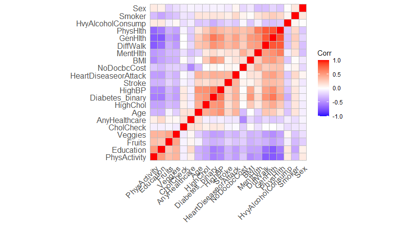
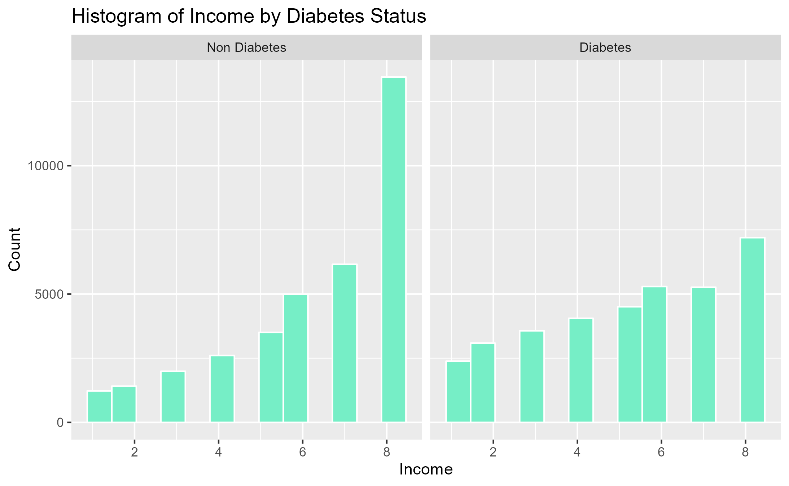
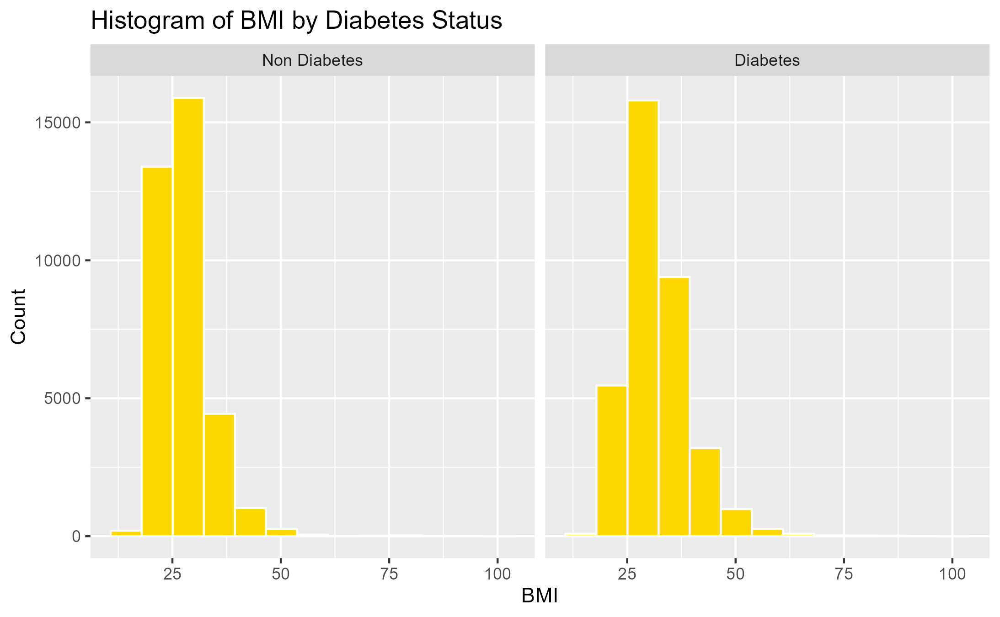
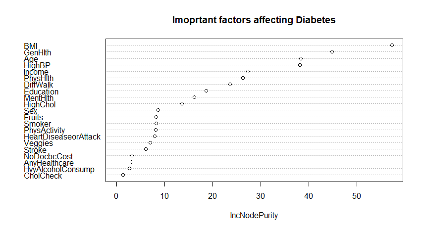
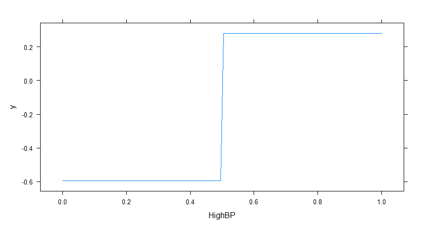
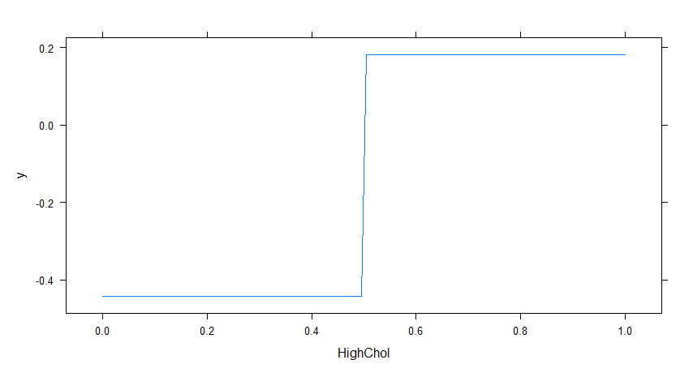

```{r, include=FALSE,eval=FALSE}
 #md_document
options(tinytex.verbose = TRUE)
options(dplyr.summarise.inform = FALSE)
```

```{r setup, include=FALSE,eval=FALSE}
library(magrittr)
library(dplyr)
library(tidyverse) 
library(sjmisc)
library(ggplot2)
library(reshape2)
library(gapminder)
library(mosaic)
library(extraDistr)
library(caret)
library(modelr)
library(parallel)
library(foreach)
library(rsample)
library(lubridate)
library(olsrr)
library(rpart)
library(rpart.plot)
library(randomForest)
library(gbm)
library(gamlr)
library(arules)
library(knitr)
library(tokenizers)
library(stopwords)
library(arulesViz)
library(kableExtra)
```


# 1. Introduction

## 1-1. Background

Diabetes is a prevalent chronic disease in the US. It is characterized by the inability to regulate glucose levels in the blood due to insufficient insulin production or ineffective use of insulin. High blood sugar levels can lead to complications such as heart disease, vision loss, lower-limb amputation, and kidney disease. While there is no cure for diabetes, lifestyle changes and medical treatments can help mitigate its harms. Early diagnosis is important, and predictive models for diabetes risk can aid public health officials. Type II diabetes is the most common form, and its prevalence varies by social determinants of health such as age, education, income, race, and location. Diabetes also has a disproportionate impact on those of lower socioeconomic status. The economic burden of diabetes is significant, with costs exceeding $400 billion annually.

Here are some statistics on diabetes in the USA:<br>
  
* As of 2021, approximately 34.2 million Americans, or 10.5% of the population, have diabetes.<br>

* About 90-95% of cases are type II diabetes.<br>

* Another 88 million American adults, or 34.5% of the population, have prediabetes.<br>


* 1 in 5 people with diabetes, and 8 in 10 people with prediabetes, are unaware of their condition.<br>

* Diabetes is the seventh leading cause of death in the United States.<br>

* In 2017, the total cost of diagnosed diabetes in the United States was estimated to be $327 billion.<br>


So given these statistics, we know that it is important to identify the key factors that lead to diabetes. If we can develop a predictive model that gives an idea how we can predict the chance of developing diabetes, we can take necessary actions to prevent diabetes. The finding will be quite useful for patients, healthcare providers or physicians as this disease is not curable. So people can take necessary actions accordingly to prevent this chronic disease.


## 1-2. Our Objectives and findings

**The objectives of this paper are as follow:**

* Can we develop a predictive model of diabetes?<br>

* Can we assign a risk score for an individual given we know his/her individual biological & demographic characteristics?<br>

* What risk factors are most predictive of diabetes risk?<br>

**Our findings will be useful for the following stakeholders:**

* Patients: Diabetes models can help patients understand their risk of developing the disease, make informed lifestyle choices, and take steps to prevent or manage the disease.<br>

* Healthcare providers: Predictive models can help healthcare providers identify patients who are at high risk of developing diabetes, allowing for earlier interventions and better disease management.<br>

* Public health officials: Modeling diabetes can help public health officials understand the patterns and trends of the disease, identify populations at high risk, and develop targeted prevention and treatment strategies.<br>

* Researchers: By analyzing data from diabetes models, researchers can gain insights into the underlying causes of the disease, identify new risk factors, and develop more effective treatments.<br>

# 2. Methods: Data and Model

## 2-1. Data

**Nature of Data:** 50% of them had diabetes & the rest did not. [These data were collected by BEHAVIORAL RISK FACTOR SURVEILLANCE SYSTEM in assistance with Chronic Disease Center](https://www.kaggle.com/datasets/alexteboul/diabetes-health-indicators-dataset). There are total 21 variables. There are a total 21 variables. The variables are defined as follows:

*Diabetes_binary*: A binary variable indicating presence of diabetes by 1 & absence by 0.

*HighBP,HighChol*(Have you smoked at least 100 cigarettes in your entire life? 0 = no 1 = yes), **Stroke, HeartDisease PhysActiv, Fruits, Veggies, HvyAlcoholConsump, AnyHealthcare, NoDocbcCost, DiffWalk** (Any difficulty on walking, 1 indicate presence of difficulty) - all are binary variables where 1 indicate presence of the factor and 0 indicates absence. Cholcheck is also a binary variable where 0 = no cholesterol check in 5 years 1 = yes cholesterol check in 5 years

*BMI:* Body Mass index is a measure of body fat based on height and weight that applies to adult men and women. Here, BMI had a minimum value of 12 & maximum value of 98. BMI more than 25 is considered obese.

**General Health:** A measure of general health situation in which 1=Excellent, 2=Very Good, 3=Good, 4=Fair, 5=Poor.

*Mental Health:* During the past 30 days, for about how many days did poor physical or mental health keep an individual from doing your usual activities, such as self-care, work, or recreation? A value from 0 to 30 where 0 indicates best mental health & 30 indicates worst.

*Physical Health:* for how many days during the past 30 days was the individual’s physical health not good? Responses range from 0 to 30 where higher the value worse the physical health.

**Demographic Variables:**

*Sex:* patient’s gender (1: male; 0: female).

*Age:* 13-level age category ,where 1 = 18-24, 2=25-29, 3= 30-34, 4=35-39, 5=40-44, 6=45-49, 7=50-54, 8=55-59, 9=60-64, 10=65-69, 11=70-74, 12 = 75-79 & 13 = 80 or older etc.

*Education:* A value that ranges from 1 to 6. Higher  value indicates higher level of education. 1= Never attended school or only kindergarten, 2 = Grades 1 through 8 (Elementary) 3 =Grades 9 through 11 (Some high school), 4= Grade 12 or GED (High school graduate), 5= College 1 year to 3 years (Some college or technical school), 6= College 4 years or more (College graduate)

*Income:* Indicates level of annual income for the households where 1= income less than \$10000, 2= \$ 10,000 to less than \$15,000, 3= \$15,000 to less than \$20,000, 4= \$20,000 to less than \$25,000, 5= \$25,000 to less than \$35,000, 6= \$35,000 to less than \$50,000, 7= \$50,000 to less than \$75,000, 8= \$75,000 or more

please see [the Appendix 5-1](#5-1) if you want to see other specific characteristics of the data.

```{r, echo=FALSE, message=FALSE, warning=FALSE, results='hide',eval=FALSE}
diabetes <- read.csv("./data/diabetes.csv")
#ge_labels <- c("18-24", "25-29", "30-34", "35-39", "40-44", "45-49", "50-54", "55-59", "60-64", "65-69", "70-74", "75-79", "80+")

ggplot(diabetes, aes(x = Age)) +
  geom_histogram(bins = 13, color = "white", fill = "salmon") +
  facet_wrap(~ Diabetes_binary, labeller = labeller(Diabetes_binary = c("0" = "Non Diabetes", "1" = "Diabetes"))) +
  labs(title = "Histogram of Age by Diabetes Status", y = "Count")
ggsave("./fig/hist_age.png")

ggplot(diabetes, aes(x = Education)) +
  geom_histogram(bins = 13, color = "white", fill = "dodgerblue") +
  facet_wrap(~ Diabetes_binary, labeller = labeller(Diabetes_binary = c("0" = "Non Diabetes", "1" = "Diabetes"))) +
  labs(title = "Histogram of Education by Diabetes Status", y = "Count")
ggsave("./fig/hist_education.png")

ggplot(diabetes, aes(x = Income)) +
  geom_histogram(bins = 13, color = "white", fill = "aquamarine2") +
  facet_wrap(~ Diabetes_binary, labeller = labeller(Diabetes_binary = c("0" = "Non Diabetes", "1" = "Diabetes"))) +
  labs(title = "Histogram of Income by Diabetes Status", y = "Count")
ggsave("./fig/hist_income.png")

ggplot(diabetes, aes(x = BMI)) +
  geom_histogram(bins = 13, color = "white", fill = "gold") +
  facet_wrap(~ Diabetes_binary, labeller = labeller(Diabetes_binary = c("0" = "Non Diabetes", "1" = "Diabetes"))) +
  labs(title = "Histogram of BMI by Diabetes Status", y = "Count")
ggsave("./fig/hist_bmi.png")
```


## 2-2. Model

### 2-2-1. Best Predictive Model

Using different predictive models such as linear regression, KNN regression & logistic regression, we will develop a model which is the best for predicting diabetes.

### 2-2-2. Scoring

Based on the best predictive model,  we will develop a risk score & based on the risk score we can give an early signal about the degree of risk exposure a person may have.

We have followed the following steps:

1. Use the estimated coefficients

we used the estimated coefficients the detail  (see [the Appendix 5-2](#5-2)) to estimate the probability of diabetes for individuals with a linear probability model and the logit model.
$$
\begin{aligned}
\hat{y}= \beta_0+\beta_1 (each\ variables)+ \beta_2 (cross\ temrs(only\ LPM))
\end{aligned}
$$

2. 100 scaled (for only the Linear Probability model)

To show $\hat{y}$ as a score in the linear probability model, we scaled it into the format 0-100 points.
$$
\begin{aligned}
score&= 100\hat{y}\\ where\ &if\ \hat{y}>100,\ then\ score=100\\
&if \hat{y}<0,\ then\ score=0
\end{aligned}
$$

3. Risk score:

We defined and classified the risk score for individuals: 0-25=”Low Risk”, 26-50=”Moderate Risk”, 51-75= “High Risk”, 76-100=”Very High Risk” 

### 2-2-3. Identifying critical factors responsible for diabetes

We have used correlation matrix, PCA, partial dependence plot etc to identify the factors responsible for diabetes. 

### 2-2-4. Factors related to "diabetes"

We used the Natural Language Processing to identify factors that are much related to "diabetes". This is because if we can get additionally data of them, we can estimate our model more preciously.

To do that, at first, we collected data of the abstract of the recent academic paper with the keyword "diabetes" from the [Pubmed](https://pubmed.ncbi.nlm.nih.gov/). Specifically, we used the application of [Publish or Perish 8](https://harzing.com/resources/publish-or-perish/), put "diabetes" into the "Keywords" and get information of the 1000 medical papers with "diabetes" keyword from 2022 to 2023.

Next, we excluded blank data and stopwords of "stopwords" library, and tokenized their abstracts using "tokenizers" library. So there were 950 papers.

After that, we applied "apriori" function for data that we got with support =.02, confidence=.001, and extract some data from them with lift>4. Then we showed the node graph that told us words that related to the word “diabetes” with [Gephi](https://gephi.org/).

Finally, from the node graph, we got factors that are related to “diabetes”, and identified the additional factors while comparing them to our current factors of data.

Note: We did not use “Google Scholar” to collect in Publish or Perish as it did not give us all the abstract data of each paper. Also, Publish or Perish can only get up to 1000 data.


# 3. Results

## 3-1. Best Prediction Model for Diabetes


### 3-1-1. Linear model regression and KNN regression

First, to find the best combination of variables for the model, we used stepwise selection. We got the best model based on  AIC criteria, which is so complex that we have shown it in [the Appendix 5-2](#5-2).

```{r , eval=FALSE,echo=FALSE,fig.width =5.5, fig.height = 2,fig.align='center'}
## Linear regression and Knn regression
# standarized
data <- diabetes[,2:22]
scale_train = apply(data, 2, sd) # calculate std dev for each column
data_tilde = scale(data , scale = scale_train) %>% as.data.frame
data_cv <- as.data.frame(c(diabetes[1],data_tilde))
```

```{r , eval=FALSE,echo=FALSE,fig.width =5.5, fig.height = 2,fig.align='center'}
# Split
diabetes_split = initial_split(data_cv, prop = 0.8)
diabetes_train = training(diabetes_split)
diabetes_test = testing(diabetes_split)

## Variable Selection needs so much time to execute
# if you want to get the data as we got, please load the RData in the following URL
#https://drive.google.com/file/d/1CUgKez73Y_T8FpmUhYUBbs0wxl6glEiS/view?usp=sharing

## Varialbe Selection
#Find some good model through stepwise(which variable should be included?)
#It took about 2hours to execute this code!
lm_medium = lm(Diabetes_binary ~ ., data=diabetes_train)
lm_step = step(lm_medium, scope=~(.)^2, data=diabetes_test)

# From this result, I got the following model is the best
# Step:  AIC=-100451.2
# Diabetes_binary ~ HighBP + HighChol + CholCheck + BMI + Smoker + 
#     Stroke + HeartDiseaseorAttack + PhysActivity + Fruits + Veggies + 
#     HvyAlcoholConsump + AnyHealthcare + NoDocbcCost + GenHlth + 
#     MentHlth + PhysHlth + DiffWalk + Sex + Age + Education + 
#     Income + GenHlth:DiffWalk + BMI:Age + Sex:Age + HighChol:Age + 
#     GenHlth:Income + BMI:DiffWalk + HighBP:HeartDiseaseorAttack + 
#     DiffWalk:Age + GenHlth:PhysHlth + HvyAlcoholConsump:Age + 
#     CholCheck:GenHlth + GenHlth:Sex + HighChol:HeartDiseaseorAttack + 
#     HighChol:GenHlth + HeartDiseaseorAttack:Age + Smoker:GenHlth + 
#     HeartDiseaseorAttack:GenHlth + Fruits:Education + HeartDiseaseorAttack:DiffWalk + 
#     HighBP:HvyAlcoholConsump + HighChol:Stroke + AnyHealthcare:Education + 
#     HighBP:CholCheck + Smoker:Education + BMI:HeartDiseaseorAttack + 
#     BMI:Smoker + MentHlth:DiffWalk + CholCheck:BMI + HighChol:BMI + 
#     HighBP:HighChol + Fruits:Age + PhysActivity:Fruits + Stroke:GenHlth + 
#     HighBP:Sex + Stroke:Age + HeartDiseaseorAttack:NoDocbcCost + 
#     CholCheck:Age + CholCheck:HeartDiseaseorAttack + Fruits:Sex + 
#     HvyAlcoholConsump:GenHlth + HighChol:MentHlth + HighBP:AnyHealthcare + 
#     HighBP:Education + Smoker:Stroke + PhysActivity:Age + PhysActivity:Education + 
#     CholCheck:AnyHealthcare + Veggies:NoDocbcCost + BMI:Sex + 
#     MentHlth:Income + PhysHlth:Income + NoDocbcCost:DiffWalk + 
#     BMI:MentHlth + HighChol:Sex + Sex:Education + Smoker:Sex + 
#     PhysHlth:Age + MentHlth:Age + HeartDiseaseorAttack:PhysHlth + 
#     PhysActivity:PhysHlth + Stroke:MentHlth + BMI:NoDocbcCost + 
#     AnyHealthcare:Age + BMI:PhysActivity + Smoker:DiffWalk + 
#     Smoker:Age + Smoker:HvyAlcoholConsump + AnyHealthcare:DiffWalk + 
#     AnyHealthcare:PhysHlth + Stroke:HeartDiseaseorAttack + PhysActivity:Income
```

We also compared three models with the cross-Validation namely - the stepwise linear model, the basic model (which simply includes all variables), and the KNN regression model. Rmse of three models are as given below:

```{r , eval=FALSE,echo=FALSE,fig.width =5.5, fig.height = 2,fig.align='center'}
## Linear regression and K-CV for the best selected model
# K-CV
K_folds = 5
diabetes_folds = crossv_kfold(data_cv, k=K_folds)

# Linear regression of some model found by step wise
model_step_cv = map(diabetes_folds$train, ~ lm(Diabetes_binary ~ HighBP + HighChol + CholCheck + BMI + Smoker + 
    Stroke + HeartDiseaseorAttack + PhysActivity + Fruits + Veggies + 
    HvyAlcoholConsump + AnyHealthcare + NoDocbcCost + GenHlth + 
    MentHlth + PhysHlth + DiffWalk + Sex + Age + Education + 
    Income + GenHlth:DiffWalk + BMI:Age + Sex:Age + HighChol:Age + 
    GenHlth:Income + BMI:DiffWalk + HighBP:HeartDiseaseorAttack + 
    DiffWalk:Age + GenHlth:PhysHlth + HvyAlcoholConsump:Age + 
    CholCheck:GenHlth + GenHlth:Sex + HighChol:HeartDiseaseorAttack + 
    HighChol:GenHlth + HeartDiseaseorAttack:Age + Smoker:GenHlth + 
    HeartDiseaseorAttack:GenHlth + Fruits:Education + HeartDiseaseorAttack:DiffWalk +
    HighBP:HvyAlcoholConsump + HighChol:Stroke + AnyHealthcare:Education + 
    HighBP:CholCheck + Smoker:Education + BMI:HeartDiseaseorAttack + 
    BMI:Smoker + MentHlth:DiffWalk + CholCheck:BMI + HighChol:BMI + 
    HighBP:HighChol + Fruits:Age + PhysActivity:Fruits + Stroke:GenHlth + 
    HighBP:Sex + Stroke:Age + HeartDiseaseorAttack:NoDocbcCost + 
    CholCheck:Age + CholCheck:HeartDiseaseorAttack + Fruits:Sex + 
    HvyAlcoholConsump:GenHlth + HighChol:MentHlth + HighBP:AnyHealthcare + 
    HighBP:Education + Smoker:Stroke + PhysActivity:Age + PhysActivity:Education + 
    CholCheck:AnyHealthcare + Veggies:NoDocbcCost + BMI:Sex + 
    MentHlth:Income + PhysHlth:Income + NoDocbcCost:DiffWalk + 
    BMI:MentHlth + HighChol:Sex + Sex:Education + Smoker:Sex + 
    PhysHlth:Age + MentHlth:Age + HeartDiseaseorAttack:PhysHlth + 
    PhysActivity:PhysHlth + Stroke:MentHlth + BMI:NoDocbcCost + 
    AnyHealthcare:Age + BMI:PhysActivity + Smoker:DiffWalk + 
    Smoker:Age + Smoker:HvyAlcoholConsump + AnyHealthcare:DiffWalk + 
    AnyHealthcare:PhysHlth + Stroke:HeartDiseaseorAttack + PhysActivity:Income,data=.))

rmse_step_cv = mean(map2_dbl(model_step_cv, diabetes_folds$test, modelr::rmse))

# Linear regression of some model found by step wise
model_lm1_cv = map(diabetes_folds$train, ~ lm(Diabetes_binary ~ .,data=.))
rmse_lm1_cv = mean(map2_dbl(model_lm1_cv , diabetes_folds$test, modelr::rmse))

# Knn regression of some model found by step wise
model_knncv = foreach(k = 1:2, .combine='rbind') %do% {
  model_cv = map(diabetes_folds$train, ~ knnreg(Diabetes_binary ~  HighBP + HighChol + CholCheck + BMI + Smoker + 
    Stroke + HeartDiseaseorAttack + PhysActivity + Fruits + Veggies + 
    HvyAlcoholConsump + AnyHealthcare + NoDocbcCost + GenHlth + 
    MentHlth + PhysHlth + DiffWalk + Sex + Age + Education + 
    Income + GenHlth:DiffWalk + BMI:Age + Sex:Age + HighChol:Age + 
    GenHlth:Income + BMI:DiffWalk + HighBP:HeartDiseaseorAttack + 
    DiffWalk:Age + GenHlth:PhysHlth + HvyAlcoholConsump:Age + 
    CholCheck:GenHlth + GenHlth:Sex + HighChol:HeartDiseaseorAttack + 
    HighChol:GenHlth + HeartDiseaseorAttack:Age + Smoker:GenHlth + 
    HeartDiseaseorAttack:GenHlth + Fruits:Education + HeartDiseaseorAttack:DiffWalk +
    HighBP:HvyAlcoholConsump + HighChol:Stroke + AnyHealthcare:Education + 
    HighBP:CholCheck + Smoker:Education + BMI:HeartDiseaseorAttack + 
    BMI:Smoker + MentHlth:DiffWalk + CholCheck:BMI + HighChol:BMI + 
    HighBP:HighChol + Fruits:Age + PhysActivity:Fruits + Stroke:GenHlth + 
    HighBP:Sex + Stroke:Age + HeartDiseaseorAttack:NoDocbcCost + 
    CholCheck:Age + CholCheck:HeartDiseaseorAttack + Fruits:Sex + 
    HvyAlcoholConsump:GenHlth + HighChol:MentHlth + HighBP:AnyHealthcare + 
    HighBP:Education + Smoker:Stroke + PhysActivity:Age + PhysActivity:Education + 
    CholCheck:AnyHealthcare + Veggies:NoDocbcCost + BMI:Sex + 
    MentHlth:Income + PhysHlth:Income + NoDocbcCost:DiffWalk + 
    BMI:MentHlth + HighChol:Sex + Sex:Education + Smoker:Sex + 
    PhysHlth:Age + MentHlth:Age + HeartDiseaseorAttack:PhysHlth + 
    PhysActivity:PhysHlth + Stroke:MentHlth + BMI:NoDocbcCost + 
    AnyHealthcare:Age + BMI:PhysActivity + Smoker:DiffWalk + 
    Smoker:Age + Smoker:HvyAlcoholConsump + AnyHealthcare:DiffWalk + 
    AnyHealthcare:PhysHlth + Stroke:HeartDiseaseorAttack + PhysActivity:Income, k=k, data = ., use.all=FALSE))
  errs_cv = map2_dbl(model_cv, diabetes_folds$test, modelr::rmse)
  c(k=k, err = mean(errs_cv), std_err = sd(errs_cv)/sqrt(K_folds))
} %>% as.data.frame

# Comparison of RMSE
knn_min_rmse=model_knncv[model_knncv$err==min(model_knncv$err),]
result_cv =c(rmse_lm1_cv,knn_min_rmse[2])
```

```{r, echo=FALSE,out.width ="50%", out.height = "70%",fig.align='center'}
knitr::kable(cbind( RMSE_stndard=0.415,RMSE_step=0.411, RMSE_KNN=0.500),caption = "Comparison of LPM and KNN model")
```

where the optimal k is $2$. From the above result, it is safe to say the stepwise model is the best predictive model so far.

### 3-1-2. Logit model comparison

To find better predictive model, we compared the LPM & Logit models:

```{r ,  eval=FALSE,include=FALSE}

## Linear Probability Model
lm_db <- lm(Diabetes_binary~ HighBP + HighChol + CholCheck + BMI + Smoker + 
    Stroke + HeartDiseaseorAttack + PhysActivity + Fruits + Veggies + 
    HvyAlcoholConsump + AnyHealthcare + NoDocbcCost + GenHlth + 
    MentHlth + PhysHlth + DiffWalk + Sex + Age + Education + 
    Income + GenHlth:DiffWalk + BMI:Age + Sex:Age + HighChol:Age + 
    GenHlth:Income + BMI:DiffWalk + HighBP:HeartDiseaseorAttack + 
    DiffWalk:Age + GenHlth:PhysHlth + HvyAlcoholConsump:Age + 
    CholCheck:GenHlth + GenHlth:Sex + HighChol:HeartDiseaseorAttack + 
    HighChol:GenHlth + HeartDiseaseorAttack:Age + Smoker:GenHlth + 
    HeartDiseaseorAttack:GenHlth + Fruits:Education + HeartDiseaseorAttack:DiffWalk +
    HighBP:HvyAlcoholConsump + HighChol:Stroke + AnyHealthcare:Education + 
    HighBP:CholCheck + Smoker:Education + BMI:HeartDiseaseorAttack + 
    BMI:Smoker + MentHlth:DiffWalk + CholCheck:BMI + HighChol:BMI + 
    HighBP:HighChol + Fruits:Age + PhysActivity:Fruits + Stroke:GenHlth + 
    HighBP:Sex + Stroke:Age + HeartDiseaseorAttack:NoDocbcCost + 
    CholCheck:Age + CholCheck:HeartDiseaseorAttack + Fruits:Sex + 
    HvyAlcoholConsump:GenHlth + HighChol:MentHlth + HighBP:AnyHealthcare + 
    HighBP:Education + Smoker:Stroke + PhysActivity:Age + PhysActivity:Education + 
    CholCheck:AnyHealthcare + Veggies:NoDocbcCost + BMI:Sex + 
    MentHlth:Income + PhysHlth:Income + NoDocbcCost:DiffWalk + 
    BMI:MentHlth + HighChol:Sex + Sex:Education + Smoker:Sex + 
    PhysHlth:Age + MentHlth:Age + HeartDiseaseorAttack:PhysHlth + 
    PhysActivity:PhysHlth + Stroke:MentHlth + BMI:NoDocbcCost + 
    AnyHealthcare:Age + BMI:PhysActivity + Smoker:DiffWalk + 
    Smoker:Age + Smoker:HvyAlcoholConsump + AnyHealthcare:DiffWalk + 
    AnyHealthcare:PhysHlth + Stroke:HeartDiseaseorAttack + PhysActivity:Income, data = data_cv)
phat_test_lm = predict(lm_db, data_cv, type='response')
yhat_test_lm = ifelse(phat_test_lm > 0.5, 1, 0)
confusion_out_lm = table(y = data_cv$Diabetes_binary ,yhat = yhat_test_lm )

## Other linear model -> accuracy rate does not change
# lm_db2 <- lm(Diabetes_binary~ ., data = data_cv)
# phat_test_lm2 = predict(lm_db2, data_cv, type='response')
# yhat_test_lm2 = ifelse(phat_test_lm2 > 0.5, 1, 0)
# confusion_out_lm2 = table(y = data_cv$Diabetes_binary ,yhat = yhat_test_lm )
#accuracy_lm2 = 1- (confusion_out_lm2[2,1]+confusion_out_lm2[1,2])/sum(confusion_out_lm2)

## Logit Model
logit_db <- glm(Diabetes_binary~ ., data = data_cv, family=binomial)
phat_test_logit = predict(logit_db, data_cv, type='response')
yhat_test_logit = ifelse(phat_test_logit> 0.5, 1, 0)
confusion_out_logit = table(y = data_cv$Diabetes_binary, yhat = yhat_test_logit)

## Accuracy
accuracy_lm = 1- (confusion_out_lm[2,1]+confusion_out_lm[1,2])/sum(confusion_out_lm)
accuracy_logit = 1- (confusion_out_logit[2,1]+confusion_out_logit[1,2])/sum(confusion_out_logit)

## TPR
TPR_lm = (confusion_out_lm[2,2])/(confusion_out_lm[2,1]+confusion_out_lm[2,2])
TPR_logit =  (confusion_out_logit[2,2])/(confusion_out_logit[2,1]+confusion_out_logit[2,2])

## FPR
FPR_lm = (confusion_out_lm[1,2])/(confusion_out_lm[1,1]+confusion_out_lm[1,2])
FPR_logit = (confusion_out_logit[1,2])/(confusion_out_logit[1,1]+confusion_out_logit[1,2])

## FDR
FDR_lm =  (confusion_out_lm[1,2])/(confusion_out_lm[1,2]+confusion_out_lm[2,2])
FDR_logit =  (confusion_out_logit[1,2])/(confusion_out_logit[1,2]+confusion_out_logit[2,2])
```

```{r, echo=FALSE,out.width ="50%", out.height = "70%",fig.align='center'}
table <- matrix(c(0.753, 0.748, 0.790, 0.768,0.282,0.272,0.263,0.253), nrow = 4, ncol = 2, byrow = TRUE)
rownames(table) <- c("accuracy", "TPR","FPR","FDR")
colnames(table) <- c("Linear", "Logit")
knitr::kable(table,caption = "Comparison of LPM and Logit")
```

From these tables, the accuracy rate of the linear model is 0.753(=75.3%) and that of the logit model is 0.748(=74.8%). Also, each true positive rate (TPR) is 0.79 and 0.768, each false positive rate (FPR) is 0.282 (=Specificity: 70.8%) and 0.272 (=Specificity: 72.8%), and each false discovery rate (FDR) is 0.263 (=Precision: 73.7%) and 0.253 (=Precision: 74.7%).

Besides, The ROC curves shows that the linear model is slightly better than that the logit model (see [the Appendix 5-3](#5-3)).

From the result, we see that the linear model is better than the logit model because the linear model has the lowest RMSE and the greater ability to predict diabetes. However, we need to be careful because sometimes the logit model might be better.

## 3-2. Scoring

### 3-2-1. What the crucial variables are to directly affect on the risk score?
```{r, echo=FALSE, message=FALSE, warning=FALSE, results='hide',eval=FALSE}
linear_score = data.frame(phat_test_lm*100)
colnames(linear_score) <- c("score")
linear_score = linear_score %>% mutate(score=ifelse(score<0, 0, score))
linear_score = linear_score %>% mutate(score=ifelse(score>100, 100, score))

logit_score = data.frame(phat_test_logit*100)
colnames(logit_score) <- c("score")
logit_score = logit_score %>% mutate(score=ifelse(score<0, 0, score))

ggplot(linear_score, aes(x=score)) + geom_histogram(bins = 13,color = "white", fill = "dodgerblue")+
  labs(title = "Risk score by LPM", y = "Count")
ggsave("./fig/lpm_score.png")

ggplot(logit_score, aes(x=score)) + geom_histogram(bins = 13,color = "white", fill = "salmon")+
  labs(title = "Risk score by Logit", y = "Count")
ggsave("./fig/logit_score.png")


data_score = data.frame(c(linear_score,logit_score))
colnames(data_score) <- c("score_linear","score_logit")
ggplot(data_score) + geom_point(aes(x=score_linear,y=score_logit))+
  labs(title = "Relationship of each risk scores by linear and logit")
ggsave("./fig/relation_score.png")
cor(data_score$score_linear,data_score$score_logit)


lm_low = sum(ifelse(0<=linear_score$score&linear_score$score<=25, 1, 0))/nrow(linear_score)*100
lm_mod = sum(ifelse(26<=linear_score$score&linear_score$score<=50, 1, 0))/nrow(linear_score)*100
lm_high = sum(ifelse(51<=linear_score$score&linear_score$score<=75, 1, 0))/nrow(linear_score)*100
lm_vhigh = sum(ifelse(76<=linear_score$score&linear_score$score<=100, 1, 0))/nrow(linear_score)*100

lg_low = sum(ifelse(0<=logit_score$score&logit_score$score<=25, 1, 0))/nrow(logit_score)*100
lg_mod = sum(ifelse(26<=logit_score$score&logit_score$score<=50, 1, 0))/nrow(logit_score)*100
lg_high = sum(ifelse(51<=logit_score$score&logit_score$score<=75, 1, 0))/nrow(logit_score)*100
lg_vhigh = sum(ifelse(76<=logit_score$score&logit_score$score<=100, 1, 0))/nrow(logit_score)*100

```

From the linear probability model, we retrieve the coefficients as the weights of the risk score. Based on the coefficients, the direct marginal effects on the risk score are as follow:

```{r, echo=FALSE,out.width ="50%", out.height = "50%",fig.align='center'}
kable_data = as.data.frame(cbind(c(HighBP=7.14e-02,HighChol= 5.28e-02, CholCheck=3.46e-02, BMI = 8.71e-02, Smoker=-3.22-03,Stroke=1.67e-02,HeartDiseaseorAttack= 3.81e-02 ,PhysActivity=-3.46-03,Fruits  =-2.3e-03, Veggies= -4.15e-03,HvyAlcoholConsump=-2.91-02 ,AnyHealthcare =-3.62e-05,NoDocbcCost=-8.20e-04,GenHlth =1.14e-01,MentHlth =-6.83e-03 ,PhysHlth=-1.31e-03,DiffWalk=2.77e-02,Sex  =2.14e-02,Age= 6.12-02,Education =-7.62e-03,Income= -2.52e-02), c(HighBP=0.365 ,HighChol=  0.293 , CholCheck= 0.211 , BMI = 0.538, Smoker=-0.000839,Stroke=0.0391,HeartDiseaseorAttack= 0.0897 ,PhysActivity= -0.0151,Fruits  = -0.0168, Veggies=-0.0249,HvyAlcoholConsump= -0.152  ,AnyHealthcare =  0.0126 ,NoDocbcCost=  0.00554 ,GenHlth =  0.651 ,MentHlth =  -0.0356  ,PhysHlth= -0.0837 ,DiffWalk=  0.0500 ,Sex  =  0.133 ,Age=   0.434 ,Education = -0.0379 ,Income=  -0.128 )))
colnames(kable_data)= c("linear", "logit")
knitr::kable(kable_data,caption = "Coefficients(Weights) of LPM and Logit model")
```


Here, these coefficients are the result of the estimation with scaled data (if you want to see all coefficients, see [the Appendix 5-2](#5-2)). Among the binary variables, the highest weight is assigned to  “HighBP”(high blood pressure) and the lowest one is assigned to “HvyAlcoholConsump” (heavy alcohol consumption). Outside the dummy variables, BMI seems to largely affect the risk score.

In the logit model, among the binary variables, “GenHlth”(general health) has the highest weight/coefficient and “HvyAlcoholConsump” (heavy alcohol consumption) has the lowest weight/coefficient. In addition to that, BMI seems to affect the risk score largely in logit model as well. We also note that the coefficient of HighBP is still positive and large. In both models, Physical activities, diets rich in fruits & vegetables have negative weights as these variables reduce the risk of diabetes. 

From the above result, the crucial variables to increase the risk score of diabetes from the viewpoint of the linear model and logit model is **High blood pressure" and "General health"**. And, the variable that does not relate to diabetes or make risk score decrease is **“Heavy alcohol consumption”**. Besides, the risk score increases as someone’s **“BMI”**  increases.

Note that we shows the ratio of the number of people by each scoring thresholds in [the Appendix 5-4](#5-4).


### 3-2-2. Which risk socre model is better between LPM and Logit?

Next we will discuss,  between LPM and Logit , which risk score model is better . Here, we have shown  the distribution of the predicted risk scores from the actual data :

```{r, echo=FALSE,out.width ="45%", out.height = "45%",fig.align='center',fig.show="hold", fig.cap=paste("Distribution of scores by the linear and the logit")}
knitr::include_graphics("./fig/lpm_score.png")
knitr::include_graphics("./fig/logit_score.png")
##knitr::include_graphics("./fig/relation_score.png")
```

The correlation between predicted output in the linear model and the logit model is 0.975.
From the graphs, we observe that the linear model roughly follows a normal distribution while top scores are slightly tilted to the right. Also, the logit model is a distribution with a dent in the middle. The correlation of the scores of these two predictive models is 0.975.

From these results we observe that the predicted scores under the two models are almost the same. So, we can focus on the shape of the distribution for scores. We think that a scoring distribution will be desirable to be normal because if there is the true score for diabetes, the distributed independent samples will be closer to from the Central Limit Theorem as the sample will  be larger. Also, if we assume this distribution as a normal, we can easily use this score for other purposes.

We have already found that the linear probability model is a better scoring model than logit.

## 3-3. Identifying factors affecting Diabetes: 

To identify the critical factors causing Diabetes, we used a correlation matrix, PCA analysis & variable importance plot (using a random forest model). The correlation matrix shows that there is a high positive correlation between **Diabetes & High BP, High cholesterol, age, Heart disease/attack, & stroke**.

```{r, echo=FALSE,out.width ="90%", out.height = "90%",fig.align='center',fig.show="hold",fig.show="hold", fig.cap=paste("Correlation matrix in data")}

```

We have also identified 3 latent groups of variables:

The most important factors according to the PCA analysis are General Health, HighBP, HeartDiseaseorAttack, HighChol , BMI, Mental Health & Age.

Since the sample size is large, we ran 2 random subsample to evaluate the random forest model & identify the most important variables using the ‘varImp plot’ (see  [the Appendix 5-5](#5-5). The 2 different random forests gave us roughly similar important variables affecting diabetes. The variables based on importance are **BMI, High BP, Age, General Health, Income, Education, Physical Activity, Mental Health, and High Cholesterol.**

So, Using the correlation matrix, PCA analysis & the variable importance plot, we find that the most common factors affecting diabetes are: **BMI, Age, General Health, High BP, Income level, Education level,High cholesterol & Heart Disease.**

In order to identify how these variables might affect the probability of developing diabetes, we ran a gradient boost model & found some interesting insights. For instance, the **partial dependence plot** (see [the Appendix 5-5](#5-5)) shows that as the **education level** goes up, the probability of diabetes goes down. Probably educated people live a more disciplined life & can take better care of their diet and health. In fact, diabetes is prevalent among less educated people. The probability of diabetes goes up after **age** 55. The plot also suggests that A person with **high cholesterol** will have a 20% greater chance of developing diabetes. The higher the BMI, the higher the probability of catching diabetes. The prevalence of diabetes also goes down as the **level of income** goes up. As people earn a higher level of income, they can spend more on healthcare, can eat a healthy diet & live a better lifestyle. It is also believed that diabetes is a disease closely related to one’s lifestyle. On the other hand, the probability of occurrence of diabetes goes up as a person rates his/her **general health** fair or poor.


## 3-4. What kind of variables is more helpful to refine our model?

```{r, echo=FALSE, message=FALSE, warning=FALSE, results='hide',eval=FALSE}
pubmed = read.csv("./data/PoPCites_Pubmed.csv", header=T)

# Drop blank row 1000rows -> 950 rows
data_pubmed = data.frame(pubmed$Abstract[!pubmed$Abstract==""])

token = list()
for (i in 1:nrow(data_pubmed)){
  token[i]= tokenize_words(data_pubmed[i,1], stopwords = stopwords::stopwords("en"))
}
## Remove duplicates ("de-dupe")
token_d = lapply(token, unique)
  
## Cast this variable as a special arules "transactions" class.
token_trans = as(token_d, "transactions")

## Cast this variable as a special arules "transactions" class.
token_rules = apriori(token_trans, 
	parameter=list(support=.02, confidence=.001))

png("./fig/plot_token.png")
plot(token_rules, method='two-key plot',jitter = 0)
dev.off()

token_graph = associations2igraph(subset(token_rules, lift>4), associationsAsNodes = FALSE)
igraph::write_graph(token_graph, file='./fig/token_graph.graphml', format = "graphml")
```


At first, as mentioned in the Model part, we used apriori function in R with support 0.02 and confidence 0.01 (see [the Appendix 5-6](#5-6)) to look at the support-confidence. And with lift >4, we created data to show the node graph. the following graph is enlarged it around the word “diabetes”:

```{r, echo=FALSE,out.width ="80%", out.height = "80%",fig.align='center',fig.cap=paste("Nodes and words around the diabetes word")}
knitr::include_graphics("./fig/token_node2.png")
```

From this graph, we can get some factors which are not included in our data are related to diabetes like these:

- fasting <br>

- metabolic<br>

- blood glucose level<br>

- cholesterol level<br>

- stress<br>

- inflammatory<br>

- pregnancy<br>

Therefore, if we want to refine our model in future, it is better to include these additional factors.

# 4. Conclusion

In this paper, we wanted to build a predictive model of diabetes. We used stepwise selection to find the best linear probability model. From the result, we got **the best model with 92 variables (21 variables and 71 cross-term variables)**, excluding the intercept terms, Also, we compared it to its KNN version’s model with Cross Validation. Then, we found that this linear model is better than its KNN model from the view of RMSE.

Then we used the linear probability model and the logit model with all variables data to construct the risk score for diabetes. The weight of the risk score is the coefficient of the linear probability model. Based on the risk score, we could identify whether someone has a low, moderate, high, or very high risk of developing diabetes.  In this paper, we found that **BMI, Age, General Health condition, High BP, Physical & Mental Health, presence of heart disease are the most critical factors that affect diabetes**. Diabetes risk increases with age, high Blood Pressure & presence of heart disease. **People with poor mental, physical & general health are more likely to develop the risk of diabetes**. Finally, **Poor & less educated people have a greater risk of suffering from diabetes**.

Finally, we used the abstracts of 1000 medical academic papers from Pubmed to find other factors to sophisticate our model. In this analysis, with Natural Language Processing, we applied apriori function in R and created the node graph. The words related to “diabetes”, which are most cited in academic papers, are ‘fasting’, ‘metabolic’, ‘blood glucose level’, ‘cholesterol level’, ‘stress’, ‘inflammatory’ and ‘pregnancy’. We believe that in the future, we can collect these data to construct a better predictive diabetes model.


# 5. Appendix

## 5-1. Charactersitcs of Data {#5-1}

In the following graphs, we show the histograms of population distribution with & without diabetes based on age, income, education & BMI.

```{r, echo=FALSE,out.width ="45%", out.height = "45%",fig.align='center',fig.show="hold"}
knitr::include_graphics("./fig/hist_age.png")
knitr::include_graphics("./fig/hist_education.png")


```

\newpage

## 5-2. Stepwise selection model {#5-2}

The model that we got from the stepwise selection in 3-1 is as follow:

$$
\begin{aligned}
 Diabetes_binary &= \beta_0 + \beta [ HighBP + HighChol + CholCheck \\
     &+BMI + Smoker + Stroke + HeartDiseaseorAttack + PhysActivity + Fruits + Veggies\\ 
     &+HvyAlcoholConsump + AnyHealthcare + NoDocbcCost + GenHlth\\
     &+MentHlth + PhysHlth + DiffWalk + Sex + Age + Education \\
     &+Income + GenHlth\cdot DiffWalk + BMI\cdot Age + Sex\cdot Age + HighChol\cdot Age\\
     &+GenHlth\cdot Income + BMI\cdot DiffWalk + HighBP\cdot HeartDiseaseorAttack \\
     &+DiffWalk\cdot Age + GenHlth\cdot PhysHlth + HvyAlcoholConsump\cdot Age \\
     &+CholCheck\cdot GenHlth + GenHlth\cdot Sex + HighChol\cdot HeartDiseaseorAttack \\ 
     &+HighChol\cdot GenHlth + HeartDiseaseorAttack\cdot Age + Smoker\cdot GenHlth \\
     &+HeartDiseaseorAttack\cdot GenHlth + Fruits\cdot Education \\
     &+HeartDiseaseorAttack\cdot DiffWalk +HighBP\cdot HvyAlcoholConsump \\
     &+HighChol\cdot Stroke + AnyHealthcare\cdot Education +HighBP\cdot CholCheck \\
     &+Smoker\cdot Education + BMI\cdot HeartDiseaseorAttack + BMI\cdot Smoker \\
     &+MentHlth\cdot DiffWalk + CholCheck\cdot BMI + HighChol\cdot BMI \\
     &+HighBP\cdot HighChol + Fruits\cdot Age+ PhysActivity\cdot Fruits \\
     &+Stroke\cdot GenHlth + HighBP\cdot Sex + Stroke\cdot Age  \\
     &+HeartDiseaseorAttack\cdot NoDocbcCost + CholCheck\cdot Age \\
     &+CholCheck\cdot HeartDiseaseorAttack + Fruits\cdot Sex\\
     &+HvyAlcoholConsump\cdot GenHlth + HighChol\cdot MentHlth \\
     &+HighBP\cdot AnyHealthcare + HighBP\cdot Education + Smoker\cdot Stroke \\
     &+PhysActivity\cdot Age + PhysActivity\cdot Education + CholCheck\cdot AnyHealthcare \\
     &+Veggies\cdot NoDocbcCost + BMI\cdot Sex + MentHlth\cdot Income \\
     &+PhysHlth\cdot Income + NoDocbcCost\cdot DiffWalk + BMI\cdot MentHlth \\
     &+HighChol\cdot Sex+ Sex\cdot Education + Smoker\cdot Sex + PhysHlth\cdot Age \\
     &+MentHlth\cdot Age \\& + HeartDiseaseorAttack\cdot PhysHlth\\ 
     &+PhysActivity\cdot PhysHlth + Stroke\cdot MentHlth + BMI\cdot NoDocbcCost \\
     &+AnyHealthcare\cdot Age + BMI\cdot PhysActivity + Smoker\cdot DiffWalk + \\
     &+Smoker\cdot Age + Smoker\cdot HvyAlcoholConsump \\& + AnyHealthcare\cdot DiffWalk +\\ 
     &+AnyHealthcare\cdot PhysHlth + Stroke\cdot HeartDiseaseorAttack \\
     &+PhysActivity\cdot Income]+\varepsilon \\
\end{aligned}
$$

\newpage

The summary of the regression of the linear probability model is as follow:
```{r, echo=FALSE,out.width ="95%", out.height = "95%",fig.align='center'}
knitr::include_graphics("./fig/reg1.png")
```

Also, the summary of the logit model is as follow:
```{r, echo=FALSE,out.width ="95%", out.height = "95%",fig.align='center'}
knitr::include_graphics("./fig/reg2.png")
```

\newpage

## 5-3. ROC curves {#5-3}

Besides, the ROC curves of the linear probability model and logit model is in the following.

```{r ,  eval=FALSE,include=FALSE}

roc = data.frame()

for (i in seq(0, 1, by = 0.01)){
  ## Linear Probability Model
  lm_db <- lm(Diabetes_binary~ HighBP + HighChol + CholCheck + BMI + Smoker + 
      Stroke + HeartDiseaseorAttack + PhysActivity + Fruits + Veggies + 
      HvyAlcoholConsump + AnyHealthcare + NoDocbcCost + GenHlth + 
      MentHlth + PhysHlth + DiffWalk + Sex + Age + Education + 
      Income + GenHlth:DiffWalk + BMI:Age + Sex:Age + HighChol:Age + 
      GenHlth:Income + BMI:DiffWalk + HighBP:HeartDiseaseorAttack + 
      DiffWalk:Age + GenHlth:PhysHlth + HvyAlcoholConsump:Age + 
      CholCheck:GenHlth + GenHlth:Sex + HighChol:HeartDiseaseorAttack + 
      HighChol:GenHlth + HeartDiseaseorAttack:Age + Smoker:GenHlth + 
      HeartDiseaseorAttack:GenHlth + Fruits:Education + HeartDiseaseorAttack:DiffWalk +
      HighBP:HvyAlcoholConsump + HighChol:Stroke + AnyHealthcare:Education + 
      HighBP:CholCheck + Smoker:Education + BMI:HeartDiseaseorAttack + 
      BMI:Smoker + MentHlth:DiffWalk + CholCheck:BMI + HighChol:BMI + 
      HighBP:HighChol + Fruits:Age + PhysActivity:Fruits + Stroke:GenHlth + 
      HighBP:Sex + Stroke:Age + HeartDiseaseorAttack:NoDocbcCost + 
      CholCheck:Age + CholCheck:HeartDiseaseorAttack + Fruits:Sex + 
      HvyAlcoholConsump:GenHlth + HighChol:MentHlth + HighBP:AnyHealthcare + 
      HighBP:Education + Smoker:Stroke + PhysActivity:Age + PhysActivity:Education + 
      CholCheck:AnyHealthcare + Veggies:NoDocbcCost + BMI:Sex + 
      MentHlth:Income + PhysHlth:Income + NoDocbcCost:DiffWalk + 
      BMI:MentHlth + HighChol:Sex + Sex:Education + Smoker:Sex + 
      PhysHlth:Age + MentHlth:Age + HeartDiseaseorAttack:PhysHlth + 
      PhysActivity:PhysHlth + Stroke:MentHlth + BMI:NoDocbcCost + 
      AnyHealthcare:Age + BMI:PhysActivity + Smoker:DiffWalk + 
      Smoker:Age + Smoker:HvyAlcoholConsump + AnyHealthcare:DiffWalk + 
      AnyHealthcare:PhysHlth + Stroke:HeartDiseaseorAttack + PhysActivity:Income, data = data_cv)
  phat_test_lm = predict(lm_db, data_cv, type='response')
  yhat_test_lm = ifelse(phat_test_lm > i, 1, 0)
  confusion_out_lm = table(y = data_cv$Diabetes_binary ,yhat = yhat_test_lm )
  
  ## Logit Model
  logit_db <- glm(Diabetes_binary~ ., data = data_cv, family=binomial)
  phat_test_logit = predict(logit_db, data_cv, type='response')
  yhat_test_logit = ifelse(phat_test_logit> i, 1, 0)
  confusion_out_logit = table(y = data_cv$Diabetes_binary, yhat = yhat_test_logit)
  
  ## TPR
  TPR_lm = tryCatch({
    (confusion_out_lm[2,2])/(confusion_out_lm[2,1]+confusion_out_lm[2,2])},error=function(e) {"."})
  TPR_logit = tryCatch({ (confusion_out_logit[2,2])/(confusion_out_logit[2,1]+confusion_out_logit[2,2])}, error=function(e) {"."})
  
  ## FPR
  FPR_lm = tryCatch({(confusion_out_lm[1,2])/(confusion_out_lm[1,1]+confusion_out_lm[1,2])}, error=function(e) {"."})
  FPR_logit = tryCatch({(confusion_out_logit[1,2])/(confusion_out_logit[1,1]+confusion_out_logit[1,2])},error=function(e) {"."})
  roc = rbind(rbind(c(i,TPR_lm,TPR_logit,FPR_lm,FPR_logit)),roc)
}
colnames(roc) <- c("TPR_lm","TPR_logit","FPR_lm","FPR_logit")
roc2 =data.frame(cbind(TPR_lm=as.numeric(roc[2:100,]$TPR_lm),FPR_lm=as.numeric(roc[2:100,]$FPR_lm), TPR_logit=as.numeric(roc[2:100,]$TPR_logit), FPR_logit=as.numeric(roc[2:100,]$FPR_logit)))

ggplot(roc2)+geom_line(aes(x=FPR_lm,y=TPR_lm),colour="red")+geom_line(aes(x=FPR_logit,y=TPR_logit),color="blue")+
  ggtitle("ROC curve:linear vs logit")
ggsave("./fig/roc.png")
```

```{r, echo=FALSE,out.width ="50%", out.height = "50%",fig.align='center', fig.cap=paste("ROC Curves between the logit and the probit")}

```
The red line of this graph represents the best linear model and the blue line represents the logit model. These gaps are so little but the linear model is slightly better than that the logit model.


## 5-4. Ratio of people who got risk scores by each thresholds {#5-4}

```{r, echo=FALSE,out.width ="50%", out.height = "50%",fig.align='center'}
linear=c(low=22.3, moderate=23.4, high=30.2, veryhigh=20.1)
logit=c(low=25.6, moderate=21.3, high=25.9, veryhigh=20.9)
knitr::kable(cbind(linear,logit),caption = "The ratio of people who got risk scores by each thresholds (%: all observations n= 70692)")
```

We saw the distribution of risk scores by thresholds which means the low score is below 25 points, moderate score is over 26 and below 50 points, high score is over 51 and below 75 points, and very high score is over 76 points. The above table shows the ratio of the number of people who get each score overall observations. The ratio of people who got high scores is 30.2% in the linear model and 25.9% in the logit model, which looks like a large difference. Similarly, The ratio of people who got low scores is 22.3% in the linear model and 25.6% in the logit model. However, the overall results seem us the same.

## 5-5. Variable Importance Plot based on Random Forest Model & Partial Dependence Plot based on Boost Model {#5-5}

```{r, echo=FALSE, message=FALSE, warning=FALSE, results='hide',eval=FALSE}
#  we created a correlation plot to identify the variables that have high correlation with diabetes.
diabetes1 <- diabetes[, c(1:21)]
corr_matrix <- cor(diabetes1)
ggcorrplot::ggcorrplot(cor(corr_matrix), hc.order = TRUE)

#We applied the PCA analysis for Diabetes. Here based on the correlation map, we identified 3 latent groups for PCA. 

PCAdiabetes = prcomp(diabetes1, scale=TRUE, rank=3)
plot(PCAdiabetes)
summary(PCAdiabetes)
round(PCAdiabetes$rotation[,1:3],2) 

loadings_summary = PCAdiabetes$rotation %>%
  as.data.frame()
loadings_summary %>%
    arrange(desc(PC1))

loadings_summary %>%
    arrange(desc(PC2))

loadings_summary %>%
    arrange(desc(PC3))

# We created 3 different subsample to run Random Forest Models & the respective variable importance plot. Diabetes.1 <- read.csv("./data/Diabetes1.csv")
Random_Forest1=randomForest(Diabetes_binary ~.,data =Diabetes.1)
varImpPlot(Random_Forest1, main = "Imoprtant factors affecting Diabetes")

Diabetes.2 <- read.csv("./data/Diabetes2.csv")
Random_Forest2=randomForest(Diabetes_binary ~.,data =Diabetes.2)
varImpPlot(Random_Forest2, main = "Imoprtant factors affecting Diabetes")

#Partial Dependence Plots using the Boost model:
Boost=gbm(Diabetes_binary ~., data = diabetes, interaction.depth=4, n.trees=500, shrinkage=.05)
plot(Boost,'GenHlth')
plot(Boost,'HighBP')
plot(Boost,'BMI')
plot(Boost,'HighChol')
plot(Boost,'Age')
plot(Boost,'Income')
plot(Boost,'Education')
```


```{r, echo=FALSE,out.width ="45%", out.height = "45%",fig.align='center',fig.show="hold"}
knitr::include_graphics("./fig/diabetes1_if.png")

knitr::include_graphics("./fig/GenHlth.png")

knitr::include_graphics("./fig/BMI.png")

knitr::include_graphics("./fig/Age.png")
knitr::include_graphics("./fig/Income.png")
knitr::include_graphics("./fig/Education.png")
```

## 5-6. Support-Confidence plot {#5-6}

The support-confidence plot at the section 3-4 is as follow: 

```{r, echo=FALSE,out.width ="40%", out.height = "40%",fig.align='center'}
knitr::include_graphics("./fig/plot_token.png")
```

This looks many data is tend to the side of the confidence. Note that although we tried to do low confidence level, its result does not change mostly.
