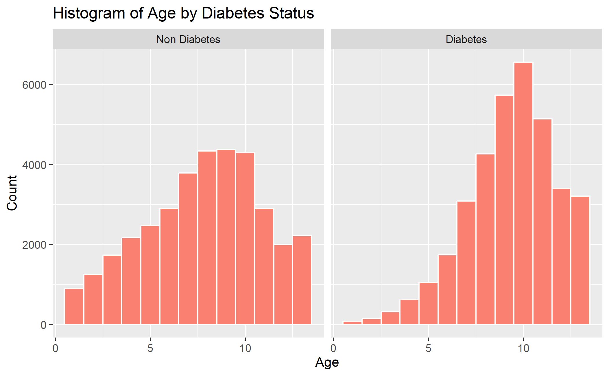
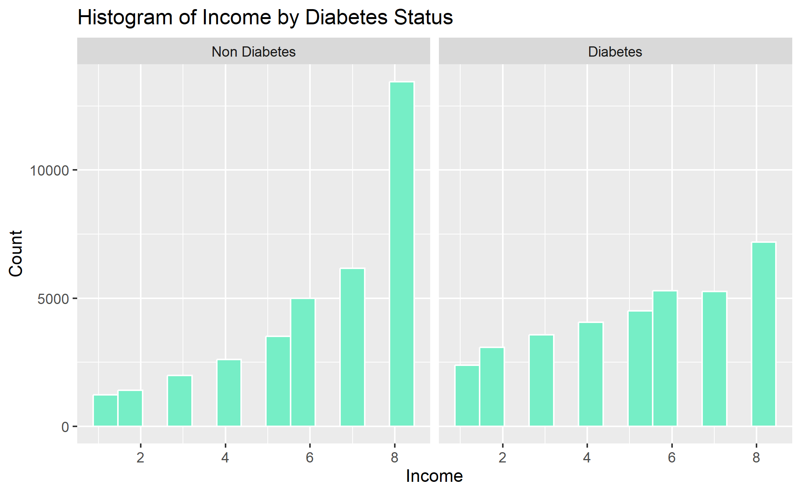
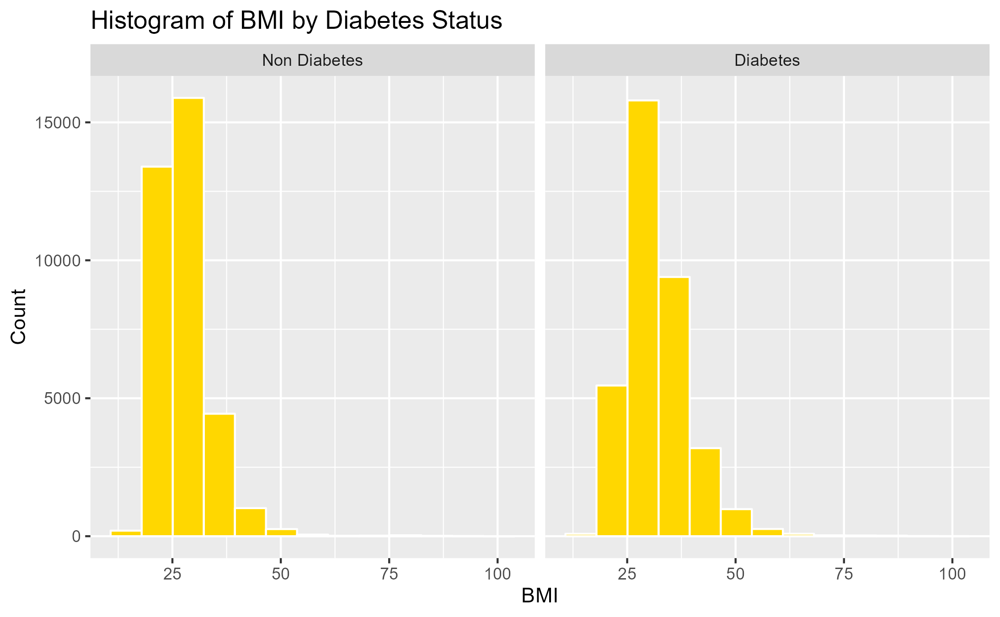

# 1. Introduction

## 1-1. Background

Diabetes is a prevalent chronic disease in the US, affecting millions of
people and placing a significant financial burden on the economy. It is
characterized by the inability to regulate glucose levels in the blood
due to insufficient insulin production or ineffective use of insulin.
High blood sugar levels can lead to complications such as heart disease,
vision loss, lower-limb amputation, and kidney disease. While there is
no cure for diabetes, lifestyle changes and medical treatments can help
mitigate its harms. Early diagnosis is important, and predictive models
for diabetes risk can aid public health officials. Type II diabetes is
the most common form, and its prevalence varies by social determinants
of health such as age, education, income, race, and location. Diabetes
also has a disproportionate impact on those of lower socioeconomic
status. The economic burden of diabetes is significant, with costs
exceeding $400 billion annually.

Here are some statistics on diabetes in the USA:  \* As of 2021,
approximately 34.2 million Americans, or 10.5% of the population, have
diabetes.  \* About 90-95% of cases are type II diabetes.  \*
Another 88 million American adults, or 34.5% of the population, have
prediabetes. \* 1 in 5 people with diabetes, and 8 in 10 people with
prediabetes, are unaware of their condition.  \* Diabetes is also
more common among people with lower income and education levels. \*
Diabetes is the seventh leading cause of death in the United States. 
\* In 2017, the total cost of diagnosed diabetes in the United States
was estimated to be $327 billion. 

So given this statistics, we know that it is important to identify the
key factors that lead to diabetes. Also if we can develop a predictive
model that gives an idea how we can predict the chance of developing
diabetes, we can take necessary actions to prevent diabetes as this
disease is not curable.

## 1-2. Our Objectives and findings

Our questions that we would like to answer and main findings in this
paper are as follow:

**\[Objectives\]**

-   Can we develop a predictive model of diabetes? 
-   Can we assign a risk score for an individual given we know his/her
    individual biological & behavioral characteristics?  
-   What risk factors are most predictive of diabetes risk? 

**\[Findings\]**

-   Patients: Diabetes models can help patients understand their risk of
    developing the disease, make informed lifestyle choices, and take
    steps to prevent or manage the disease. 
-   Healthcare providers: Predictive models can help healthcare
    providers identify patients who are at high risk of developing
    diabetes, allowing for earlier interventions and better disease
    management. 
-   Public health officials: Modeling diabetes can help public health
    officials understand the patterns and trends of the disease,
    identify populations at high risk, and develop targeted prevention
    and treatment strategies. 
-   Researchers: By analyzing data from diabetes models, researchers can
    gain insights into the underlying causes of the disease, identify
    new risk factors, and develop more effective treatments. 

To achieve the objective of our project, we are expecting to do the
following:  **1. Visualize data:** By using visualization techniques
such as scatter plot, hit maps, clusters etc we can identify the
relationship between different biological, behavioral & demographic and
diabetes.   **2. Predictive model:** Using different predictive
models such as linear regression, KNN regression, random forest,
logistic regression, decision tree models, we shall come up with
predicting diabetes.  **3. Identifying importance of different
factors:** We can use PCA, partial dependence plot etc to identify the
marginal effects of different variables on diabetes.  **4. Develop a
risk score:** based on the individual characteristics we will develop a
risk score & based on the risk score we can give early signal whether an
individual is within the risk zone of developing diabetes. 

# 2. Data and Model

## 2-1. Data

**Nature of Data:** Dataset includes 70,692 observations of US
individuals 50% of whom are diabetic patients (others are not). These
data were collected by BEHAVIORAL RISK FACTOR SURVEILLANCE SYSTEM in
assistance with Chronic Disease Center. There are total 21 variables.
The variables are defined as follows: Diabetes\_binary: A binary
variable indicating presence of diabetes by 1 & absence by 0.

*HighBP,HighChol*,Smoker (Have you smoked at least 100 cigarettes in
your entire life? 0 = no 1 = yes), Stroke, HeartDisease PhysActiv,
Fruits, Veggies, HvyAlcoholConsump, AnyHealthcare, NoDocbcCost, DiffWalk
(Any difficulty on walking, 1 indicate presence of difficulty) - all are
binary variables where 1 indicate presence of the factor and 0 indicates
absence. Cholcheck is also a binary variable where 0 = no cholesterol
check in 5 years 1 = yes cholesterol check in 5 years

*BMI :* Body Mass index is a measure of body fat based on height and
weight that applies to adult men and women. Here, BMI had minimum value
of 12 & maximum value of 98. BMI more than 25 is considered obese.
General Health: A measure of general health situation, 1=Excellent,
2=Very Good, 3=Good, 4=Fair, 5=Poor.

*Mental Health:* During the past 30 days, for about how many days did
poor physical or mental health keep an individual from doing your usual
activities, such as self-care, work, or recreation? A value from 0 to 30
where 0 indicates bests mental health & 30 indicates worst.

*Physical Health:* for how many days during the past 30 days was the
individual’s physical health not good? A value from 0 to 30 where higher
the value worse the physical health.

**Demographic Variables:**

*Sex:* patient’s gender (1: male; 0: female).

*Age:* 13-level age category ,where 1 = 18-24 9 = 60-64 13 = 80 or older
etc.

*Education:* A value that ranges from 1 to 6. Higher the value higher
the level of education. 1= Never attended school or only kindergarten, 2
= Grades 1 through 8 (Elementary) 3 =Grades 9 through 11 (Some high
school), 4= Grade 12 or GED (High school graduate), 5= College 1 year to
3 years (Some college or technical school), 6= College 4 years or more
(College graduate)

*Income:* Indicates level of annual income for the households where 1=
income less than $10000, 2= $10,000 to less than $15,000, 3= $15,000 to
less than $20,000, 4= $20,000 to less than $25,000, 5= $25,000 to less
than $35,000, 6= $35,000 to less than $50,000, 7= $50,000 to less than
$75,000, 8= 75,000 or more

In the following, we shows histograms conunting of some characteristics
by diabees status from the raw data.

## 2-2. Model

# 3. Result

## 3-1. Best Diabete Prediction

### 3-1-2. Linear model regression

First, to find the best combination of variables for the model, we used
stepwise selection. And we got the best model from the point of AIC
view, which is so complex, and so we shows it in the
[Appendix](##%206-1.%20Stewise%20selection%20model).

Also, we compared three model with the cross-Validation, the linear
model of this stepwised model and the basic model (which simply includes
all variables), and Knn regression model. These rmse of three model is
as follow:

<table>
<thead>
<tr class="header">
<th style="text-align: right;">RMSE_stndard</th>
<th style="text-align: right;">RMSE_step</th>
<th style="text-align: right;">RMSE_KNN</th>
</tr>
</thead>
<tbody>
<tr class="odd">
<td style="text-align: right;">0.415</td>
<td style="text-align: right;">0.411</td>
<td style="text-align: right;">0.5</td>
</tr>
</tbody>
</table>

where the optimal k is 2. From the above the result, it is safe to say
the stepwise model is the best predictive model so far.

### 2-3-2. Logit model comparison

# 4. Conclusion

# 5. Reference

# 6. Appendix

## 6-1. Stewise selection model

The model tha we got from the setpwise selection in 3-1 is as follow:

$$
\begin{aligned}
 Diabetes\_binary &= \beta\_0 + \beta \[ HighBP + HighChol + CholCheck +\\\BMI + Smoker + 
     &Stroke + HeartDiseaseorAttack + PhysActivity + Fruits + Veggies \\\\+ 
     &HvyAlcoholConsump + AnyHealthcare + NoDocbcCost + GenHlth + \\\\
     &MentHlth + PhysHlth + DiffWalk + Sex + Age + Education + \\\\
     &Income + GenHlth\cdot DiffWalk \\\\& + BMI\cdot Age + Sex\cdot Age + HighChol\cdot Age +\\\\ 
   &GenHlth\cdot Income + BMI\cdot DiffWalk \\\\& + HighBP\cdot HeartDiseaseorAttack + \\\\
     &DiffWalk\cdot Age + GenHlth\cdot PhysHlth \\\\& + HvyAlcoholConsump\cdot Age + \\\\
     &CholCheck\cdot GenHlth + GenHlth\cdot Sex \\\\& + HighChol\cdot HeartDiseaseorAttack +\\\\ 
     &HighChol\cdot GenHlth + HeartDiseaseorAttack\cdot Age + Smoker\cdot GenHlth + \\\\
     &HeartDiseaseorAttack\cdot GenHlth \\\\& + Fruits\cdot Education + HeartDiseaseorAttack\cdot DiffWalk +\\\\&HighBP\cdot HvyAlcoholConsump \\\\& + HighChol\cdot Stroke + AnyHealthcare\cdot Education +\\\\ 
    & HighBP\cdot CholCheck + Smoker\cdot Education + BMI\cdot HeartDiseaseorAttack + \\\\
     &BMI\cdot Smoker + MentHlth\cdot DiffWalk \\\\& + CholCheck\cdot BMI + HighChol\cdot BMI + \\\\
     &HighBP\cdot HighChol + Fruits\cdot Age \\\\& + PhysActivity\cdot Fruits + Stroke\cdot GenHlth + \\\\ 
     &HighBP\cdot Sex + Stroke\cdot Age \\\\& + HeartDiseaseorAttack\cdot NoDocbcCost + \\\\
     &CholCheck\cdot Age + CholCheck\cdot HeartDiseaseorAttack \\\\& + Fruits\cdot Sex + \\\\
     &HvyAlcoholConsump\cdot GenHlth \\\\& + HighChol\cdot MentHlth \\\\& + HighBP\cdot AnyHealthcare + \\\\ 
     &HighBP\cdot Education + Smoker\cdot Stroke \\\\& + PhysActivity\cdot Age + PhysActivity\cdot Education + 
     &CholCheck\cdot AnyHealthcare + Veggies\cdot NoDocbcCost + BMI\cdot Sex + \\\\
     &MentHlth\cdot Income + PhysHlth\cdot Income + NoDocbcCost\cdot DiffWalk + \\\\
     &BMI\cdot MentHlth + HighChol\cdot Sex \\\\& + Sex\cdot Education + Smoker\cdot Sex + \\\\
     &PhysHlth\cdot Age + MentHlth\cdot Age \\\\& + HeartDiseaseorAttack\cdot PhysHlth + \\\\ 
     &PhysActivity\cdot PhysHlth + Stroke\cdot MentHlth + BMI\cdot NoDocbcCost + \\\\
     &AnyHealthcare\cdot Age + BMI\cdot PhysActivity + Smoker\cdot DiffWalk + \\\\
     &Smoker\cdot Age + Smoker\cdot HvyAlcoholConsump \\\\& + AnyHealthcare\cdot DiffWalk +\\\\ 
     &AnyHealthcare\cdot PhysHlth + Stroke\cdot HeartDiseaseorAttack + \\\\ &PhysActivity\cdot Income\]+\varepsilon
\end{aligned}
$$
