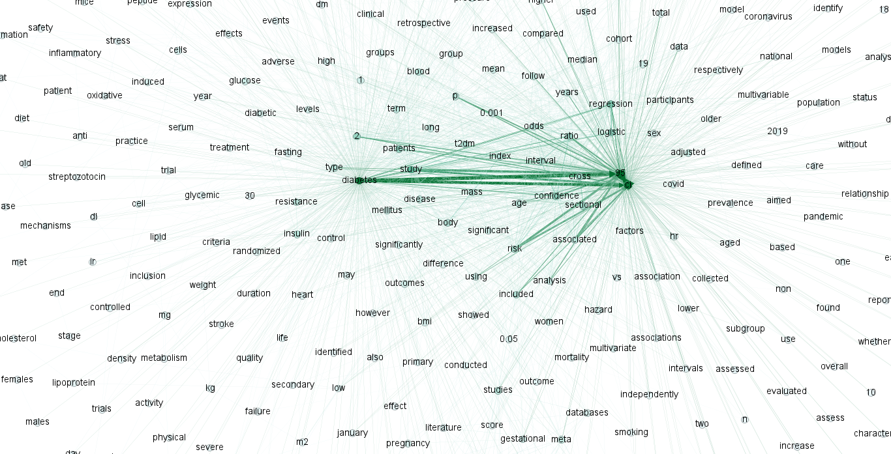
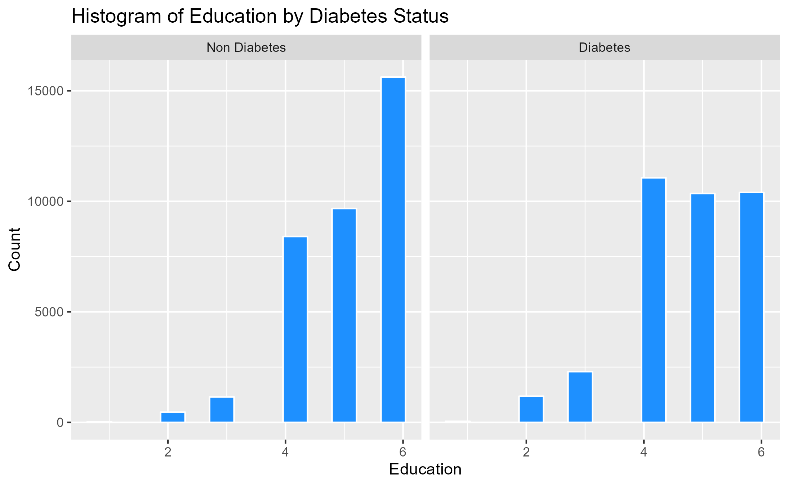

# 1. Introduction

## 1-1. Background

Diabetes is a prevalent chronic disease in the US, affecting millions of
people and placing a significant financial burden on the economy. It is
characterized by the inability to regulate glucose levels in the blood
due to insufficient insulin production or ineffective use of insulin.
High blood sugar levels can lead to complications such as heart disease,
vision loss, lower-limb amputation, and kidney disease. While there is
no cure for diabetes, lifestyle changes and medical treatments can help
mitigate its harms. Early diagnosis is important, and predictive models
for diabetes risk can aid public health officials. Type II diabetes is
the most common form, and its prevalence varies by social determinants
of health such as age, education, income, race, and location. Diabetes
also has a disproportionate impact on those of lower socioeconomic
status. The economic burden of diabetes is significant, with costs
exceeding $400 billion annually.

Here are some statistics on diabetes in the USA: 

-   As of 2021, approximately 34.2 million Americans, or 10.5% of the
    population, have diabetes. 

-   About 90-95% of cases are type II diabetes. 

-   Another 88 million American adults, or 34.5% of the population, have
    prediabetes.

-   1 in 5 people with diabetes, and 8 in 10 people with prediabetes,
    are unaware of their condition. 

-   Diabetes is also more common among people with lower income and
    education levels. 

-   Diabetes is the seventh leading cause of death in the United
    States. 

-   In 2017, the total cost of diagnosed diabetes in the United States
    was estimated to be $327 billion. 

So given this statistics, we know that it is important to identify the
key factors that lead to diabetes. Also if we can develop a predictive
model that gives an idea how we can predict the chance of developing
diabetes, we can take necessary actions to prevent diabetes as this
disease is not curable.

## 1-2. Our Objectives and findings

Our questions that we would like to answer and main findings in this
paper are as follow:

**\[Objectives\]**

-   Can we develop a predictive model of diabetes? 

-   Can we assign a risk score for an individual given we know his/her
    individual biological & behavioral characteristics?  

-   What risk factors are most predictive of diabetes risk? 

**\[Findings\]**

-   Patients: Diabetes models can help patients understand their risk of
    developing the disease, make informed lifestyle choices, and take
    steps to prevent or manage the disease. 

-   Healthcare providers: Predictive models can help healthcare
    providers identify patients who are at high risk of developing
    diabetes, allowing for earlier interventions and better disease
    management. 

-   Public health officials: Modeling diabetes can help public health
    officials understand the patterns and trends of the disease,
    identify populations at high risk, and develop targeted prevention
    and treatment strategies. 

-   Researchers: By analyzing data from diabetes models, researchers can
    gain insights into the underlying causes of the disease, identify
    new risk factors, and develop more effective treatments. 

To achieve the objective of our project, we are expecting to do the
following: 

**1. Building Best predictive model:** Using different predictive models
such as linear regression, KNN regression, random forest, logistic
regression, decision tree models, we shall come up with predicting
diabetes. 

**2. Develop a risk score:** based on the best predictive model we will
develop a risk score & based on the risk score we can give early signal
whether an individual is within the risk zone of developing
diabetes. 

**3. Identifying importance of different factors:** We can use PCA,
partial dependence plot etc to identify the marginal effects of
different variables on diabetes. 

**4. Need more data to estimate our model preciously:** Our data are
always limited, and so we cannot build a perfect predictive model. Then,
we use the “Natural Language Processing” and “Association rules” to
identify factors that are much related to “diabetes” because if we can
get additionally data of them, we can estimate our model more
preciously. 

# 2. Methods: Data and Model

## 2-1. Data

**Nature of Data:** Dataset includes 70,692 observations of US
individuals 50% of whom are diabetic patients (others are not). [These
data were collected by BEHAVIORAL RISK FACTOR SURVEILLANCE SYSTEM in
assistance with Chronic Disease
Center](https://www.kaggle.com/datasets/alexteboul/diabetes-health-indicators-dataset).
There are total 21 variables. The variables are defined as follows:
Diabetes\_binary: A binary variable indicating presence of diabetes by 1
& absence by 0.

*HighBP,HighChol*,Smoker (Have you smoked at least 100 cigarettes in
your entire life? 0 = no 1 = yes), Stroke, HeartDisease PhysActiv,
Fruits, Veggies, HvyAlcoholConsump, AnyHealthcare, NoDocbcCost, DiffWalk
(Any difficulty on walking, 1 indicate presence of difficulty) - all are
binary variables where 1 indicate presence of the factor and 0 indicates
absence. Cholcheck is also a binary variable where 0 = no cholesterol
check in 5 years 1 = yes cholesterol check in 5 years

*BMI :* Body Mass index is a measure of body fat based on height and
weight that applies to adult men and women. Here, BMI had minimum value
of 12 & maximum value of 98. BMI more than 25 is considered obese.
General Health: A measure of general health situation, 1=Excellent,
2=Very Good, 3=Good, 4=Fair, 5=Poor.

*Mental Health:* During the past 30 days, for about how many days did
poor physical or mental health keep an individual from doing your usual
activities, such as self-care, work, or recreation? A value from 0 to 30
where 0 indicates bests mental health & 30 indicates worst.

*Physical Health:* for how many days during the past 30 days was the
individual’s physical health not good? A value from 0 to 30 where higher
the value worse the physical health.

**Demographic Variables:**

*Sex:* patient’s gender (1: male; 0: female).

*Age:* 13-level age category ,where 1 = 18-24 9 = 60-64 13 = 80 or older
etc.

*Education:* A value that ranges from 1 to 6. Higher the value higher
the level of education. 1= Never attended school or only kindergarten, 2
= Grades 1 through 8 (Elementary) 3 =Grades 9 through 11 (Some high
school), 4= Grade 12 or GED (High school graduate), 5= College 1 year to
3 years (Some college or technical school), 6= College 4 years or more
(College graduate)

*Income:* Indicates level of annual income for the households where 1=
income less than $10000, 2= $10,000 to less than $15,000, 3= $15,000 to
less than $20,000, 4= $20,000 to less than $25,000, 5= $25,000 to less
than $35,000, 6= $35,000 to less than $50,000, 7= $50,000 to less than
$75,000, 8= 75,000 or more

[please see the specific characteristic of the
data](##%205-1.%20Charactersitcs%20of%20Data)

## 2-2. Model

### 2-2-1. Best Predictive Model

### 2-2-2. Scoring

After getting the best predictive model, we try to give individuals the
risk score for the diabetes. The way to do is as follow:

1.  Use the estimated coefficients

we used the estimated coefficients (see [the detail in
Appendix](5-2.%20Stewise%20selection%20model)) to estimate the
probability of diabetes for individuals with a linear probability model
and the logit model.
$$
\begin{aligned}
\hat{y}= \beta\_0+\beta\_1 (each\\ variables)+ \beta\_2 (cross\\ temrs(only\\ LPM))
\end{aligned}
$$

1.  100 scaling (only LP&lt;)

To show *ŷ* as a score in the linear probability model, we scaled it
into the format 0-100 points.
$$
\begin{aligned}
score&= 100\hat{y}\\\\ where\\ &if\\ \hat{y}&gt;100,\\ then\\ score=100\\\\
&if \hat{y}&lt;0,\\ then\\ score=0
\end{aligned}
$$

### 2-2-3. PCA

(Please insert here)

### 2-2-4. Factors related to “diabetes”

In this paper, we use the Natural Language Processing to identify
factors that are much related to “diabetes” because if we can get
additionally data of them, we can estimate our model more preciously.

To do that, at first, we collected data of the abstract of the recent
academic paper with keyword “diabetes” from the
[Pubmed](https://pubmed.ncbi.nlm.nih.gov/). Specifically, we used the
application of [Publish or Perish
8](https://harzing.com/resources/publish-or-perish/), put “diabetes”
into the “Keywords” and get information of the 1000 medical papers with
“diabetes” keyword from 2022 to 2023.

Next, we excluded blank data and stopwords of “stopwords” library, and
tokenized their abstracts using “tokenizers” library. So there were 950
papers’ data.

After that, we apply apriori function for data that we got with support
=.02, confidence=.001, and extract some data from them with lift&gt;4.
Then we showed the node graph that told us words that related to
“diabetes” word with [Gephi](https://gephi.org/).

Finally, from the node graph, we got factors that related to “diabetes”,
and identified factors that we should collect additionally while
comparing to our current factors of data.

Note: the reason we did not use “Google scholar” to collect in Publish
or Perish is it did not give us all abstract data of each papers. 
Also, Publish or Perish can only get up to 1000 data.

# 3. Results

## 3-1. Best Diabetes Prediction

### 3-1-1. Linear model regression

First, to find the best combination of variables for the model, we used
stepwise selection. And we got the best model from the point of AIC
view, which is so complex, and so we shows it in the
[Appendix](##%205-2.%20Stewise%20selection%20model).

Also, we compared three model with the cross-Validation, the linear
model of this stepwised model and the basic model (which simply includes
all variables), and KNN regression model. These rmse of three model is
as follow:

<table>
<thead>
<tr class="header">
<th style="text-align: right;">RMSE_stndard</th>
<th style="text-align: right;">RMSE_step</th>
<th style="text-align: right;">RMSE_KNN</th>
</tr>
</thead>
<tbody>
<tr class="odd">
<td style="text-align: right;">0.415</td>
<td style="text-align: right;">0.411</td>
<td style="text-align: right;">0.5</td>
</tr>
</tbody>
</table>

where the optimal k is 2. From the above the result, it is safe to say
the stepwise model is the best predictive model so far.

### 3-1-2. Logit model comparison

Next to find better predictive model,

<table>
<caption>the output of LPM and Logit</caption>
<thead>
<tr class="header">
<th style="text-align: left;"></th>
<th style="text-align: right;">Linear</th>
<th style="text-align: right;">Logit</th>
</tr>
</thead>
<tbody>
<tr class="odd">
<td style="text-align: left;">accuracy</td>
<td style="text-align: right;">0.753</td>
<td style="text-align: right;">0.748</td>
</tr>
<tr class="even">
<td style="text-align: left;">TPR</td>
<td style="text-align: right;">0.790</td>
<td style="text-align: right;">0.768</td>
</tr>
<tr class="odd">
<td style="text-align: left;">FPR</td>
<td style="text-align: right;">0.282</td>
<td style="text-align: right;">0.272</td>
</tr>
<tr class="even">
<td style="text-align: left;">FDR</td>
<td style="text-align: right;">0.263</td>
<td style="text-align: right;">0.253</td>
</tr>
</tbody>
</table>

the output of LPM and Logit

From these tables, the accuracy rate of the linear model is
0.753(=75.3%) and that of the logit model is 0.748(=74.8%). Also, each
true positive rate (TPR) is 0.79 and 0.768, each false positive rate
(FPR) is 0.282 (=Specificity: 70.8%) and 0.272 (=Specificity: 72.8%),
and each false discovery rate (FDR) is 0.263 (=Precision: 73.7%) and
0.253 (=Precision: 74.7%).

Besides, the ROC curves of the linear probability model and logit model
is in the following.

The red line of this graph represents the best linear model and the blue
line represents the logit model. These gaps are so little but the linear
model is slightly better than that the logit model.

Accordingly, from the result, the linear model can be better than the
logit model because the linear model has the lowest rmse and the ability
of the prediction for diabetes. However, we need to careful about what
sometimes the logit model will be better.

## 3-2. Scoring

### 3-2-1. What the crucial variables are to directly affect on the risk score?

From the linear probability model, the weights to get individual risk
scores in the data is the coefficient of the estimation. In the
coefficients, the direct marginal effects on the risk score are as
follow:

<table>
<thead>
<tr class="header">
<th style="text-align: left;"></th>
<th style="text-align: right;">linear</th>
<th style="text-align: right;">logit</th>
</tr>
</thead>
<tbody>
<tr class="odd">
<td style="text-align: left;">HighBP</td>
<td style="text-align: right;">7.14e-02</td>
<td style="text-align: right;">0.365000</td>
</tr>
<tr class="even">
<td style="text-align: left;">HighChol</td>
<td style="text-align: right;">5.28e-02</td>
<td style="text-align: right;">0.293000</td>
</tr>
<tr class="odd">
<td style="text-align: left;">CholCheck</td>
<td style="text-align: right;">3.46e-02</td>
<td style="text-align: right;">0.211000</td>
</tr>
<tr class="even">
<td style="text-align: left;">BMI</td>
<td style="text-align: right;">8.71e-02</td>
<td style="text-align: right;">0.538000</td>
</tr>
<tr class="odd">
<td style="text-align: left;">Smoker</td>
<td style="text-align: right;">-6.22e+00</td>
<td style="text-align: right;">-0.000839</td>
</tr>
<tr class="even">
<td style="text-align: left;">Stroke</td>
<td style="text-align: right;">1.67e-02</td>
<td style="text-align: right;">0.039100</td>
</tr>
<tr class="odd">
<td style="text-align: left;">HeartDiseaseorAttack</td>
<td style="text-align: right;">3.81e-02</td>
<td style="text-align: right;">0.089700</td>
</tr>
<tr class="even">
<td style="text-align: left;">PhysActivity</td>
<td style="text-align: right;">-6.46e+00</td>
<td style="text-align: right;">-0.015100</td>
</tr>
<tr class="odd">
<td style="text-align: left;">Fruits</td>
<td style="text-align: right;">-2.30e-03</td>
<td style="text-align: right;">-0.016800</td>
</tr>
<tr class="even">
<td style="text-align: left;">Veggies</td>
<td style="text-align: right;">-4.15e-03</td>
<td style="text-align: right;">-0.024900</td>
</tr>
<tr class="odd">
<td style="text-align: left;">HvyAlcoholConsump</td>
<td style="text-align: right;">-4.91e+00</td>
<td style="text-align: right;">-0.152000</td>
</tr>
<tr class="even">
<td style="text-align: left;">AnyHealthcare</td>
<td style="text-align: right;">-3.62e-05</td>
<td style="text-align: right;">0.012600</td>
</tr>
<tr class="odd">
<td style="text-align: left;">NoDocbcCost</td>
<td style="text-align: right;">-8.20e-04</td>
<td style="text-align: right;">0.005540</td>
</tr>
<tr class="even">
<td style="text-align: left;">GenHlth</td>
<td style="text-align: right;">1.14e-01</td>
<td style="text-align: right;">0.651000</td>
</tr>
<tr class="odd">
<td style="text-align: left;">MentHlth</td>
<td style="text-align: right;">-6.83e-03</td>
<td style="text-align: right;">-0.035600</td>
</tr>
<tr class="even">
<td style="text-align: left;">PhysHlth</td>
<td style="text-align: right;">-1.31e-03</td>
<td style="text-align: right;">-0.083700</td>
</tr>
<tr class="odd">
<td style="text-align: left;">DiffWalk</td>
<td style="text-align: right;">2.77e-02</td>
<td style="text-align: right;">0.050000</td>
</tr>
<tr class="even">
<td style="text-align: left;">Sex</td>
<td style="text-align: right;">2.14e-02</td>
<td style="text-align: right;">0.133000</td>
</tr>
<tr class="odd">
<td style="text-align: left;">Age</td>
<td style="text-align: right;">4.12e+00</td>
<td style="text-align: right;">0.434000</td>
</tr>
<tr class="even">
<td style="text-align: left;">Education</td>
<td style="text-align: right;">-7.62e-03</td>
<td style="text-align: right;">-0.037900</td>
</tr>
<tr class="odd">
<td style="text-align: left;">Income</td>
<td style="text-align: right;">-2.52e-02</td>
<td style="text-align: right;">-0.128000</td>
</tr>
</tbody>
</table>

where these coefficients are the result of the estimation with scaled
data (if you want to see all coefficients, see [the
appendix](##%205-2.%20Stewise%20selection%20model)). So, in the binary
data, the most highest coefficient in the above is “HighBP”(high blood
pressure) and the lowest one is “HvyAlcoholConsump” (heavy alcohol
consumption). Also, except for the dummy variables, BMI looks like
largely affect the risk score.

Also, we also shows the case of the logit model. In the binary data, the
most highest coefficient in the above is “GenHlth”(general health) and
the lowest one is “HvyAlcoholConsump” (heavy alcohol consumption). Also,
except for the dummy variables, BMI looks like largely affect the risk
score as well as the above linear model. Note that coefficients of
HighBP is still positive and large.

So, from these result, the crucial variables to increase the risk score
of diabetes is **High blood pressure” and “General health”**. And, the
variable that does not related to the diabetes or make risk score
decrease is **“Heavy alcohol consumption”**. Besides, please be careful
about **“BMI”** that increases risk scores as your BMI increase.

### 3-2-2. Which risk socre model is better between LPM and Logit?

Next we try to discuss which risk score model is better between LPM and
Logit for the view of scoring. So, we shows the shape of the
distribution of the predicted risk scores from the actual data as
follow:

where the correlation between predicted output in the linear model and
the logit model is 0.975.

From the above graphs, the linear model is like the normal distribution
that the top was biased to slightly the right. Also, the logit model is
a distribution with a dent in the middle. The bottom of the graph shows
the relationship between two ways to score, and these correlation is
0.975.

From these result, whichever ways to score we select, almost scores are
the same as another way. So, we can focus on the shape of the
distribution for scores. In general, a scoring distribution will be
normal hopefully because we have already had some uncertain conditions
for this prediction, such as unknown factors or something like this.
Also, the result of the logit model can distinguish diabetes or not as
possibly, and many people gives scores of below 50 points compared to
linear model. In practice, the scoring has a function of warning and so,
we think many low score should not be given.

Accordingly, we think the linear probability model is better scoring
model than logit.

## 3-3. PCA

(Please insert here)

## 3-4. What kind of variables is more helpful to refine our model?

At first, as we mentioned at Model part, we used apriori function in R
with support 0.02 and confidence 0.01 (see [Appendix to look at the
support-confidence](##%205-3.%20Support-Confidence%20plot)). And with
lift &gt;4, we created data to show the node graph. the following graph
is enlarged it around the word “diabetes”:

From this graph, we can get some factors which are not included in our
data are related to diabetes like these:

-   fasting  

-   metabolic 

-   blood glucose level 

-   cholesterol level 

-   stress 

-   inflammatory 

-   pregnancy 

Therefore, if we want to refine our model much more, it is better to get
data included these factors additionally.

# 4. Conclusion

Diabetes is a prevalent chronic disease in the US, affecting millions of
people and placing a significant financial burden on the economy.
Diabetes is a prevalent chronic disease in the US, affecting millions of
people and placing a significant financial burden on the economy. So in
this paper, to contribute decreasing diabetes, we executed 4 analysis,
(1) building the best predict diabetes model, (2) constructing the risk
score for diabetes, **(3)–(Please insert here)–**, and (4) find other
important factors that we have not yet got from academic paper.

For the first analysis, we used the stepwise selection to find the best
linear probability model. From the result, we got the model with 92
variables (21 variables and 71 cross term variables), excluding the
intercept terms, Also, we compared it to its KNN version’s model with
Cross Validation. Then, we found this linear model is better than its
KNN model from the view of RMSE.

For the second analysis, we used the best linear probability model and
the logit model with all variables data to construct the risk score for
diabetes. The weight of the risk score are the coefficient of the linear
probability model. So, we could get the crucial variables to increase
the risk score of diabetes is High blood pressure” and “General health”.
And, the variable that does not related to the diabetes or make risk
score decrease is “Heavy alcohol consumption”. Besides, please be
careful about BMI that increases risk scores as your “BMI” increase.
Also, from the shape of the distribution between the probability model
and the logit one, we thought the linear probability model is better to
construct the risk score because its shape was closer to the normal
distribution derived by the Law of the Large Number.

**For the third analysis, we** (please insert here)

For the fourth analysis, we used abstracts of 1000 medical academic
papers from Pubmed to find other factors to sophisticate our model. In
this analysis, with Natural Language Processing, we apply apriori
function in R and created the node graph. Then, we got factors that
related to “diabetes”, and identified factors that we should collect
additionally while comparing to our current factors of data. From the
result, we found the words that are related to “diabetes” academic paper
are fasting, metabolic, blood glucose level, cholesterol level, stress,
inflammatory and pregnancy. We suggested to collect these kind of data
to construct better predictive diabetes model.

# 5. Appendix

## 5-1. Charactersitcs of Data

In the following, we shows histograms counting of some characteristics
by diabetes status from the raw data.

## 5-2. Stewise selection model

The model that we got from the stepwise selection in 3-1 is as follow:

$$
\begin{aligned}
 Diabetes\_binary &= \beta\_0 + \beta \[ HighBP + HighChol + CholCheck +\\\BMI + Smoker + 
     &Stroke + HeartDiseaseorAttack + PhysActivity + Fruits + Veggies \\\\+ 
     &HvyAlcoholConsump + AnyHealthcare + NoDocbcCost + GenHlth + \\\\
     &MentHlth + PhysHlth + DiffWalk + Sex + Age + Education + \\\\
     &Income + GenHlth\cdot DiffWalk \\\\& + BMI\cdot Age + Sex\cdot Age + HighChol\cdot Age +\\\\ 
   &GenHlth\cdot Income + BMI\cdot DiffWalk \\\\& + HighBP\cdot HeartDiseaseorAttack + \\\\
     &DiffWalk\cdot Age + GenHlth\cdot PhysHlth \\\\& + HvyAlcoholConsump\cdot Age + \\\\
     &CholCheck\cdot GenHlth + GenHlth\cdot Sex \\\\& + HighChol\cdot HeartDiseaseorAttack +\\\\ 
     &HighChol\cdot GenHlth + HeartDiseaseorAttack\cdot Age + Smoker\cdot GenHlth + \\\\
     &HeartDiseaseorAttack\cdot GenHlth \\\\& + Fruits\cdot Education + HeartDiseaseorAttack\cdot DiffWalk +\\\\&HighBP\cdot HvyAlcoholConsump \\\\& + HighChol\cdot Stroke + AnyHealthcare\cdot Education +\\\\ 
    & HighBP\cdot CholCheck + Smoker\cdot Education + BMI\cdot HeartDiseaseorAttack + \\\\
     &BMI\cdot Smoker + MentHlth\cdot DiffWalk \\\\& + CholCheck\cdot BMI + HighChol\cdot BMI + \\\\
     &HighBP\cdot HighChol + Fruits\cdot Age \\\\& + PhysActivity\cdot Fruits + Stroke\cdot GenHlth + \\\\ 
     &HighBP\cdot Sex + Stroke\cdot Age \\\\& + HeartDiseaseorAttack\cdot NoDocbcCost + \\\\
     &CholCheck\cdot Age + CholCheck\cdot HeartDiseaseorAttack \\\\& + Fruits\cdot Sex + \\\\
     &HvyAlcoholConsump\cdot GenHlth \\\\& + HighChol\cdot MentHlth \\\\& + HighBP\cdot AnyHealthcare + \\\\ 
     &HighBP\cdot Education + Smoker\cdot Stroke \\\\& + PhysActivity\cdot Age + PhysActivity\cdot Education + \\\\
     &CholCheck\cdot AnyHealthcare + Veggies\cdot NoDocbcCost + BMI\cdot Sex + \\\\
     &MentHlth\cdot Income + PhysHlth\cdot Income + NoDocbcCost\cdot DiffWalk + \\\\
     &BMI\cdot MentHlth + HighChol\cdot Sex \\\\& + Sex\cdot Education + Smoker\cdot Sex + \\\\
     &PhysHlth\cdot Age + MentHlth\cdot Age \\\\& + HeartDiseaseorAttack\cdot PhysHlth + \\\\ 
     &PhysActivity\cdot PhysHlth + Stroke\cdot MentHlth + BMI\cdot NoDocbcCost + \\\\
     &AnyHealthcare\cdot Age + BMI\cdot PhysActivity + Smoker\cdot DiffWalk + \\\\
     &Smoker\cdot Age + Smoker\cdot HvyAlcoholConsump \\\\& + AnyHealthcare\cdot DiffWalk +\\\\ 
     &AnyHealthcare\cdot PhysHlth + Stroke\cdot HeartDiseaseorAttack + \\\\ &PhysActivity\cdot Income\]+\varepsilon \\\\
\end{aligned}
$$

The summary of the regression of the linear probability model is as
follow:

    Residuals:
         Min       1Q   Median       3Q      Max 
    -1.75341 -0.32024  0.05317  0.31446  1.22353 

    Coefficients:
                                       Estimate Std. Error t value Pr(>|t|)    
    (Intercept)                       5.402e-01  2.273e-03 237.646  < 2e-16 ***
    HighBP                            7.140e-02  1.829e-03  39.041  < 2e-16 ***
    HighChol                          5.283e-02  1.699e-03  31.086  < 2e-16 ***
    CholCheck                         3.460e-02  2.164e-03  15.985  < 2e-16 ***
    BMI                               8.713e-02  1.832e-03  47.567  < 2e-16 ***
    Smoker                           -3.219e-03  1.623e-03  -1.984 0.047313 *  
    Stroke                            1.686e-02  2.414e-03   6.982 2.93e-12 ***
    HeartDiseaseorAttack              3.811e-02  2.482e-03  15.355  < 2e-16 ***
    PhysActivity                     -3.456e-03  1.738e-03  -1.989 0.046719 *  
    Fruits                           -2.308e-03  1.629e-03  -1.416 0.156666    
    Veggies                          -4.145e-03  1.628e-03  -2.547 0.010868 *  
    HvyAlcoholConsump                -2.905e-02  1.815e-03 -16.003  < 2e-16 ***
    AnyHealthcare                    -3.624e-05  2.062e-03  -0.018 0.985981    
    NoDocbcCost                      -8.194e-04  1.749e-03  -0.468 0.639457    
    GenHlth                           1.136e-01  2.154e-03  52.744  < 2e-16 ***
    MentHlth                         -6.827e-03  2.014e-03  -3.391 0.000698 ***
    PhysHlth                         -1.306e-03  2.596e-03  -0.503 0.614918    
    DiffWalk                          2.769e-02  2.429e-03  11.397  < 2e-16 ***
    Sex                               2.143e-02  1.629e-03  13.156  < 2e-16 ***
    Age                               6.115e-02  1.945e-03  31.438  < 2e-16 ***
    Education                        -7.619e-03  1.811e-03  -4.207 2.59e-05 ***
    Income                           -2.517e-02  1.967e-03 -12.795  < 2e-16 ***
    GenHlth:DiffWalk                 -1.717e-02  2.252e-03  -7.627 2.44e-14 ***
    BMI:Age                           2.976e-02  1.820e-03  16.352  < 2e-16 ***
    Sex:Age                           2.024e-02  1.742e-03  11.617  < 2e-16 ***
    HighChol:Age                     -1.461e-02  1.866e-03  -7.827 5.07e-15 ***
    GenHlth:Income                    1.418e-02  2.036e-03   6.962 3.38e-12 ***
    BMI:DiffWalk                     -1.514e-02  1.693e-03  -8.945  < 2e-16 ***
    HighBP:HeartDiseaseorAttack      -1.169e-02  2.039e-03  -5.731 1.00e-08 ***
    DiffWalk:Age                     -1.457e-02  2.384e-03  -6.111 9.93e-10 ***
    GenHlth:PhysHlth                 -1.577e-02  2.124e-03  -7.423 1.16e-13 ***
    HvyAlcoholConsump:Age            -8.422e-03  1.623e-03  -5.190 2.11e-07 ***
    CholCheck:GenHlth                 7.512e-03  1.812e-03   4.147 3.37e-05 ***
    GenHlth:Sex                      -5.582e-03  1.798e-03  -3.104 0.001912 ** 
    HighChol:HeartDiseaseorAttack    -1.061e-02  1.903e-03  -5.574 2.50e-08 ***
    HighChol:GenHlth                  1.247e-02  1.879e-03   6.636 3.25e-11 ***
    HeartDiseaseorAttack:Age         -1.416e-02  2.325e-03  -6.092 1.12e-09 ***
    Smoker:GenHlth                   -3.720e-03  1.905e-03  -1.953 0.050827 .  
    HeartDiseaseorAttack:GenHlth     -1.167e-02  2.184e-03  -5.342 9.23e-08 ***
    Fruits:Education                 -4.449e-03  1.607e-03  -2.769 0.005620 ** 
    HeartDiseaseorAttack:DiffWalk     7.955e-03  1.703e-03   4.670 3.01e-06 ***
    HighBP:HvyAlcoholConsump         -6.729e-03  1.724e-03  -3.903 9.50e-05 ***
    HighChol:Stroke                  -6.477e-03  1.790e-03  -3.618 0.000297 ***
    AnyHealthcare:Education          -4.973e-03  1.462e-03  -3.401 0.000673 ***
    HighBP:CholCheck                  5.259e-03  2.006e-03   2.621 0.008768 ** 
    Smoker:Education                  5.783e-03  1.668e-03   3.468 0.000524 ***
    BMI:HeartDiseaseorAttack         -6.988e-03  1.754e-03  -3.984 6.79e-05 ***
    BMI:Smoker                        7.850e-03  1.689e-03   4.648 3.35e-06 ***
    MentHlth:DiffWalk                 2.875e-03  1.658e-03   1.734 0.082975 .  
    CholCheck:BMI                     6.305e-03  1.749e-03   3.605 0.000313 ***
    HighChol:BMI                     -7.411e-03  1.741e-03  -4.256 2.09e-05 ***
    HighBP:HighChol                   8.004e-03  1.804e-03   4.437 9.15e-06 ***
    Fruits:Age                       -4.880e-03  1.614e-03  -3.024 0.002496 ** 
    PhysActivity:Fruits              -4.090e-03  1.581e-03  -2.587 0.009676 ** 
    Stroke:GenHlth                   -6.692e-03  1.835e-03  -3.647 0.000266 ***
    HighBP:Sex                       -4.463e-03  1.802e-03  -2.477 0.013244 *  
    Stroke:Age                       -7.106e-03  2.181e-03  -3.258 0.001124 ** 
    HeartDiseaseorAttack:NoDocbcCost -3.667e-03  1.537e-03  -2.385 0.017067 *  
    CholCheck:Age                     5.785e-03  1.632e-03   3.545 0.000393 ***
    CholCheck:HeartDiseaseorAttack   -8.301e-03  2.649e-03  -3.134 0.001726 ** 
    Fruits:Sex                       -4.255e-03  1.579e-03  -2.695 0.007050 ** 
    HvyAlcoholConsump:GenHlth        -5.618e-03  1.746e-03  -3.218 0.001290 ** 
    HighChol:MentHlth                 3.464e-03  1.779e-03   1.947 0.051543 .  
    HighBP:AnyHealthcare             -3.148e-03  1.725e-03  -1.825 0.067959 .  
    HighBP:Education                  3.159e-03  1.642e-03   1.923 0.054425 .  
    Smoker:Stroke                    -4.196e-03  1.632e-03  -2.571 0.010131 *  
    PhysActivity:Age                 -2.567e-03  1.750e-03  -1.467 0.142433    
    PhysActivity:Education           -2.380e-03  1.731e-03  -1.375 0.169065    
    CholCheck:AnyHealthcare           1.499e-03  8.802e-04   1.703 0.088663 .  
    Veggies:NoDocbcCost              -2.043e-03  1.464e-03  -1.396 0.162770    
    BMI:Sex                          -1.502e-03  1.739e-03  -0.864 0.387737    
    MentHlth:Income                   3.452e-03  1.677e-03   2.058 0.039598 *  
    PhysHlth:Income                  -6.629e-03  1.924e-03  -3.445 0.000571 ***
    NoDocbcCost:DiffWalk             -4.846e-03  1.549e-03  -3.128 0.001761 ** 
    BMI:MentHlth                      4.668e-03  1.538e-03   3.035 0.002409 ** 
    HighChol:Sex                     -4.347e-03  1.690e-03  -2.572 0.010100 *  
    Sex:Education                     4.255e-03  1.675e-03   2.540 0.011081 *  
    Smoker:Sex                        2.595e-03  1.618e-03   1.603 0.108878    
    PhysHlth:Age                     -4.363e-03  2.194e-03  -1.988 0.046767 *  
    MentHlth:Age                      4.634e-03  1.890e-03   2.451 0.014241 *  
    HeartDiseaseorAttack:PhysHlth     2.283e-03  1.747e-03   1.307 0.191326    
    PhysActivity:PhysHlth            -3.579e-03  1.548e-03  -2.312 0.020757 *  
    Stroke:MentHlth                  -7.576e-04  1.366e-03  -0.555 0.579203    
    BMI:NoDocbcCost                   2.574e-03  1.476e-03   1.743 0.081257 .  
    AnyHealthcare:Age                -3.109e-03  1.799e-03  -1.728 0.083994 .  
    BMI:PhysActivity                  2.868e-03  1.594e-03   1.799 0.072039 .  
    Smoker:DiffWalk                  -3.612e-03  1.852e-03  -1.951 0.051119 .  
    Smoker:Age                        2.841e-03  1.688e-03   1.683 0.092318 .  
    Smoker:HvyAlcoholConsump          2.194e-03  1.680e-03   1.306 0.191540    
    AnyHealthcare:DiffWalk            2.890e-03  1.903e-03   1.518 0.128947    
    AnyHealthcare:PhysHlth           -2.912e-03  1.795e-03  -1.622 0.104798    
    Stroke:HeartDiseaseorAttack       2.490e-03  1.210e-03   2.057 0.039692 *  
    PhysActivity:Income              -2.207e-03  1.802e-03  -1.225 0.220572    
    ---
    Signif. codes:  0 ‘***’ 0.001 ‘**’ 0.01 ‘*’ 0.05 ‘.’ 0.1 ‘ ’ 1

    Residual standard error: 0.4109 on 70599 degrees of freedom
    Multiple R-squared:  0.3256,    Adjusted R-squared:  0.3247 
    F-statistic: 370.4 on 92 and 70599 DF,  p-value: < 2.2e-16

Also, the summary of the logit model is as follow:

    glm(formula = Diabetes_binary ~ ., family = binomial, data = data_cv)

    Deviance Residuals: 
        Min       1Q   Median       3Q      Max  
    -3.5606  -0.8050  -0.0186   0.8388   2.9678  

    Coefficients:
                          Estimate Std. Error z value Pr(>|z|)    
    (Intercept)          -0.039644   0.009300  -4.263 2.02e-05 ***
    HighBP                0.364689   0.009789  37.255  < 2e-16 ***
    HighChol              0.293265   0.009418  31.139  < 2e-16 ***
    CholCheck             0.211387   0.012632  16.735  < 2e-16 ***
    BMI                   0.537938   0.011194  48.057  < 2e-16 ***
    Smoker               -0.000839   0.009426  -0.089 0.929075    
    Stroke                0.039125   0.009880   3.960 7.50e-05 ***
    HeartDiseaseorAttack  0.089678   0.010092   8.886  < 2e-16 ***
    PhysActivity         -0.015138   0.009730  -1.556 0.119726    
    Fruits               -0.016817   0.009548  -1.761 0.078185 .  
    Veggies              -0.024920   0.009524  -2.616 0.008884 ** 
    HvyAlcoholConsump    -0.151613   0.009861 -15.375  < 2e-16 ***
    AnyHealthcare         0.012612   0.009782   1.289 0.197264    
    NoDocbcCost           0.005539   0.009942   0.557 0.577452    
    GenHlth               0.651008   0.012747  51.071  < 2e-16 ***
    MentHlth             -0.035561   0.010477  -3.394 0.000688 ***
    PhysHlth             -0.083731   0.011995  -6.981 2.94e-12 ***
    DiffWalk              0.049951   0.011239   4.445 8.81e-06 ***
    Sex                   0.133136   0.009540  13.956  < 2e-16 ***
    Age                   0.434217   0.011148  38.950  < 2e-16 ***
    Education            -0.037886   0.010518  -3.602 0.000316 ***
    Income               -0.127918   0.011295 -11.325  < 2e-16 ***
    ---
    Signif. codes:  0 ‘***’ 0.001 ‘**’ 0.01 ‘*’ 0.05 ‘.’ 0.1 ‘ ’ 1

    (Dispersion parameter for binomial family taken to be 1)

        Null deviance: 98000  on 70691  degrees of freedom
    Residual deviance: 72388  on 70670  degrees of freedom
    AIC: 72432

    Number of Fisher Scoring iterations: 5

## 5-3. Support-Confidence plot

The support-confidence plot at the section 3-4 is as follow:

This looks many data is tend to the side of the confidence. Note that
although we tried to do low confidence level, its result does not change
mostly.

[1] <avijit@iba-du.edu>

[2] <arindamchatterjee@utexas.edu>

[3] <take.hashimoto0527@utexas.edu>
